# PhyPiDAQ Dokumentation (für Lehrkräfte)
---  

Dies ist die deutsche Version der Dokumentation für Lehrkräfte von PhyPiDAQ, 
einem Paket zur Aufnahme, Speicherung, Visualisierung und Auswertung von Messdaten
mit dem [Raspberry Pi](https://www.raspberrypi.com/).

Here is the [English version](EducatorsGuide.md).  

---  

In dieser Anleitung wird der gesamte Workflow von PhyPiDAQ, begonnen von der Installation bis hin zur Auswertung von 
Versuchen beschrieben.

- [Was ist PhyPiDAQ ?](#wasistphypidaq)
- [Was brauche ich und wie baue ich das zusammen ?](#wasbraucheichundwiebaueichdaszusammen)
- [Wie setze ich den Raspberry Pi auf und installiere PyPiDAQ?](#wiesetzeichdenraspberrypiaufundinstalliereichphypidaq)
    - [Wie setze ich den Raspberry Pi auf ?](#wiesetzeichdenraspberrypiauf)
    - [Wie installiere ich PhyPiDAQ ?](#wieinstalliereichphypidaq)
- [Wie bediene ich die PhyPiDAQ Software ?](#wiebedieneichdiephypidaqsoftware)
    - [Starten und Startoberfälche](#startenundstartoberflaeche)
    - [Konfigurationsdatei](#konfigurationsdatei)
    - [Messung starten](#messungstarten)
- [Experimente mit PhyPiDAQ ?](#wiefuehreichdamitversuchedurch)
    - [Einführung in die digitale Messtechnik]
	- [Elektrostatik](#elektrostatik)
	- [Kraftsensor](#kraftsensor)
	- [Photoeffekt](#photoeffekt)
- [Weitere Dokumentation und andere Projekte](#andereProjekte)


&nbsp;  
&nbsp;  
<a name="wasistphypidaq"></a>

## 1. Was ist PhyPiDAQ ?

PhyPiDAQ ist ein Projekt zur transparenten, einfach verständlichen Datenerfassung mit einem Raspberry Pi. Die Software 
enthält grundlegende Funktionen zur Datenaufnahme und -visualisierung wie Datenlogger, Balkendiagramm, XY- oder 
Oszilloskopanzeige und Datenaufzeichnung auf die Festplatte zur anschließenden Auswertung.

Die Bedienoberfläche ist so gestaltet, dass vorgefertigte Vorlagen für viele Sensoren benutzt werden können, um diese 
somit einfach und schnell auszulesen. Darüber hinaus bietet sie aber auch die Möglichkeit, die einzelnen Parameter wie 
Abtastrate, Intervall, Achsenbeschriftung, Differentieller Modus, Funktionen zur direkten Umrechnung und viele mehr zu 
verändern. Die Einstellungen lassen sich bequem abspeichern und wieder aufrufen, sodass ein Demonstrationsversuch 
schnell gezeigt werden kann.

Es wird bereits eine Vielzahl unterschiedlicher Sensoren, wie verschiedene Analog-Digital-Wandler, Stromsensoren, 
Klimadatensensoren, Gammadetektoren etc. unterstützt. Hierbei wurde auf weit verbreitete und preiswerte Sensoren 
gesetzt, welche eine hohe Genauigkeit aufweisen, die für Schulversuche mehr als ausreichend ist.

Die Sensoren können einzeln mittels sogenannter Jumper-Kabeln mit dem Raspberry Pi verbunden werden, oder es kann die 
eigens für PhyPiDAQ entworfene Platine verwendet werden, auf welcher die Sensoren fest angebracht werden. Dadurch kann 
der Verkabelungsaufwand auf ein Mindestmaß reduziert werden und Versuche können auch schnell in der 5-Minuten-Pause 
aufgebaut werden. Mit maßgeschneiderten 3D-gedruckten Modellen kann alles geräumig in einem Organizer-Koffer befestigt 
werden.  

*Abb. 1*:  Darstellung der Zeitabhängigkeit von zwei Signalquellen 
              (Kondensatorspannung an Rechteckspannung) an einem AD-Wandler  
                      

*Abb. 2*:  Messkoffer mit Raspberry Pi, Vorschaltplatine und eingebautem Display  
                      


&nbsp;  
&nbsp;  
<a name="wasbraucheichundwiebaueichdaszusammen"></a>
## 2. Was brauche ich und wie baue ich das zusammen ?  

Sensoren und Standardverstärker sind das Herzstück des PhyPiDAQ-Projekts. 
Eine Reihe von analogen und digitalen Sensoren werden von der PhyPiDAQ-Software 
unterstützt, die quelloffen ist und vom 
[PhyPiDAQ Github-Repository](https://github.com/PhyPiDAQ/PhyPiDAQ) 
heruntergeladen werden.  
Die detaillierte Vorgehenswese zur Installation der Software ist 
[hier](#wiesetzeichdenraspberrypiauf) beschrieben.

Sensoren können direkt an die GPIO-Pins des Raspberry Pi angeschlossen werden, 
und ein ein externes Steckbrett kann verwendet werden, um schwache Signale zu 
verstärken, falls dies notwendig sein sollte. 

Ein Vorschlag für einen Messkoffer, der einige der gängigsten Sensoren zur Messung 
von Spannungen und Strömen und eine Reihe von Standardverstärkern enthält, wird im 
Rahmen des PhyPiDAQ Projekts vorgeschlagen. 
Eine detaillierte Bauanleitung und eine Liste der empfohlenen Komponenten
sind im Ordner *MeasuringCase* beschrieben, den Sie auch auf dem
[Github-Repository](https://github.com/PhyPiDAQ/MeasuringCase) finden.  

&nbsp;  
&nbsp;  
<a name="wiesetzeichdenraspberrypiaufundinstalliereichphypidaq"></a> 
## 3. Wie setze ich den Raspberry Pi auf und installiere PhyPiDAQ ?

Falls sich bereits ein Betriebssystem auf dem Raspberry Pi befindet, können  Sie direkt mit 
[3.2](#wieinstalliereichphypidaq) fortfahren. Falls nicht, wird dieses nun aufgesetzt.  

<a name="wiesetzeichdenraspberrypiauf"></a>

### 3.1 Wie setze ich den Raspberry Pi auf ?

Laden Sie auf einem beliebigen Rechner mit SD Karten-Slot zunächst *Raspberry Pi  Imager* von der offiziellen Seite 
https://www.raspberrypi.org/downloads/ herunter.  

Installieren Sie den *Raspberry Pi Imager*, indem Sie die heruntergeladene Datei  doppelklicken.  

*Abb. 3*:  Installation von Raspberry Pi Imager, Doppelklick auf die "Himbeere"  
                    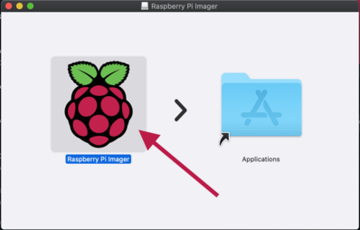  

Es öffnet sich ein neues Fenster, in welchen Sie das zu installierende Betriebssystem  auswählen können, sowie die 
SD-Karte. Wählen Sie bei *Operating System*  *"Raspberry Pi OS (other)"* und dann *"Raspberry Pi OS Full"* aus.  

*Abb. 4*:  Auswahl des Betriebssystems  
                    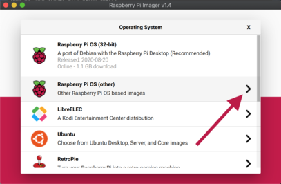  

*Abb. 5*:  Auswahl des Betriebssystems  
                    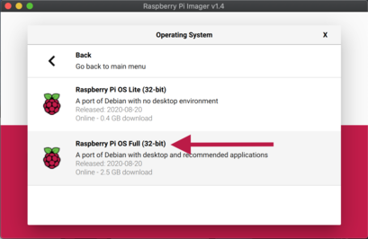  

Stecken Sie nun die SD-Karte in den Slot des Rechners. Vergessern Sie sich  hierbei, dass sich die SD-Karte im 
beschreibbaren Modus befindet, indem Sie den kleinen Schieber am linken Rand des SD-Karten-Adapters nach oben schieben.

*Abb. 6*:  SD-Karte beschreibbar machen, Schieber in obere Stellung bringen  
                      

Im *Raspberry Pi Imager* können Sie nun bei *"SD Card"* per Klick Ihre SD-Karte  
auswählen.  

*Abb. 7*:  Auswahl der SD-Karte  
                    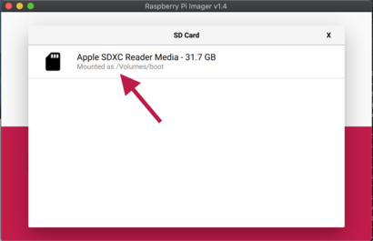  

Mit einem Klick auf *"Write"* und anschließendem bestätigen können Sie schließlich  die SD-Karte bespielen, ggf. wird 
hierzu einmal nach dem Passwort gefragt.  Dieser Vorgang kann nun einige Minuten in Anspruch nehmen.  

*Abb. 8*:  Beschreiben der SD-Karte  
                    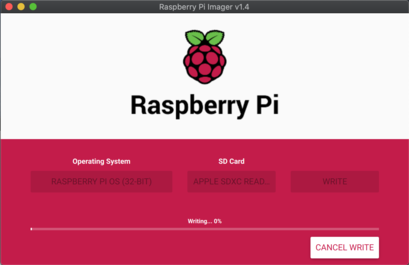  

Wenn der Vorgang abgeschlossen ist befindet sich das Betriebssystem für den  Raspberry Pi auf der SD-Karte und diese 
kann in den Raspberry Pi eingesteckt  werden. Falls Sie sich nicht für die Koffervariante mit Display entschieden 
haben, verbinden Sie nun einen externen Monitor, und stellen Sie sicher, dass eine Maus und Tastatur angeschlossen ist. 
Verbinden Sie weiter ein Ethernet-Kabel, falls Sie keine Wlan-Verbindung verfügbar haben. Anschließend können Sie den 
Raspberry Pi mit dem Netzteil verbinden, er startet automatisch.  
Es werden nun verschiedene Pakete automatisch installiert, was ebenfalls  mehrere Minuten dauern kann. Ist das 
erfolgreich geschenen, so öffnet sich ein  Fenster, in welchem Sie grundlegende Systemeinstellungen wie Zeitzone, Land, 
 Tastaturlayout und Ihr Wlan-Netz einstellen, sofern das gewünscht ist. Das Aufsetzen des Pi ist damit abgeschlossen 
und wir können mit dem Installieren von *PhyPiDAQ* fortfahren.

### 3.2.1 Ein paar Worte zu Linux

Das Betriebssystem des Raspberry Pi ist ein Linux-System, das von Hause aus schon viele Programme mitbringt. Zur 
Arbeitsweise unter Linux gehört es,
häufig die Kommandozeile zu verwenden, die in vielen Belangen der "Kommandozeile" unter
Windows gleicht. Als modernes Betriebssystem verfügt Linux natürlich auch über eine
sehr komfortable grafische Oberfläche, in der Sie Anwendungen mit der Maus starten
und steuern können. Die Programmnamen für gängige Anwendungen weichen bisweilen vom 
gewohnten ab. Eine Übersicht findet sich in der Liste unten. 

**Liste der wichtigsten Anwendungen unter Linux auf dem Raspberry Pi**  

| Programm           | Beschreibung                                                 |
| ------------------ | ------------------------------------------------------------ |
| `LXTerminal`       | Linux-Konsole für Befehlseingabe                             |
| `leafpad`          | einfacher Editor für Textdateien                             |
| `gedit`            | Editor für Textdateien mit fortgeschrittenen Möglichkeiten (z. B. Syntax-Highlighting) |
| `qpdfview`         | Anzeige von pdf-Dokumenten                                   |
| `gpicview`         | Bildbetrachter                                               |
| `idle3`            | einfache Entwicklungsumgebung für python (vers. 3)           |
| `Thonny`           | Entwicklungsumgebung für Python-Programme mit Debugger und Einzelschritt |
| `libreoffice`      | Textverarbeitung, Tabellenkalkulation und Präsentation       |
| `chromium-browser` | Web-Browser                                                  |
| `Mathematica`      | Computer-Algebra, sehr mächtig                               |
| `pi-packages`      | grafischer Manager für Software-Pakete                       |
| `apg-get`          | Kommandozeilen-Werkzeug zur Installation und zum Löschen von Softwarepaketen |
| `git`              | Quellcode-Management System zum Herunterladen, Modifizieren und Veröffentlichen von 
Programmpaketen; üblicherweise verbunden mit einem Konto auf *https://github.com*   |
|                    |                                                              |

 Sollte eines der aufgeführten Programme nicht vorhanden sein, kann es leicht genau so 
wie andere Programmpakete mit dem Befehl `sudo apt-get install <name>` auf der Kommandozeile 
nachinstalliert werden. Fast alle der aufgeführten Programm können auch über die grafische
Bedienoberfläche des Raspberry Pi aus dem Programm-Menü gestartet werden. 

Die am häufigsten verwendeten Befehle in der Konsole (`LXTerminal`, s. Liste oben) sind in
der Tabelle unten kurz beschrieben. 

**Liste der  wichtigsten Befehle für die Kommandozeile** 

| Befehl                             | Beschreibung                                                 |
| ---------------------------------- | ------------------------------------------------------------ |
| `ls`                               | listet alle Dateien im aktuellen Verzeichnis auf             |
| `cd`  **Ordnername**               | wechselt in den angegebenen Ordner                           |
| `cd`                               | wechselt ins Home-Verzeichnis                                |
| `pwd`                              | zeigt aktuelles (Arbeits-)Verzeichnis an                     |
| `cp` **Datei1** **Datei2**         | kopiert **Datei1** in (neue) **Datei2**                      |
| `mv` **Dateiname1** **Dateiname2** | Datei mit **Dateiname1** in **Dateiname2** umbenennen        |
| `mkdir` **Ordnername**             | erzeugt einen Ordner mit namen **Ordnername**                |
| `rmdir` **Ordnername**             | Ordner **Ordnername** entfernen (muss leer sein)             |
| `sudo nano` **Dateiname**          | erstellt/öffent neue Datei **Dateiname**                     |
| `rm` **Dateiname**                 | löscht die angegebene Datei                                  |
| `pyhton3` **Dateiname.py**         | führt Datei **Dateiname.py** in *python3* aus                |
| `./`**Dateiname.py**               | alternativ: führt Datei **Dateiname.py** aus                 |
| `cat` **Dateiname**                | zeigt Inhalt der Datei mit Namen **Dateiname** an            |
| `less` **Dateiname**               | zeigt Inhalt einer Datei an (auf und ab mit Pfeiltasten, Ende mit *q*) |
| `man` **Befehl**                   | zeigt Hilfsinformation zum angegebenen **Befehl** an         |
| *Pfeiltaste hoch/runter*           | zeigt zuletzt benutzte Befehle an                            |
| *Pfeiltaste rechts/links*          | Befehl editieren                                             |
| `<Str> + <c>`                      | Beendet das im Terminal ausgeführte Programm                 |
| `<Str> + <z>`                      | Verschiebt das im Terminal laufende Programm in den Hintergrund |
| `bg`                               | führt in den Hingergrund verschobenes Programm weiter aus    |
| `jobs`                             | zeigt alle im Termnal laufenden Prozese an                   |
| `kill %i`                          | stoppt Prozess mit Nummer *i*  (siehe Befehl `jobs`)         |
| **Befehl**`&`                      | führt **Befehl** als Hintergrundprozess aus                  |
| `date`                             | zeigt Datum und Uhrzeit an                                   |
|                              | `/` in Dateiangabe trennt Unterordner von Ordner- oder Dateinamen |
|                              | `~/` in Dateiangabe steht für das Home-Verzeichnis           |
|                              | `*` in Dateiname steht für beliebige Zeichenfolge            |
|                              | `?` in Datei- oder Verzeichnisname steht für ein beliebiges Zeichen |
|                              | `./` in Pfadangabe zu Datei steht für das aktuelle Verzeichnis |
| **Befehl** `>` **Dateiname** | Ausgabe von **Befehl** in Datei mit Namen **Dateiname** speichern |
| **Befehl**1 `|` **Befehl2**  | Ausgabe von **Befehl1** als Eingabe an **Befehl2**           |
| `sudo` **Befehl**            | führt **Befehl** als Administrator aus (mit "**s**uper**u**ser-Rechten") |
| `sudo reboot`                | System neu starten                                           |
| `sudo halt`                  | System anhalten (kann danach ausgeschaltet werden)           |


<a name="wieinstalliereichphypidaq"></a>  
### 3.2 Installation von PhyPiDAQ auf dem Raspberry Pi

**Beziehen des PhyPiDAQ Codes und einfache Installation**

Bitte beachten Sie , dass Ihr Raspberry Pi für die folgenden Schritte mit dem Internet verbunden sein muss. Öffnen Sie 
das Terminal, welches Sie in der Systemleiste oben links finden.

*Abb. 9*:  Terminal öffnen  
                    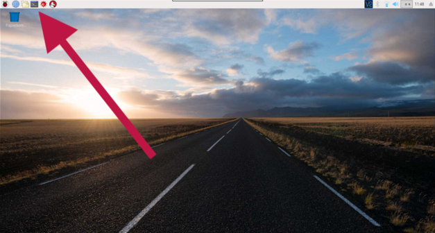  


Installieren Sie zunächst *git*, mit welchem sich alle Dateien des Pakets  PhyPiDAQ* herunterladen lassen. Geben Sie 
hierzu folgendes in das Terminalfenster ein:
```bash
sudo apt-get install git
```

*Abb. 10*:  Befehl im Terminal eingeben  
                    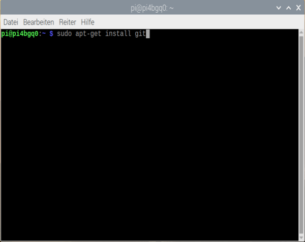  

Zur Installation von *PhyPiDAQ* geben Sie folgende Befehle ein. Kopieren Sie grundsätzlich Zeile für Zeile dieses Cods 
in das Terminal und bestätigen Sie jeden Befehl mit der Enter-Taste. Fügen Sie **NICHT** alle Zeilen auf einmal ein.

```bash
mkdir ~/git
cd ~/git
git clone https://github.com/GuenterQuast/PhyPiDAQ
cd ~/git/PhyPiDAQ
./installlibs.sh
cp ~/git/PhyPiDAQ/phypi.desktop ~/Desktop/
```
Damit ist die Installation schon abgeschlossen und *PhyPiDAQ* ist bereit für den ersten Einsatz. 
Falls Sie später die installierte Version aktualisieren wollen geben Sie folgendes in das Terminal ein (nicht notwendig 
bei Erstinstallation, da bereits die aktuelle Version heruntergeladen ist):

```bash
cd ~/git/PhyPiDAQ
git pull
./installlibs.sh
```


&nbsp;  
&nbsp;  
<a name="wiebedieneichdiephypidaqsoftware"></a>
## 4. Wie bediene ich die PhyPiDAQ Software ?

<a name="startenundstartoberflaeche"></a>
## 4.1 Starten und Startoberfälche

Zum Starten der Anwendung *PhyPiDAQ*, doppelklicken Sie auf dem Desktop auf das Icon **PhyPi**.  

*Abb. 11*:  PhyPiDAQ öffnen  
                    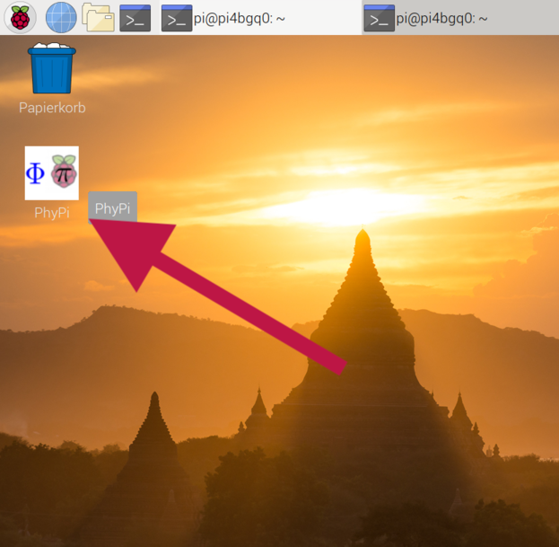  

Sie werden gefragt, wie Sie es öffnen möchten, wählen Sie hier "*Ausführen*" aus.  
Es öffnen sich nun zwei Fenster: ein schwarzes Terminal Fenster, welches aktuelle Statusmeldungen und Log-Dateien 
anzeigt. Für die einfache Bedienung können Sie dieses Fenster ignorieren. Wichtig wird es erst, wenn Fehler angezeigt 
werden.  In diesem Fall zeigt das Terminal-Fenster den Fehlercode und Hinweise, welche auf das Problem hinzeigen und 
das Problem dadurch in der Regel schnell behoben  werden kann.  
Das wichtigere Fenster ist die Bedienoberfläche von *PhyPiDAQ*.  

*Abb. 12*:  Bedienoberfläche *PhyPiDAQ*  
                    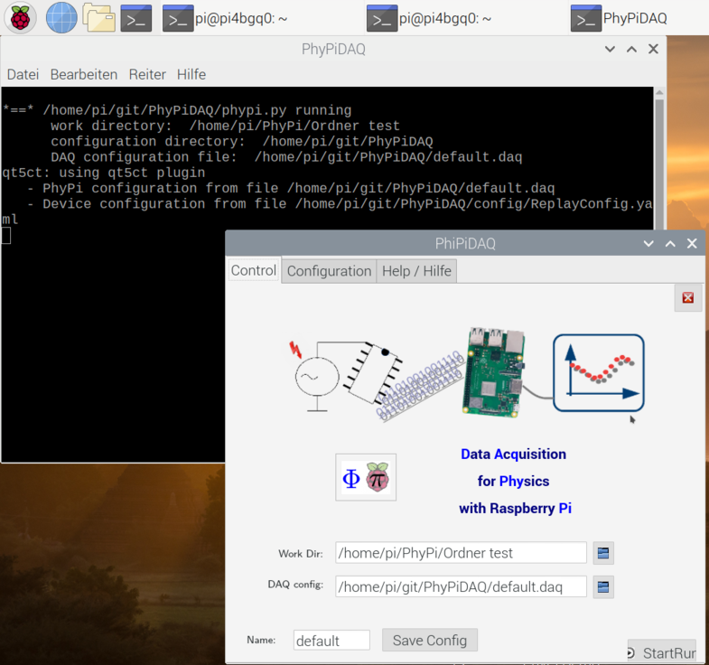  

Im Reiter "*Control"*, in welchem Sie sich nach dem Öffnen befinden, ist der Startreiter. Von hier aus kann eine 
Messung gestartet werden, indem der Button rechts unten "*StartRun*" geklickt wird, was aber erst später probiert 
werden soll. Weiter lässt sich in diesem Reiter das sogenannte Arbeitsverzeichnis auswählen. Hier können Sie bestimmen, 
wo der konfigurierte Versuch abgespeichert werden soll. Eine übersichtliche Ordnerstruktur ist essentiell,  wenn 
*PhyPiDAQ* in mehrerern Schulklassen verwendet wird. Es wird daher sehr empfohlen, eine Struktur wie die Folgende zu 
verwenden:  

*Abb. 13*:  Ordnerstruktur  
                      

Sie können neue Ordner im Dateimanager erstellen (ähnlich wie Windows  "Arbeitsplatz" oder Mac "Finder"), indem Sie mit 
der rechten Maustaste im  Fenster auf *"Neu"*->*"Ordner"* klicken.  

*Abb. 15*:  neuen Ordner erstellen  
                    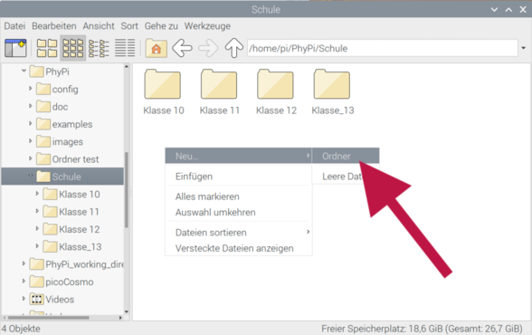  

Eine andere Möglichkeit ist die Eingabe des folgenden Befehls im Terminal,  welcher den Unterordner *"Klasse_12"* im 
Ordner *"Schule"* erstellt.  

```bash
mkdir /home/pi/PhyPi/Schule/Klasse_12
```
Sie wählen also in der Bedienoberfläche von PhyPiDAQ in Feld *"Work Dir:"* aus,  in welchem Ordner Sie das aktuelle 
Projekt speichern möchten.  Darunter, in *"DAQ config*" können Sie bereits gespeicherte Projekte öffnen.  Das ist 
besonders dann sinnvoll, wenn Sie bereits einen Versuch im Vorraus  getestet haben und im Unterricht vorführen möchten. 
Es wird dann das gespeicherte Projekt genauso wieder geöffnet und Sie können den Versuch sofort starten.  
Darunter, im Feld *"Name"* können Sie den Namen des Versuchs eingeben. Dieser wird als Teil des Dateinamens erscheinen. 
Wenn Sie auf *"Save Config"* klicken, speichern  Sie die Konfigurationsdatei ab. Die Datei wird dann "default.daq" 
heißen, falls  Sie bei *Name:* "default" hingeschrieben haben. Bei jedem Starten durch "StartRun"  wird eine 
zusätzliche Datei erzeugt mit Name, Uhrzeit und Datum, welche in dem  Verzeichnis abgespeichert wird, welches Sie bei 
"Work Dir" angegeben haben, z.B.  Schule / Klasse_12 / Photoeffekt.

**Aufgabe:** Erstellen Sie nun eine wie in Abb. 30 gezeigte Ordnerstruktur,  mit Ihren Schulklassen. Erstellen Sie in 
eine dieser Klassen einen Ordner mit dem Namen *"Testversuch"*. Anschließend wechseln Sie zur Bedienoberfläche von  
*PhyPiDAQ* und wählen in *Work Dir* den eben erstellten *Testversuch* aus.  
Vergeben Sie nun den Name "Standardversuch" und speichern Sie das Projekt ab.  
Verifizieren Sie anschließend im Dateimanager, dass sich das erstellte Projekt  dort befindet.  

<a name="konfigurationsdatei"></a>

## 4.2 Konfigurationsdatei

Wir wollen uns nun mit dem zweiten Reiter, *"Configuration"*, vertraut machen.  
Klicken Sie auf den Reiter *"Configuration"*.  

*Abb. 16*:  Konfiguration
                    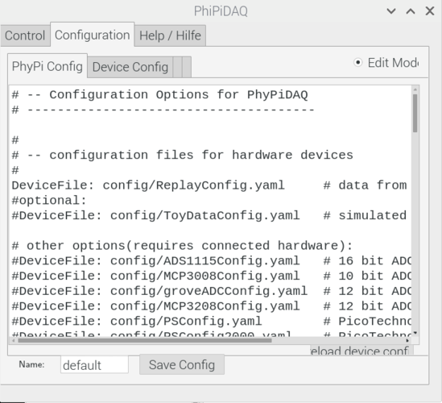  
Es ist nun ein Fenster zu sehen, in welchem sämtliche Parameter für den Versuch  
eingestellt werden können, wie beispielsweise:

- welchen Sensor verwende ich (DeviceFile)?
- welche maximalen Werte sollen im Diagramm angezeigt werden (ChanLimits)?
- sollen die Werte des Sensors direkt umrechnet werden (ChanFormula)?
- welche Achsenbeschriftung soll angezeigt werden (ChanLabels)?
- welche Einheiten sollen angezeigt werden (ChanUnits)?
- wie oft soll abgetastet werden (Interval)?  

und einige weitere ...  
Lassen Sie sich hier nicht abschrecken ! Diese Parameter stellen Möglichkeiten dar, wie ein Versuch erweitert oder 
perfektioniert werden kann. Es sind keinesfalls alle Parameter erforderlich - in der Regel reichen hierbei ungefähr  
3-5 Zeilen aus. In der *"default"*-Config, welche in Abb. 32 zu sehen ist, sind lediglich alle Einstellmöglichkeiten 
aufgezeigt und durch ein "#" am Anfang  der jeweiligen Zeile auskommentiert.  

Wenn Sie Änderungen an der dieser Konfiguration vornehmen möchten, so müssen Sie zunächst oben rechts den *"Edit Mode"* 
aktivieren, indem Sie einmal daruf klicken.  
Dass Sie nun in der Datei schreiben können, wird durch das Feld davor angezeigt. Sie können nun direkt in der 
Oberfläche schreiben und auch hilfreiche, aus vielen anderen Programmen bekannte Tastenkombinationen wie 

- *Str+C* für das Kopieren von ausgewählten Zeichen 
- *Str+V* für das Einfügen der eben kopierten Zeichen 
- *Str+Z* für Rückgängig machen
- *Str+Shift+Z* für erneutes Rückgängig machen  

benutzen. 

Beginnen Sie immer damit, dass Sie der Oberfälche mitteilen, welchen Sensor  Sie auslesen möchten, indem Sie bei der 
entsprechenden Zeile am Anfang das "#"  entfernen.  

Wir wollen nun demonstrativ den Analog-Digital-Wandler ADS1115 auslesen und  ändern daher die Zeile

```yaml
#DeviceFile: config/ADS1115Config.yaml   # 16 bit ADC, I2C bus
```
in
```yaml
DeviceFile: config/ADS1115Config.yaml   # 16 bit ADC, I2C bus
```
um. Alle weiteren Einstellungen hier können Sie unverändert lassen, da bereits  automatisch für diesen Sensor passende 
Parameter gewählt werden. Für den  Sensor müssen aber ggf. noch Änderungen vorgenommen werden, da dieser beispielsweise 
vier Eingänge besitzt, aber ja nach Projekt nicht alle ausgelesen werden müssen. Klicken Sie hierzu nun auf *"reload 
device config"*, was Sie unten rechts finden. Es folgt eine Bestätigung, dass *PhyPiDAQ* nun den ausgewählten Sensor 
übernommen hat. 

<a name="sensorkonfiguration"></a>

### 4.2.1 Sensor-Konfiguration "Device-Config"

Klicken Sie nun oben auf den Reiter  *"Device Config"*. Es sind nun die Parameter des Sensors zu sehen.  

*Abb. 17*:  Konfiguration des Sensors  
                    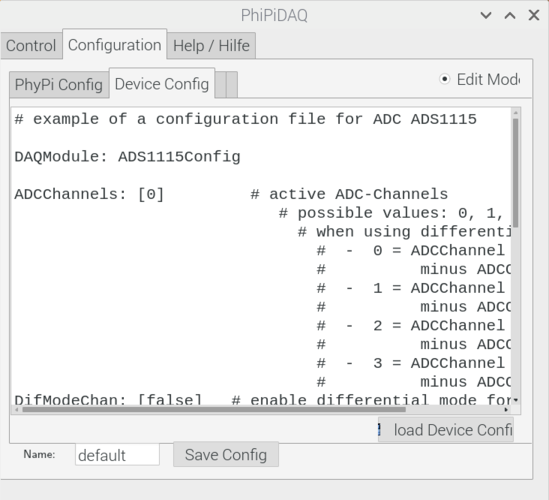  

Hier ist die Syntax wieder die gleiche, das bedeutet:  

- Zeilen, die mit "#" beginnen, sind auskommentiert und haben keinen Einfluss auf das Programm  
- um Änderungen vorzunehmen müssen Sie in den "Edit-Mode" gehen, indem Sie oben rechts das Feld "Edit-Mode" anklicken.  

Sie haben nun die Wahl, welche Kanäle Sie auslesen möchten, was in "ADCChannels" bestimmt wird. Möchten Sie nur den 
Kanal 1 auslesen, so lautet die Zeile  

```yaml
ADCChannels: [0]
```
da bei null mit Zählen begonnen wird. Möchten Sie nur den Kanal 2 auslesen, so lautet die Zeile  

```yaml
ADCChannels: [1]
```
Sie können mehrere Eingänge gleichzeitig auslesen, indem Sie die einzelnen Kanäle  
durch Kommata trennen:
```yaml
ADCChannels: [0, 1, 2, 3]
```
Die anderen Parameter darunter können bei Bedarf genutzt werden, um zum Beispiel  einen Eingang von einem anderen zu 
subtrahieren. Folgen Sie hierzu den Hinweisen  in den entsprechenden Zeilen. Zu beachten ist, dass Sie, wenn Sie 
mehrere Kanäle auslesen wollen, auch die Parameter unten auf die jeweilige Anzahl an Kanälen angleichen müssen. 
Folgendes ist also nicht möglich und wird zu einer Fehlermeldung führen:
```yaml
# example of a configuration file for ADC ADS1115

DAQModule: ADS1115Config  

ADCChannels: [0, 1, 2, 3] # active ADC-Channels
DifModeChan: [false]      # enable differential mode for Channels
Gain: [2/3]               # programmable gain of ADC-Channel
sampleRate: 860           # programmable Sample Rate of ADS1115
```
Korrekt ist:
```yaml
# example of a configuration file for ADC ADS1115

DAQModule: ADS1115Config  

ADCChannels: [0, 1, 2, 3]         # active ADC-Channels
DifModeChan: [false, false, false, false]   # enable differential mode for Channels
Gain: [2/3, 2/3, 2/3, 2/3]                # programmable gain of ADC-Channel
sampleRate: 860             # programmable Sample Rate of ADS1115
```

Wir haben nun also den Sensor *ADS1115* mit vier Kanälen ausgewählt. Sie können  nun einen Namen unten vergeben und die 
Konfiguration abspeichern.  

Wenn Sie den Messkoffer verwenden, ist der Aanlog-Digital-Wandler bereite mit dem Raspberry Pi verbunden und der Aufbau 
ist messbereit. Falls Sie einen offenen Aufbau verwenden, verbinden Sie den Analog-Digital-Wandler mit dem Raspberry Pi 
mit vier Leitungen benötigt: GND und +5V für die Spannungsversorgung und SCL und SDA  für die *i2C*-Verbindung, 
überwelche der Sensor Daten an den Pi übermittelt.  

<a name="messungstarten"></a>

## 4.3 Messung starten

Anschließend können Sie den Button *"StartRun"* klicken. Es öffnet sich ein Fenster mit dem Diagramm und Sie können 
unten links mit einem Klick auf *"Run"*  die Messung starten. Herzlichen Glückwunsch, Sie haben Ihre erste Messung mit 
*PhyPiDAQ* getätigt !  

*Abb. 18*:  Auslesen von vier Kanälen mit einem Analog-Digital-Wandler  
                      

Es gibt nun zahlreiche Möglichkeiten, wie Sie *PhyPiDAQ* einsetzten können.  
Wichtig ist hier zum Einen die Möglichkeit, aufgenommene Daten zu speichern, was mit *"SaveData"* geschieht. Die Werte 
werden in dem im Arbeitsverzeichnis  (*"WorkDir"*) ausgewählten Ordner in dem zur Messung gehörenden Ordner 
gespeichert.  
Standardmäßig werden nur die ersten 12 Sekunden abgespeichert, was genau das  Intervall ist, welches im Display zu 
sehen ist. In der Konfiguration kann dies natürlich angepasst und verlängert werden, falls gewünscht. Das Datenformat 
ist  standardmäßig *".csv"*, was aber auch angepasst werden kann. 

Für alle Buttons sind Tastaturkürzel definiert, die durch "_" im Button-Text angegeben sind. 


&nbsp;  
&nbsp;  
<a name="wiefuehreichdamitversuchedurch"></a>
## 5. Experimente mit PhyPiDAQ

Wir sind nun soweit, dass wir eine Vielzahl unterschiedlicher Sensoren auslesen, live im Monitor grafisch plotten und 
die Werte exportieren können. Das eröffnet unzählige Möglichkeiten, *PhyPiDAQ* im Unterricht einzusetzen. 

Eine Einführung in die Grundlagen der digitalen Messtechnik für Schülerinnen und Schüler findet sich im 
[Kurs digitale Messswerterfassung](
Experimente/Kurs_digitale_Messwerterfassung_mit_PhyPiDAQ.md). Dort wird zunächst gezeigt, wie man grundsätzlich eine Spannung 
digitalisiert und mit Hilfe von Python-Code mit dem Rechner aufnimmt und weiter verarbeitet. Als interessantes erstes 
Projekt wird eine Hell-Dunkel-Schaltung realisiert. Es folgt eine etwas anspruchsvollere Aufgabe, die Kalibration eines 
temperaturabhängigen Widerstands und die anschließende Temperaturmessung mit diesem Sensor. Den Abschluss des 
vorgeschlagenen Kurses bildet der Bau eines Kraftmessers mit einer Wägezelle, wie sie auch in modernen Küchenwagen 
verwendet wird. 

Einige anspruchsvollere Beispiele für Messungen aus verschiedenen Bereichen des Physikunterrichts werden in einzelnen Dokumenten beschrieben. 

#### Liste mit Beschreibungen von Experimenten mit *PhyPiDAQ* 

 - <a name="elektrostatik"></a> [Experimente zur Elektrostatik](Experimente/Elektrostatik.md)

 - <a name="kraftsensor"></a> [Kraftsensor mit Wägezelle](Experimente/Kraftsensor.md)

 - <a name="photoeffekt"></a> [Photoeffekt](Experimente/Photoeffekt.md)

&nbsp;  
&nbsp;  
<a name="andereProjekte"></a>  
## 6. Weitere Dokumentation und andere Projekte  


  - Moritz Aupperle, ["Konzeption und Gestaltung eines digitalen Messwerterfassungssystems
    für den Physikunterricht in der Schule"](https://publish.etp.kit.edu/record/21520),
    Masterarbeit Karlsruhe (2018)
  - Dominik Braig, ["Digitales Messsystem mit aktiver Messbereichserweiterung zum Einsatz in physikalischen Praktika"](https://publish.etp.kit.edu/record/21995),
    Bachelor Arbeit, ETP 2020


Aktuelle Präsentationen zum Projekt:  

  - [Digitales Messen mit dem Raspberry Pi auf Basis von PhyPiDAQ](
    http://ekpwww.etp.kit.edu/~quast/Projects/PhyPiDAQ/Projekte_PhyPiDAQ_1810.pdf),  
    Moritz Aupperle, Expose zur Masterarbeit
  - [Digitale Messwerterfassung für den Physikunterricht mit dem Raspberry Pi](
   http://ekpwww.etp.kit.edu/~quast/Projects/PhyPiDAQ/DigitalesMessen_DPG1903.pdf),
   G. Quast, Tagung der deutschen Physikalsichen Gesellschaft Aachen (2019)  
  - [Digitales Messen im Physikunterricht](http://ekpwww.etp.kit.edu/~quast/Projects/   PhyPiDAQ/DigitalesMessen_GQuast_Pforzheim1902.pdf), G. Quast,
    Lehrerfortbildung Pforzheim (2019)
  - [Digitales Messen im Physikunterricht](
    http://ekpwww.etp.kit.edu/~quast/Projects/PhyPiDAQ/DigitalesMessen_GQuast_Pforzheim2002.pdf), Lehrerfortbildung Pforzheim (2020)

Andere Projekte:

M. Wong, [Schülerprojekt Mint-Micro-Macro](http://www.hw.pf.bw.schule.de/joomla/index.php/bildungsangebote/berufsschule/82-home/255-mint-mikro-makro-projekt)
