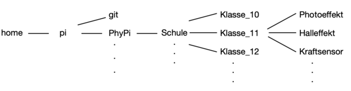

# PhyPiDAQ documentation (for teachers)

---  

This is the English version for educators of the project PhyPiDAQ, 
a package for acquisition, storage, visualization and analysis of measurement data 
with the [Raspberry Pi](https://www.raspberrypi.com/).

Hier gibt es die [Deutsche Version](Dokumentation_de.md).  

---  

In this document, the entire PhyPiDAQ workflow, starting from the  
Installation up to descripotions of concrete experiments is described.  

- [What is PhyPiDAQ?](#wasistphypidaq)
- [What do I need and how do I assemble it?](#wasbraucheichundwiebaueichdaszusammen)
- [How do I set up the Raspberry Pi and install PyPiDAQ?](#wiesetzeichdenraspberrypiaufundinstalliereichphypidaq)
    - [How do I set up the Raspberry Pi?](#wiesetzeichdenraspberrypiauf)
    - [How do I install PhyPiDAQ?](#wieinstalliereichphypidaq)
- [How do I use the PhyPiDAQ software?](#wiebedieneichdiephypidaqsoftware)
    - [Starting surface](#startenundstartoberflaeche)
    - [configuration file](#konfigurationsdatei)
    - [starting the measurement](#messungstarten)
- [Experiments with PhyPiDAQ?](#wiefuehreichdamitversuchedurch)  
     - [electrostatics](#elektrostatik)
     - [force sensor](#kraftsensor)
     - [photo effect](#photoeffekt)

&nbps;&nbsp;<a name="wasistphypidaq"> </a>
## 1. What is PhyPiDAQ?

PhyPiDAQ is a project for transparent, easily understandable Data AQuisition (DAQ) 
with a Raspberry Pi. The software contains basic functions for data acquisition and
visualization such as data logger, bar graph, XY or oscilloscope display and data 
recording on disk for subsequent evaluation.

The user interface is designed in such a way that pre-made templates for many 
sensors can be used to read them out quickly and easily.  In addition, it also offers 
the option of changing parameters like, e. g.  sampling rate, range,  axis labeling, 
function evaluation for direct conversion of raw measurements of special sensor
settings. The settings can be conveniently saved and recalled so that initial examples
for own experiments or for a quick demonstration can be easily provided. 

A large number of sensors, such as various analog-digital converters,  current sensors, 
environmental data sensors, gamma ray detectors or a usb-oscilloscope, are supported.
Here, widespread and inexpensive sensors were used, which have a sufficient level
 of accuracy that is more than sufficient for school experiments.  

The sensors can be individually connected to the Raspberry Pi using jumper cables, 
or via a printed board specially designed for use with the PhyPiDAQ software on which
some sensors and amplifiers are permanently attached. The latter set-up reduces
cabling efforts to a minimum and experiments can be set up quickly.  A 3d printed
connection panel and a printed circuit-board  are available so that all components
can be conveniently  provided  in an organizer case.  

*Fig. 1*:  Representation of the time dependence of two signal sources 
(square wave and capacitor voltage) connected to an AD converter  
                      

*Fig. 2*:  Measurement case with Raspberry Pi, circuit board and built-in display  
                      

&nbsp;  
&nbsp;  
<a name="wasbraucheichundwiebaueichdaszusammen"></a>
## 2. What do I need and how do I assemble it?

Sensors and standard amplifiers are at the heart of the PhyPiDAQ project. 
A number of analog and digital sensors are supported by the PhyPiDAQ software,
which is open source and can be downloaded from the 
[Github repository](https://github.com/PhyPiDAQ/PhyPiDAQ). 
The detailed installation procedure is  described [here](#wiesetzeichdenraspberrypiauf).

Sensors can be directly conneted to the GPIO pins of your Raspberry Pi, and an 
external breadboard may be used to provide amplification of weak signals, if
necessary. 

A proposal for a case containing some of the most common sensors to measure voltages
and currents and a set of standard amplifiers is proposed as part of the PhyPiDAQ
project. Detailed building instructions and a liste of recommended compontents
are described in the folder *MeasuringCase*, which you can also find on the
[Github repository](https://github.com/PhyPiDAQ/MeasuringCase).  


&nbsp;  
&nbsp;  
<a name="wiesetzeichdenraspberrypiaufundinstalliereichphypidaq"></a>  
## 3. How do I set up the Raspberry Pi and install PhyPiDAQ?

If there already is an operating system on the Raspberry Pi, you can  continue directly with 
[3.2](#wieinstalliereichphypidaq). 
If not, proceed with this description how to install the operating system. 

<a name="wiesetzeichdenraspberrypiauf"></a>  
### 3.1 How do I set up the Raspberry Pi?

First download *Raspberry Pi Imager* from the official website  
https://www.raspberrypi.org/downloads/ to any computer with an SD card slot.  

Install the *Raspberry Pi Imager* by double-clicking the downloaded file.  

*Fig. 3*: Installation of Raspberry Pi Imager, double click on the "Raspberry"  
                     
 
A new window opens in which you can select the operating system to be 
installed and the SD card. Under *Operating System* select "Raspberry 
Pi OS (other)" and then "Raspberry Pi OS Full".

*Fig. 4*: Selection of the operating system  
                      

*Fig. 5*: Selection of the operating system  
                      

Insert the SD card into the slot of the computer. Ensure that the SD  card is in writable 
mode by pushing the small slide on the left edge of the  SD card adapter upwards.  

*Fig. 6*: Make the SD card writable, move the slider to the top position  
                      

In the *Raspberry Pi Imager* you can now select your SD card by clicking on *"SD Card"*.

*Fig. 7*: Selection of the SD card  
                      

By clicking on *"Write"* and then confirming, you can finally record onto 
the SD card; you may be asked for the password once. This process can now 
take a few minutes.  

*Fig. 8*: Writing to the SD card  
                    

When the process is complete, the operating system for the Raspberry Pi is 
on the SD card and this can be plugged into the Raspberry Pi. If you have 
not decided to use the case version with a display, connect an external monitor 
and make sure that a mouse and keyboard are connected. Also connect an 
Ethernet cable if you don't have a WiFi connection available. Then you can 
connect the Raspberry Pi to the power supply, and it boots automatically. 
Various packages are now installed automatically, which can take  several minutes. 
If this is successful, a window opens in which you can set  basic system settings such 
as time zone, country, keyboard layout and your  WiFi network, if this is desired. 
The installation of the Pi is now   complete and we can continue installing *PhyPiDAQ*.  


<a name="wieinstalliereichphypidaq"></a>  
### 3.2 Installation of PhyPiDAQ on the Raspberry Pi

**Obtaining the PhyPiDAQ code and easy installation**

Please note that your Raspberry Pi must be connected to the Internet for  
the following steps. Open the terminal, which you can find in the system  
bar at  the top left.  

*Fig. 9*: Open the terminal  
                      

First install the repository manager *git*, which is used to download all
files of the *PhyPiDAQ* package from its github repository. 
To do this, enter the following texxt in the terminal window:  
`` bash
sudo apt-get install git
``

*Fig. 10*: Enter command in the terminal  
                      

Enter the following commands to install *PhyPiDAQ*. Always copy this code 
line by line into the terminal and confirm each command with the Enter key.  
**DO NOT** insert all lines at once.
```bash
mkdir ~/git
cd ~/git
git clone https://github.com/GuenterQuast/PhyPiDAQ
cd ~/git/PhyPiDAQ
./installlibs.sh
cp ~/git/PhyPiDAQ/phypi.desktop ~/Desktop/
```
The installation is now complete and *PhyPiDAQ* is ready for the first use. 
If you want to update the installed version later, enter the following in 
the terminal (not necessary for the first installation, as the current 
version has already been downloaded):  
```bash
cd ~/git/PhyPiDAQ
git pull
./installlibs.sh
```

&nbsp;  
&nbsp;  
<a name="wiebedieneichdiephypidaqsoftware"></a>  
## 4. How do I use the PhyPiDAQ software?<a name="startenundstartoberflaeche"></a>
## 4.1 Start-up interface

To start the *PhyPiDAQ* application, double-click the icon on the desktop **PhyPi**.  

*Fig. 11*: Open PhyPiDAQ  
                      

You will be asked how you would like to open it, select "*Run*" here. Two 
windows open now: a black terminal window, which shows current status 
messages and log files. You can ignore this window for ease of use. It only 
gets important when errors are displayed. In this case, the terminal 
window shows the error code and instructions which point to the problem and 
which can usually be used to fix the problem quickly. The more important 
window is the user interface of *PhyPiDAQ*.


*Fig. 12*: User interface *PhyPiDAQ*  
                      

The tab "*Control"*, in which you are after opening, is the start tab. A 
measurement can be started from here by clicking the button "*StartRun*" 
at the bottom right, but this should only be tried later. The so-called 
working directory can also be selected in this tab. Here you can determine 
where the configured experiment should be saved. A clear folder structure 
is essential if *PhyPiDAQ* is used in several school classes. So it is 
highly recommended to use a structure like the following:  

*Fig. 13*: folder structure  
                      
                    
You can create new folders in the file manager (similar to Windows "My 
Computer" or Mac "Finder") by right-clicking on *"New"* -> *"Folder"* 
in the window.  

*Fig. 15*: create a new folder  
                      

Another possibility is to enter the following command in the terminal, 
which creates the subfolder *"class_12"* in the folder *"school"*.  
```bash
mkdir /home/pi/PhyPi/school/class_12
```
In the PhyPiDAQ user interface you select in the field *"Work Dir:"* in 
which folder you want to save the current project. Below that, in *"DAQ 
config*", you can open projects that have already been saved. This is 
particularly useful if you have already tested an experiment in advance and 
want to demonstrate it in class. The saved project will then be opened 
again in exactly the same way and you can start the experiment immediately. 
Below, in the field *"Name"* you can enter the name of the experiment. 
This will appear in the file name. If you click on *"Save Config"*, you 
save the configuration file. The file will then be called "default.daq" if 
you wrote "default" in *Name:*. Each time you start the program with 
"StartRun", an additional file is created with name, time and date, which 
is saved in the directory you specified for "Work Dir", 
e.g. school/class_12/photoeffect.

**Task:** Now create a folder structure as shown in Fig. 30 with your 
school classes. Create a folder with the name *"Test"* in one of these 
classes. Then switch to the *PhyPiDAQ* user interface and select the 
*test* you just created in *Work Dir*. Now assign the name 
"standard experiment" and save the project. Then verify in the file 
manager that the created project is there.


<a name="konfigurationsdatei"></a>
## 4.2 configuration file

We now want to familiarize ourselves with the second tab, *"Configuration"*. 
Click on the tab *"Configuration"*.  

*Fig. 16*: configuration  
                      
A window can now be seen in which all parameters for the experiment can be 
set, such as:

  - which sensor do I use (DeviceFile)?  
  - which maximum values ​​should be displayed in the diagram (ChanLimits)?  
  - should the values ​​of the sensor be converted directly (ChanFormula)?  
  - which axis labeling should be displayed (ChanLabels)?  
  - which formulas should be displayed (ChanUnits)?  
  - how often should be scanned (Interval)?  

and many more...

Don't let this put you off! These parameters represent ways in which an 
experiment can be expanded or perfected. By no means all parameters are 
required - usually around 3-5 lines are sufficient. In the *"default"* - 
Config, which can be seen in Fig. 32, all setting options are 
indicated  and can be commented out by a "#" at the beginning of the 
respective line.

If you want to make changes to this configuration, you must first activate 
the *"Edit Mode"* at the top right by clicking on it once. 
The field in front of it shows that you can now write into the text field. 
Helpful Keyboard shortcuts are:

  - *Str + C* for copying selected characters
  - *Str + V* for pasting the characters you just copied
  - *Str + Z* for undo
  - *Str + Shift + Z* to undo again.

Always start by telling the software which sensor you want to read out by 
removing the "#" at the beginning of the corresponding line.  

We now want to read out the ADS1115 analog-to-digital converter 
demonstratively and therefore change the line  
```bash
#DeviceFile: config/ADS1115Config.yaml   # 16 bit ADC, I2C bus
```
to
```bash
DeviceFile: config/ADS1115Config.yaml   # 16 bit ADC, I2C bus
```
You can leave all other settings here unchanged, as suitable parameters for this  
sensor are automatically selected. Changes may have to be made to the sensor,  
because e.g. it has four inputs but not all of them have to be  
read out depending on the project. To do this, click on *"reload device config"*,  
which you will find at the bottom right. A confirmation follows that *PhyPiDAQ*  
has now accepted the selected sensor.

<a name="sensorkonfiguration"></a>
### 4.2.1 Sensor configuration "Device-Config"

Now click on the tab *"Device Config"* at the top. The parameters of the sensor can be seen now.

*Fig. 17*: Configuration of the sensor  
                      

Here the syntax is the same again, that means:

  - Lines that begin with "#" are commented out and have no function on the program
  - To make changes you have to go to "Edit-Mode" by clicking above on the 
    "Edit-Mode" field on the right.

You now have the choice of which channels you want to read out, as determined 
in "ADCChannels". If you only want to read out channel 1, this is  the line: 
```bash
ADCChannels: [0]
```
because counting starts at zero. If you only want to read out channel 2, this 
is the line:
```bash
ADCChannels: [1]
```
You can read out several inputs at the same time by separating the individual 
channels with commas:
```bash
ADCChannels: [0, 1, 2, 3]
```
The other parameters below can be used if necessary, for example to subtract one 
input from another. To do this, follow the instructions in the corresponding 
lines. Please note that if you want to read out several channels, you also have 
to adjust the parameters below to the respective number of channels. So the 
following is not possible and will lead to an error message:
```bash
# example of a configuration file for ADC ADS1115

DAQModule: ADS1115Config  

ADCChannels: [0, 1, 2, 3]         # active ADC-Channels
DifModeChan: [false]   # enable differential mode for Channels
Gain: [2/3]                # programmable gain of ADC-Channel
sampleRate: 860             # programmable Sample Rate of ADS1115
```
Correct is:
```bash
# example of a configuration file for ADC ADS1115

DAQModule: ADS1115Config  

ADCChannels: [0, 1, 2, 3]         # active ADC-Channels
DifModeChan: [false, false, false, false]   # enable differential mode for Channels
Gain: [2/3, 2/3, 2/3, 2/3]                # programmable gain of ADC-Channel
sampleRate: 860             # programmable Sample Rate of ADS1115
```

We have now selected the sensor *ADS1115* with four channels. You can now assign 
a name below and save the configuration.

Now connect the analog-digital converter to the Raspberry Pi - four wires are required:  
GND and + 5V for the power supply and SCL and SDA for the *i2C* connection for the data 
transmission from the sensor to the Pi.

<a name="messungstarten"></a>
## 4.3 Starting the measurement

Then you can click the button *"StartRun"*. A window with the diagram opens and
you can start the measurement by clicking at the bottom left on *"Run"*.
Congratulations, you have taken your first measurement with *PhyPiDAQ*! 
Fig. 18 shows the graphical display you should see.

*Fig. 18*: Reading out four channels with an analog-digital converter  
                      


There are numerous ways in which you can interact wiht *PhyPiDAQ*. On the one hand, it 
is important to be able to save recorded data, which is done with the button *"SaveData"*. 
The values are saved in the folder selected in the working directory (*"WorkDir"*) in the 
folder belonging to the measurement. By default, only the first 12 seconds are saved, which 
is exactly the interval that can be seen in the display. In the configuration this can of 
course be adjusted and extended if desired. The standard data format is *".csv"*, which can 
also be adapted.

Keyboard shortcuts are defined for all buttons, as indicated by the '_' on the
button text. In many practical cases, typing a button is much easier than interacting via the mouse.


&nbsp;  
&nbsp;  
<a name="wiefuehreichdamitversuchedurch"></a>  
## 5. Experiments with *PhyPiDAQ*

We are now ready to read out a large number of different sensors, graphically 
plot them live on the monitor and export the values. That opens up countless 
possibilities to use *PhyPiDAQ* in the classroom. 

There is an introductory Course in German languge, 
[Kurs digitale Messswerterfassung](
docs/Kurs_digitale_Messwerterfassung_mit_PhyPiDAQ.md), which has not yet been
translated to English. 
Starting with very basic material on digitization and data processing with *Python*, 
a first project deals with a non-linear, temperature dependent resistor, an NTC, 
which is first calibrated and then used in a self-made thermometer. 
As a  more advanced example involving active amplification of a weak signal, a load-cell 
as contained in standard kitchen scales is used to build a very sensitive force sensor. 

Some more advanced sample experiments from different areas of Phyics are described below 
to illustrate the entire *PhyPiDAQ* workflow from start to end.

List of experiments with *PhyPiDAQ*

  - <a name="elektrostatik"></a> [Electrostatics](experiments/electrostatics.md)
  - <a name="kraftsensor"></a> [Force sensor](experiments/forcesensor.md)
  - <a name="photoeffekt"></a> [Photoeffect](experiments/photoeffect.md)
