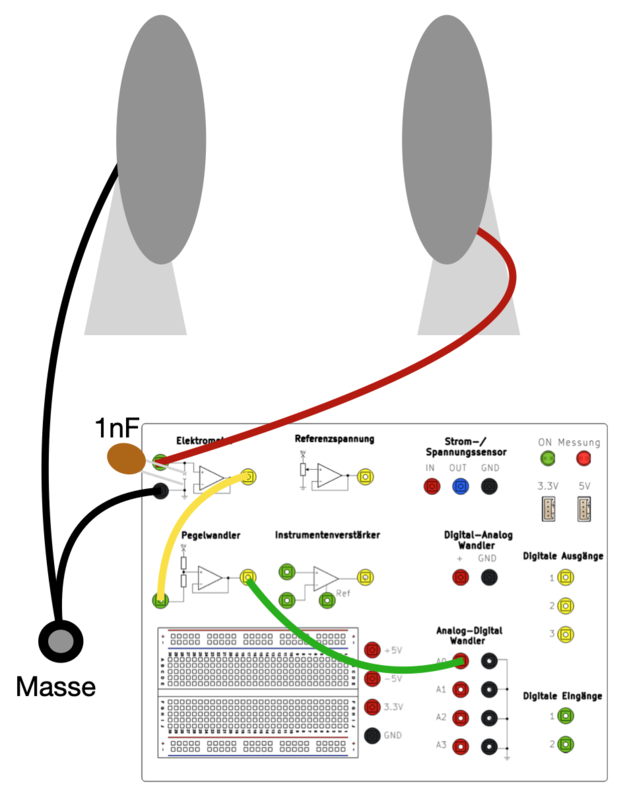
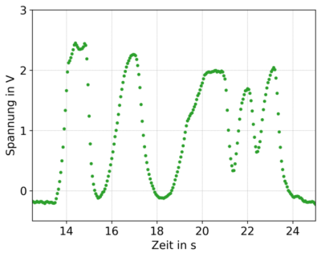
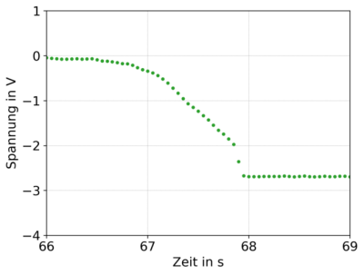

# *PhyPiDAQ*: Messungen zur Elektrostatik

Messungen von Ladungen und am Plattenkondensator sind auch mit kleinen, für Schülerinnen und 
Schüler unbedenklichen Spannungen möglich, wenn man einen sehr hochomigen Verstärker einsetzt, 
mit dem Spannungsmessungen ohne störenden Stromfluss messbar sind. 
Dazu kann man den Operationsverstärker CA 3140 mit einem Innenwiderstand >10¹² Ω einsetzen, 
mit dem eine "Elektrometerschaltung" realisiert werden kann und der auch im Bauvorschlag für 
eine allgemein einsetzbare 
[Verstärkerplatine](https://github.com/PhyPiDAQ/MeasuringCase) enthalten ist.

## Grundlagen der Messtechnik 

Die Elektrometerschaltung ist in Abb. 1 gezeigt. Da häufig die Polarität des Signals nicht
von vorneherein klar ist, wurde eine symmetrische Spannungsversorgung vorgesehen, so dass
Eingangssignale zwischen -5V und +5V möglich sind. Der Eingang (1) muss entweder mit einem 
Widerstand oder mit einem Kondensator gegen Masse verbunden werden, um eine zu einem kleinen
Strom oder zu einer Ladung proportionale Spannung am Eingang zu erzeugen. 

*Abb. 1*:  Elektrometerschaltung mit CA3140 und symmetrischer Spannungsversorung  ±5V mit dem DC-DC-Wandler TMA0505D.  
                      

Wenn das Signal mit einem an den Raspberry Pi angeschlossenen Analog-Digital-Wandler aufgezeichnet werden soll,
ist die Wandlung des Ausgangssignals von ±5V nach 0-5V notwendig. Dazu eignet sich eine einfache Schaltung mit
einem Operationsverstärker zur Pegelanpassung, wie sie in Abb. 2 gezeigt ist. 

*Abb. 2*: Operationsverstärker-Schaltung zur Pegelanpassung ±5V → 0-5V.  
                      


## Demonstration von elektrostatischer Influenz 

Im folgenden Versuch soll der Effekt Influenz dargestellt werden. Des Weiteren lässt sich derselbe Aufbau ebenfalls zur 
Demonstration eines Ladungslöffels verwenden.  
An das Elektrometer wird eine offene, runde Kondensatorplatte mit einem Durchmesser von d ≈ 5 cm angeschlossen. Die 
Masse des Messkoffers wird auf  das Erdpotential gezogen. Zwischen der Kondensatorplatte und der Erde wird ein  
Kondensator mit der Kapazität von 1 nF angeschlossen. Der Ausgang des  Elektrometers wird mit dem Pegelwandler 
verbunden und dieser wiederum mit dem  
ADC. Somit können sowohl positive, als auch negative Spannungen ausgelesen werden.  

*Abb. 3*:  Aufbau Elektrostatik-Versuch  
                      

Wir befassen uns nun mit der Konfigurationsdatei.  Aus Gründen der Übersichtlichkeit sind nun überflüssige Kommentare 
und auskommentierte  Zeilen ggf. weggelassen.  

**elektrostatik.daq:**

```yaml
DeviceFile: config/myADS1115Config.yaml   # 16 bit ADC, I2C bus 
ChanLabels: ['Uc']            # names for channels 
ChanUnits: ['V']         # units for channels 
ChanColors: [darkblue]      # channel colours in display
ChanFormula:
  - 2*c0-5  # chan0
Interval: 0.1                 # logging interval  
DisplayModule: DataGraphs     # text, bar-graph, history and xy-view
Title: "Data from File"       # display title
```
**myADS1115Config.yaml:** 

```yaml  
# example of a configuration file for ADC ADS1115

DAQModule: ADS1115Config  

ADCChannels: [0]       # active ADC-Channels
DifModeChan: [false]   # enable differential mode for Channels
Gain: [1]              # programmable gain of ADC-Channel
sampleRate: 860        # programmable Sample Rate of ADS1115  
```
Den *Gain* in der vorletzten Zeile müssen Sie ggf. anpassen - je nachdem,  ob das angezeigte Signal zu 
klein oder zu groß ist.  
Softwareseitig wird die Funktion des Pegelwandlers folgendermaßen kompensiert:  
U<sub>Kondensator</sub> = 2 · U<sub>gemessen</sub> − 5 V, was bei  *ChanFormula* bereits berücksichtigt ist.  
Bevor die Messung beginnt,  wird die Kondensatorplatte mit Hilfe eines Leiters mit dem Erdpotential  verbunden, sodass 
diese ungeladen ist. Wird nun ein geladener Körper der Kondensatorplatte angenähert, so bewirkt das elektrische Feld 
des geladenen Körpers eine Kraft auf die freien Elektronen der Kondensatorplatte, welche daraufhin - je nach Ladung des 
Körpers - zu diesem hin beziehungsweise von diesem weg beschleunigt werden (Influenz). Dieser Prozess wird dadurch 
beschränkt, dass durch die Ladungsverschiebung ein elektrisches Feld aufgebaut wird, welches der Kraft entgegenwirkt. 
Die Ladungstrennung kann als elektrische Spannung gemessen werden, welche zwischen Erde und der Kondensatorplatte 
anliegt, also gerade auf der Eingangsseite des Elektrometers.  
Es ist anzumerken, dass für diesen Versuch zwingend ein Elektrometer mit einem  sehr großen Innenwiderstand 
erforderlich ist, da sonst der größere Stromfluss zwischen dem Eingang des Elektrometers und der Erde zu einem 
Ladungsausgleich an der Kondensatorplatte führt.
Mit  einem herkömmlichen Multimeter ist der Effekt nicht sichtbar. 
Als Körper wird ein Kunststoffstab verwendet, welcher an einem Wollpullover gerieben wurde,  sodass dieser sich 
aufgeladen hat. Anschließend wird er der Kondensatorplatte angenähert, wobei der Abstand mehrmals variiert wird. Die 
aufgenommene Kurve in Abbildung unten zeigt den zeitlichen Verlauf der Spannung am Kondensator an.  
Die Veränderung der Spannung mit dem Abstand des Stabs ist gut zu erkennen.  Anhand des Vorzeichens der Spannung ist 
weiter zu erkennen, dass der Stab positiv geladen ist. 

*Abb. 4*:  **Influenz**  
Zeitlicher Verlauf der Spannung am Kondensator bei  mehrmaliger Veränderung des Abstandes zum 
geladenen Stab.  
                      

## Aufladung eines Kondensators mit Konduktorkugel. 

Nun folgt die Demonstration des Ladungslöffels. Hierzu wird eine Metallkugel  an einem Wollpullover gerieben und 
anschließend die entladene Kondensatorplatte damit berührt. In der Abbildung ist der Verlauf der Spannung zu sehen. Der 
Anstieg der Kondensatorspannung bei Berührung mit der Kugel lässt auf die Ladung  schließen. Mit ∆Q = C · ∆U, einer 
bekannten Kapazität von 1 nF und der Spannungsdifferenz von −2,7 V beträgt die übertragene 
Ladung −2,7 nC.

*Abb. 5*:  **Ladungslöffel**  
Zeitlicher Verlauf der Spannung am Kondensator bei Annäherung und Berührung mit einer 
geladenen Kugel. Bei ca. 66 s wird der Kondensator geerdet, sodass die Spannung 0 V beträgt. Bei Annäherung der 
geladenen Kugel steigt der Betrag der Spannung am Kondensator durch Influenz an. Bei Berührung der Kugel an der 
Kondensatorplatte (t ≈ 67,9 s) erreicht die Spannung einen konstanten Wert.  
                      

