# Dem idealen Gas-Gesetz auf der Spur
### mit einem selbstgebauten Versuchsgerät

Mit wenigen Mitteln einen anschaulichen Unterricht zum idealen Gasgesetz gestalten

– Abgeänderter Auszug aus der Masterarbeit von Pierre Lang –

**Was Sie hier erwartet:**

* Vorstellung von Experimenten, die die grundlegenden Zusammenhänge zwischen Druck, Temperatur und Volumen darlegen, inkl. Auswertung
* Konstruktion und Fertigung des Versuchsgeräts (Anhang 1)
* Zusatzmaterial für Interessierte:
  * Auswahl eines passenden Temperatursensors (Anhang 2)
  * Kalibrierung des Drucksensors (Anhang 3)
  * Quantifizierung des Druckverlusts (Anhang 4)
  * Differenzierte Betrachtung der Wärmeleitung (Anhang 5)
  * Berechnung des polytropen-Exponents (Anhang 6)
  * Weitere Informationen zur eingesetzten Sensorik (Anhang 7)

**Allgemeines**:

Die Erfassung und Speicherung der Messdaten erfolgt über einen Raspberry Pi, die Auswertung und Veranschaulichung ermöglicht das Open-Source-Programm „PhyPiDAQ“. Eine Einführung in die Arbeit mit diesem System bietet des „[Educator’s Guide](https://github.com/PhyPiDAQ/EducatorsGuide)“ und weitere Inhalte auf der [PhyPiDAQ-Github-Seite](https://github.com/PhyPiDAQ/) und diverse Videos auf [Youtube](https://youtube.com/@wissen_tut_nicht_weh?si=12ssxkpETU-0izkf). Die dargestellten Herangehensweisen, Methoden und Mittel stellen **eine** Möglichkeit der Umsetzung dar und erheben keinen Absolutheitsanspruch. Gerne können Sie Verbesserungen daran vornehmen und Abwandlungen nutzen. In diesem Fall würden wir uns auch freuen, wenn Sie Ihre Idee/n der Community mitteilen, bspw. als Pull-Request über Github oder eine Mitteilung an uns.

****

## Experimente zum idealen Gas-Gesetz mit einem selbstgebauten Versuchsgerät

Durch den Einsatz des im Anhang näher beschriebenen Versuchsgeräts wird die Veranschaulichung einiger grundlegender physikalischer Gesetzmäßigkeiten und verschiedener thermodynamischer Prozesse ermöglicht, welche auf analogem Wege nur schwer oder nicht realisierbar sind. Zum Zwecke der Übersichtlichkeit sollen sie im Folgenden in Stichpunkten kurz genannt und im weiteren Verlauf im Detail veranschaulicht werden.

* Isothermer Prozess (Boyle-Mariotte): Erhöhung des Drucks bei langsamer Kompression

* Isobarer Prozess und Wärmeleitung: Exponentieller Abfall der Temperatur bei konstantem Druck

* Isochorer Prozess: Veränderung der Temperatur und des Drucks bei konstantem Volumen

* Adiabatische beziehungsweise isentrope Zustandsänderung: Aufnahme und Analyse der Messungen, Fehleranalyse und Modellanpassung

* Quasi-Adiabatische Expansion und isobare Erwärmung: Abfall der Temperatur bei Expansion von Luft (Umwandlung von innerer Energie in Volumenarbeit), Beobachten eines isobaren Erwärmungsprozesses

Weiterhin kann der exponentielle Druckabfall sehr gut veranschaulicht werden. Die fachtheoretischen Ausführungen der Experimente richten sich hauptsächlich an Personen mit physikalischem Hintergrundwissen und erheben nicht den Anspruch, auf eine Schülergruppe vollständig didaktisch zugeschnitten zu sein. Für eine Umsetzung im Unterricht ist das jeweilige Experiment der Zielgruppe entsprechend anzupassen und die Erklärungen gegebenenfalls didaktisch zu reduzieren.

Die folgenden Experimente sind als abgesonderte „Pakete“ zu verstehen, welche die für das Experiment relevanten didaktischen und thermodynamischen Informationen als Einleitung enthalten. Dies soll die Verständlichkeit und Umsetzbarkeit erleichtern.

  

****

### Isothermer Prozess

Dieses Experiment soll mit dem isobaren und isochoren Prozess einen Einstieg in das ideale Gasgesetz bieten, indem einzelne Größen, wie hier die Temperatur, konstant gehalten und die anderen Zustandsgrößen betrachtet werden. Da die Temperatur bei richtiger Anwendung konstant bleibt, kann die Aufmerksamkeit allein auf den Zusammenhang von Volumen und Druck gelenkt werden. Da mit leichten Gewichten hantiert wird, ist auch eine Schülerbeteiligung oder sogar Gruppenarbeit mit mehreren solcher Versuchsaufbauten möglich. Ausgehend von bekannten Vorgängen/Phänomenen in Natur, Technik und Alltag formulieren die Lernenden Hypothesen über den Verlauf der Messgrößen, ehe sie diese experimentell überprüfen. Zum Ende der Unterrichtseinheit sollte der Zusammenhang nach Boyle-Mariotte bekannt sein.  

#### Didaktische Kernpunkte

Hinweise:

- Kein Vorwissen zum idealen Gasgesetz nötig

- Der Begriff isotherm sollte nicht zu früh genannt werden, um die Lernenden kognitiv nicht zu überlasten

- Die Visualisierung sollte so einfach und schülernah wie möglich gehalten werden

Mögliche Ziele dieses Experiments:

- Erkennen eines Zusammenhangs zwischen der stückweisen Volumenreduktion und der Erhöhung des Drucks bei konstanter Temperatur

- Visualisierung der Messwerte, Analyse und Interpretation des Verlaufs

- Herstellen eines theoretischen Zusammenhangs aus den Messwerten bis hin zum Zusammenhang nach Boyle-Mariotte (p*V=const.)

- Diskussion von Abweichungen vom theoretischen Wert 

Hierbei können je nach Unterrichtssetting und Schwerpunktsetzung verschiedene Kompetenzen gefördert werden wie beispielsweise handwerkliche Kompetenz, analytische Fähigkeiten, Experimentier-, EDV-, Interpretierungs- und Kommunikationskompetenz.

#### Thermodynamischer Hintergrund

Die isotherme Zustandsänderung nach Boyle-Mariotte beschreibt eine Verhältnismäßigkeit des idealen Gasgesetzes. Diese besagt, dass bei gleichbleibender Temperatur das Produkt aus Druck und Volumen konstant ist:

Ausgehend vom ersten Hauptsatz der Thermodynamik für geschlossene Systeme kann dieser Prozess wie folgt hergeleitet werden:

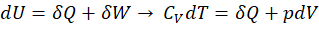

Da beim isothermen Prozess idealerweise keine Temperaturdifferenz vorhanden ist, kann der Ausdruck vereinfacht werden:

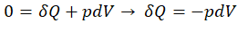

Hieraus können zwei Szenarien abgeleitet werden:

- Die in das System eingebrachte Arbeit 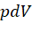  verlässt es in Form von Wärme 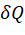  wieder, ohne die innere Energie zu erhöhen

- Die zugeführte Wärmemenge   führt zu einer Volumenänderung --> Erhöhung der Arbeit 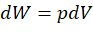 

Im Folgenden soll dem ersten Szenario nachgegangen werden.

#### Durchführung

Für die Durchführung werden außer dem Versuchsgerät folgende **Hilfsmittel** benötigt:

- Raspberry Pi inklusive Sensoren/Elektrik und Programm PhyPiDAQ (inklusive vorgefertigter Konfigurationsdatei)

- Gewichte beliebiger Masse (empfohlen: 1-8 kg, in 1 kg-Schritten)

- Ein Aufbau, mit welchem einige Gewichte sicher und stabil auf dem Kolbenpleuel platziert werden können, beispielsweise mithilfe eines Stativfußes (z.B. von Phywe), einem Gefäß und Stäben wie in Abbildung 16 dargestellt

**Vorgang**:

1. Formulieren von Hypothesen des Verlaufs des Drucks bei Kompression

2. Starten der Messung über PhyPiDAQ

3. Einstellen des ersten Volumens und Beobachten des Drucks. Hierauf ist darauf zu achten, dass die Temperatur konstant bleibt

4. Einstellen der nächsten Volumina unter gleicher Prämisse

5. Notieren des Atmosphärendrucks, welcher zum Zeitpunkt der Messung vorliegt (für die Modellanpassung)

6. Auswerten der Daten und Visualisieren als p/V-Schaubild

7. Diskutieren der Messergebnisse und -abweichungen

8. Mathematisieren des Zusammenhangs

 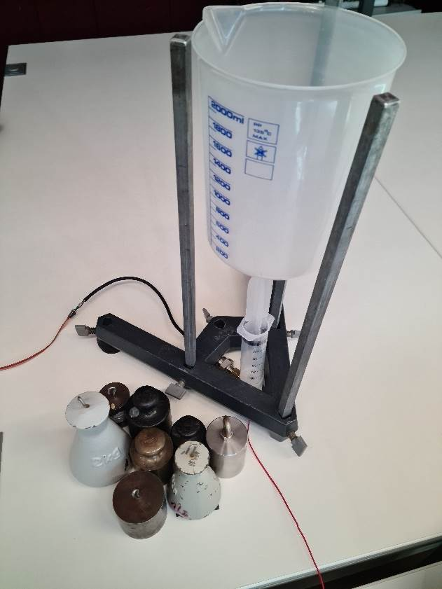 Abbildung 1: Versuchsaufbau für einen isothermen Prozess 

Die Messwerte können entweder extern (beispielsweise in einem Tabellenkalkulations- oder einem Datenvisualisierungsprogramm) oder intern von PhyPiDAQ erfasst werden. Bei Erfassung mit PhyPiDAQ können die Messwerte im Anschluss in Form einer CSV-Datei exportiert werden. Bei der folgenden Durchführung soll die erste Option gewählt werden, da nicht viele Messpunkte aufzunehmen sind. Um die Reliabilität der Messwerte zu erhöhen, sollen im Folgenden zwei Messreihen nach obiger Anleitung aufgenommen und die Ergebnisse visualisiert werden. Das folgende Schaubild, welches mit Hilfe eines Datenvisualisierungsprogramms erzeugt wurde, zeigt den Verlauf der aufgenommenen Wertepaare im p/V-Diagramm (Differenzdruck _p_ über dem Restvolumen _V_).

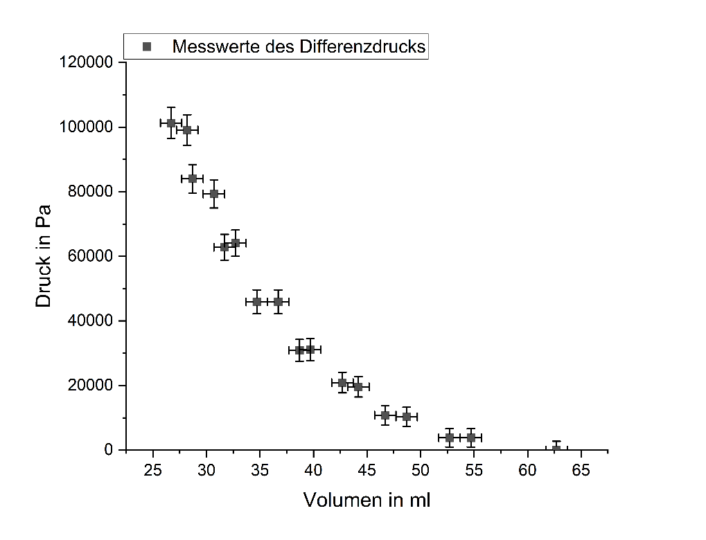

Abbildung 2: Visualisierung der Messdaten eines isothermen Prozesses mit Fehlern
in einem p/V-Diagramm

Mithilfe des Zusammenhangs aus Formel  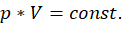  können die Messwerte mit dem isothermen Modell verglichen werden, indem der Zusammenhang, nach dem Druck umgestellt, als Kurvenanpassung genutzt wird  . Hierbei ist zu beachten, dass nicht der Differenzdruck, sondern der Absolutdruck für die Berechnung des Modells maßgebend ist. Der zum Zeitpunkt des Versuchs vorliegende Atmosphärendruck ist somit zu den Messwerten hinzuzurechnen. Bei Berücksichtigung der korrelierten und unkorrelierten Messabweichungen/Fehler ergibt sich das folgende Schaubild.

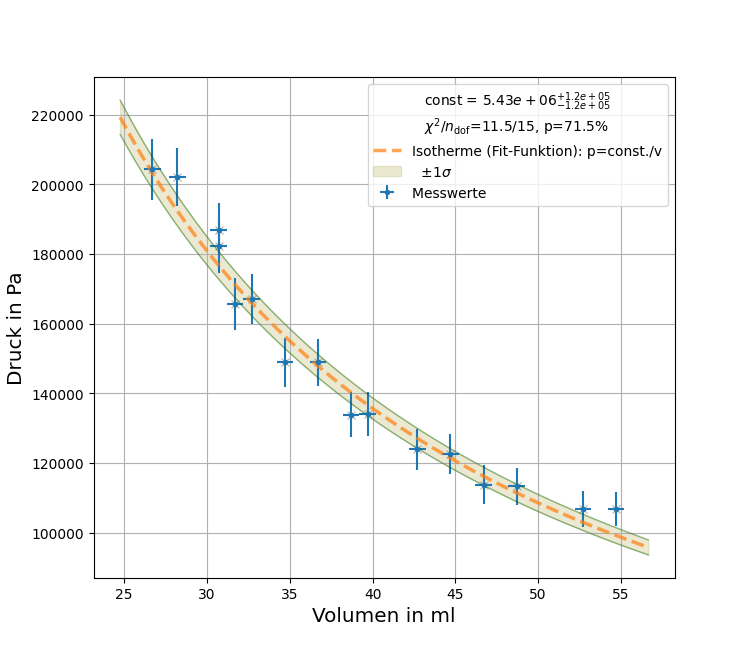

Abbildung 3: Kurvenanpassung an die Messdaten

Aus der Kurvenanpassung der relevanten Messpaare geht der Wert der Konstanten zu
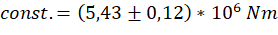  hervor. Die Abweichungen im unteren Druckbereich können durch Haftreibung des Kolbens an der Zylinderwand bedingt sein. Die Abweichungen im oberen Druckbereich können durch den Luftverlust von insgesamt 2 ml bedingt sein. Dennoch zeigen die Messwerte zumindest hinreichend genau den qualitativen Zusammenhang bei isothermer Kompression.

#### Konklusion

Dieses Experiment veranschaulicht hinreichend genau einen isothermen Prozess und den Zusammenhang mit dem Modell nach Boyle-Mariotte trotz einzelner Abweichungen und stellt eine weitere Stufe zur Einführung in das ideale Gasgesetz dar. Die Fehler bieten eine Diskussionsgrundlage und Möglichkeit zur weiteren Auseinandersetzung. Je nach methodischer Gestaltung des Experiments und Schwerpunktsetzung konnten die Lernenden Erfahrungen im Experimentieren und in der Datenerfassung, -visualisierung und -analyse sammeln.

****

### Isobarer Prozess und Wärmeleitung

Dieses Experiment soll mit dem isothermen und isochoren Prozess einen Einstieg in das ideale Gasgesetz bieten, indem einzelne Größen, wie hier der Druck, konstant gehalten und die anderen Zustandsgrößen betrachtet werden. Bei diesem Experiment kann zum einen die Verhältnismäßigkeit nach Gay-Lussac nachgestellt und zum anderen der exponentielle Abfall der Temperatur bei konstantem Druck beobachtet und quantitativ beschrieben werden (Newtonsches Abkühlungsgesetz). Da das Volumen aufgrund der Undichtigkeit nicht hinreichend genau bestimmt werden konnte, ist in der Durchführung lediglich der Temperaturabfall betrachtet worden. Falls – wie im Folgenden beschrieben – mit einem schweren Gewicht hantiert wird, ist dieser Versuch als Vorführexperiment vorgesehen.

#### Didaktische Kernpunkte

Hinweise:

- Kein Vorwissen zum idealen Gasgesetz nötig

- Der Begriff isobar sollte nicht zu früh genannt werden, um die Lernenden kognitiv nicht zu überlasten

- Die Visualisierung sollte so einfach und schülernah wie möglich gehalten werden

- Im Vorfeld ist festzulegen, welche Kompetenzen mit diesem Experiment gefördert werden sollen

Mögliche Ziele dieses Experiments:

- Formulieren von Hypothesen, Aufstellen von Vermutungen zum Verlauf

- Erkennen eines exponentiellen Abfalls der Temperatur bei konstantem Druck

- Auswertung und Visualisierung der Daten

- Überprüfen der Ergebnisse und Vergleich mit dem angenommenen Modell

- Diskussion der Fehlerherkunft

- Mathematisierung des Verlaufs

- Übertragung auf Beispiele in Technik, Natur und/oder Alltag

Bereits im Vorfeld oder auch während des Experiments können Hypothesen über den Verlauf gesammelt werden, worauf weiter aufgebaut werden kann. Hierbei bietet es sich an, Bezug zu Vorgängen/Phänomenen aus Natur, Technik und Alltag herzustellen, um die Prägnanz des Prozesses zu verdeutlichen. Zum Ende der Unterrichtseinheit sollte der Zusammenhang nach Gay-Lussac bekannt sein. 

#### Thermodynamischer Hintergrund

Die isobare Zustandsänderung nach Gay-Lussac beschreibt eine Verhältnismäßigkeit des idealen Gasgesetzes. Diese besagt, dass bei gleichbleibender Temperatur das Produkt aus Druck und Volumen konstant ist:

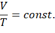

Ausgehend vom ersten Hauptsatz der Thermodynamik für geschlossene Systeme kann dieser Prozess wie folgt hergeleitet werden:

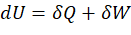

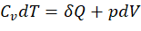

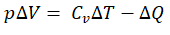

Da die Differenz 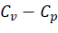  im betrachteten Bereich konstant ist, muss auch der Quotient   konstant sein.

Aus dem Verhältnis 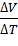  ergeben sich zwei mögliche Szenarien:

- Eine Expansion bei gleichzeitiger Temperaturerhöhung

- Eine Kompression bei gleichzeitiger Temperaturabsenkung

Im Folgenden soll die zweite Variante verfolgt werden, da sie mit dem Versuchsaufbau leichter realisierbar ist.

#### Durchführung

Für die Durchführung werden außer dem Versuchsgerät folgende **Hilfsmittel** benötigt:

- Raspberry Pi inklusive Sensoren/Elektrik und Programm PhyPiDAQ (inklusive vorgefertigter Konfigurationsdatei)

- Schweres Gewicht mit einer Masse von ca. 20 kg

- Ein Aufbau, mit welchem das Gewicht sicher und stabil auf dem Kolbenpleuel platziert werden kann

**Vorgang**:

1. Formulieren von Hypothesen des Verlaufs der Temperatur bei konstantem Druck

2. Starten der Messung über PhyPiDAQ

3. Schnelles Belasten des Kolbens mit dem Gewicht, Notieren des Volumens nach Kompression

4. Betrachten des Verlaufs der Temperatur und des Drucks

5. Wenn Temperatur bei Raumtemperatur angekommen ist: Notieren des Volumens, Entlasten des Kolbens und Speichern/Exportieren der Messwerte

6. Notieren des Atmosphärendrucks, welcher zum Zeitpunkt der Messung vorliegt (für die Berechnungen)

7. Auswerten der Daten und Visualisieren als T/t-Schaubild

8. Diskutieren der Messergebnisse und -abweichungen

9. Mathematisieren des Zusammenhangs

Um die Wärmeverluste durch Wärmeleitung während der Kompressionsphase möglichst gering zu halten, ist auf eine zügige Kompression zu achten. Falls das Volumen exakt gemessen werden kann, ist das Verhältnis 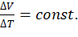  zu bestimmen. Zusätzlich bietet es sich an, den exponentiellen Verlauf der Temperatur über der Zeit zu veranschaulichen:  

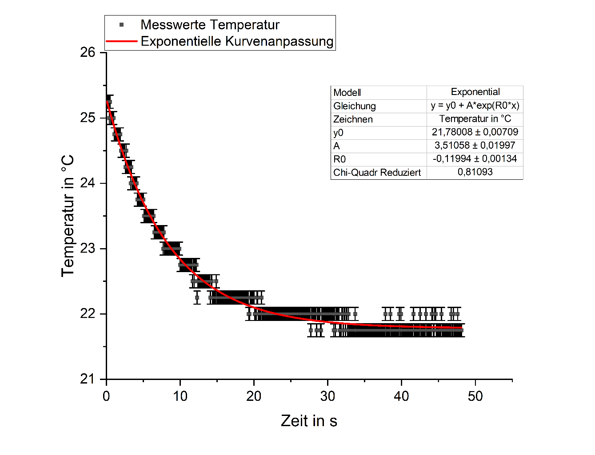

Abbildung 5: Messwerte und Kurvenanpassung des isobaren Prozesses

Zur didaktischen Annäherung an die Messwerte können mehrere Wege, je nach Schwerpunktsetzung der Unterrichtseinheit, gewählt werden. Ein möglicher Weg ist die Veranschaulichung über ein Datenanalyse-Programm und die anschließende Diskussion, mit welcher mathematischen Funktion der Verlauf am besten beschrieben werden könnte. Im weiteren Verlauf können verschiedene mathematische Funktionen an die Messwerte probeweise angepasst und die Genauigkeit der Passung von Funktion zu Messwerten (_Chi-Quadrat reduziert_ beziehungsweise _Chi²/Freiheitsgrad n_ nahe 1) beurteilt werden. Dies ist allerdings erst dann sinnvoll, wenn die Lernenden ein entsprechendes mathematisches Verständnis über Fehleranalyse vorweisen können. Wird sich den Messwerten der Temperatur mit einer exponentiellen Funktion der Form
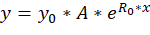  angenähert, so lässt sich eine gute Übereinstimmung mit den Messwerten finden (_Chi-Quadrat reduziert_ beziehungsweise _Chi²/Freiheitsgrad n_ nahe 1), wie in der obigen Abbildung ersichtlich.

Die Messwerte lassen sich in Verbindung mit dem Newtonschen Abkühlungsgesetz bringen, welches besagt, dass die Abkühlungsgeschwindigkeit eines Körpers näherungsweise proportional zur Differenz der Temperaturen von Körper und Umgebung ist:

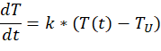

Die Materialkonstante 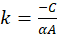  stellt mit der Wärmekapazität  , der Wärmeübergangszahl   und der Fläche  , durch die die Wärme dringt, eine Objektkonstante dar. Die Differenzialgleichung lässt sich zu folgendem Ausdruck hin lösen:

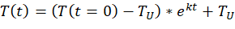

Hierbei stellt 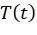  die aktuelle Temperatur, 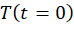  die Anfangstemperatur und 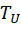  die Umgebungstemperatur dar. Mit den Größen aus der Kurvenanpassung lassen sich die folgenden Werte finden:

  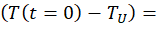 3,51 °C

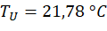  

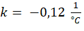  

Durch das Anpassen einer exponentiellen Funktion an die Messwerte konnte somit die Umgebungstemperatur und die Temperaturdifferenz bestimmt werden. Durch Extrapolieren der Messwerte über die maximale Temperatur hinaus kann die Latenz des Thermoelementes herausgerechnet und somit die theoretische Temperatur zum Zeitpunkt der Druckerhöhung bestimmt werden.

Im weiteren Verlauf könnte diskutiert werden, von welchen Eigenschaften die Wärmeleitung abhängt. Somit könnte eine Anbindung an die adiabatische Zustandsänderung geschaffen werden.

#### Konklusion

Dieses Experiment ermöglicht den Lernenden, im Vorfeld Hypothesen zu bilden und während der Messung einen Abkühlungsprozess in Echtzeit zu beobachten. Wird das Volumen und die Temperatur in Echtzeit gemessen, beispielsweise durch Ablesen oder einen weiteren Sensor, kann das Verhältnis nach Gay-Lussac nachgebildet werden. Über das Newtonsche Abkühlungsgesetz kann jedoch auch eine Quantifizierung der Temperaturverlaufs erfolgen. Hierbei stehen der Lehrkraft verschiedene Möglichkeiten der Umsetzung offen, ebenso wie die Tiefe der Mathematisierung und damit Binnendifferenzierung. Ein Transfer auf Phänomene in der Natur, welche ebenso meist isobar verlaufen, bietet sich hierbei besonders an.

****

### Isochorer Prozess

Der isochore Prozess ist der letzte noch verbleibende Prozess auf dem Weg zum idealen Gasgesetz, in welchem eine einzelne Zustandsgröße, hier das Volumen, konstant gehalten wird. Neben der Realisierung mit dem Versuchsgerät wurde in einem Nebenexperiment hierfür ein weit verbreitetes Lehrmittel nachempfunden, womit der Prozess ebenfalls gezeigt werden könnte. Konstruktion, Verwendung und Diskussion dieses Versuchsaufbaus sind im Anhang nachzulesen. An dieser Stelle soll jedoch die Realisierung mit dem aktuellen Versuchsgerät vorgestellt werden.

#### Didaktische Kernpunkte

Hinweise:

- Kein Vorwissen zum idealen Gasgesetz nötig

- Die Durchführung des Experimentes sollte möglichst von den Lernenden selbst oder unter ihrer Beteiligung erfolgen

- Der Begriff isochor sollte nicht zu früh genannt werden, um die Lernenden kognitiv nicht zu überlasten

- Die Visualisierung sollte so einfach und schülernah wie möglich gehalten werden

Mögliche Ziele dieses Experiments:

- Formulieren von Hypothesen, Aufstellen von Vermutungen zum Verlauf

- Bei Schülerbeteiligung: Förderung von Experimentierkompetenz

- Überprüfen der Ergebnisse und Vergleich mit dem angenommenen Modell

- Mathematisierung des Verlaufs

- Übertragung auf Beispiele in Technik, Natur und Alltag

Die Lernziele sind hierbei von der jeweiligen Schwerpunktsetzung abhängig, ebenso welche Kompetenzen konkret gefördert werden.

#### Thermodynamischer Hintergrund

Die isochore Zustandsänderung nach Amontons beschreibt eine Verhältnismäßigkeit des idealen Gasgesetzes. Bei Messung und Auftragen des Drucks und der Temperatur des Prozesses sollte gemäß der Definition eine lineare Funktion zutage treten mit einer konstanten Steigung:

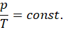

Ausgehend vom Vereinfachten ersten Hauptsatz der Thermodynamik ergibt sich durch Eliminieren der Verschiebeenergie  :

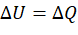

Hieraus können zwei Szenarien abgeleitet werden:

- Erhöhung der inneren Energie 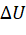  durch Zufuhr von Wärme  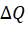

- Absenkung der inneren Energie   durch Abfuhr von Wärme  

Da die innere Energie wie die Wärme von der Temperatur abhängt, folgt aus ihrer Erhöhung beziehungsweise Abnahme auch die Zu- beziehungsweise Abnahme der Temperatur, falls das Volumen konstant ist.

Im Folgenden soll dem zweiten Szenario nachgegangen werden.

#### Durchführung

Unter Verwendung einer Vorrichtung, welche ein gleichbleibendes Volumen garantiert, wie beispielsweise eine handelsübliche Kartuschenpresse, kann hypothetisch über die folgende Vorgehensweise ein isochorer Prozess realisiert werden:

1. Formulieren von Hypothesen des Verlaufs der Temperatur bei konstantem Druck

2. Starten der Messung über PhyPiDAQ, Notieren des Anfangsvolumens

3. Schnelle Kompression des Gases durch Verfahren des Kartuschenpressen-Stempels, bis eine deutliche Temperaturänderung sichtbar wird, Notieren des Volumens direkt nach Kompression

4. Betrachten des Verlaufs der Temperatur und des Druckes

5. Wenn Temperatur bei Raumtemperatur angekommen ist, Notieren des Volumens, Entlasten des Kolbens und Speichern/Exportieren der Messwerte

6. Aus Gründen der Reliabilität und Reproduzierbarkeit der Messwerte sind mehrere Messungen empfehlenswert

7. Notieren des Atmosphärendrucks, welcher zum Zeitpunkt der Messung vorliegt (für die Berechnungen)

8. Auswerten der Daten und Visualisieren als T/p-Schaubild

9. Diskutieren der Messergebnisse und -abweichungen

10. Mathematisieren des Zusammenhangs

Da handelsübliche Kartuschenpressen einen geringeren Verfahrweg haben als die Gesamtlänge des Prototyps, muss bei dem Zusammenfügen bereits der Stempel geringfügig eingedrückt werden, wie in folgender linken Abbildung ersichtlich.

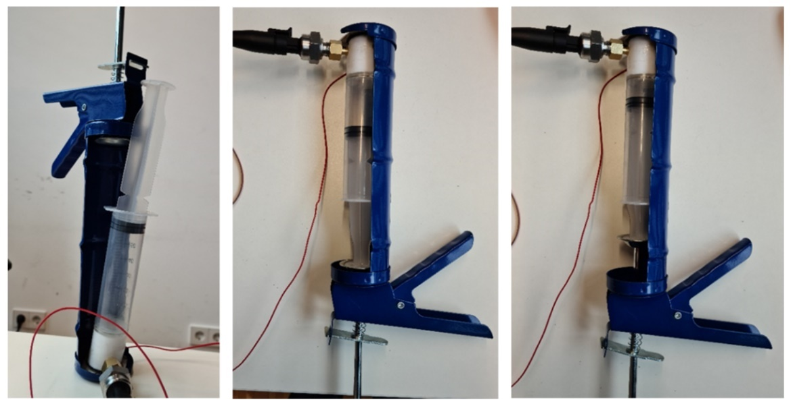

Abbildung 6: Beispielhafter Aufbau für einen isochoren Prozess

Ist der Prototyp eingelegt (mittleres Bild) und die Messung gestartet, kann mit dem Komprimieren begonnen werden. Da dies in Schüben durch das Betätigen des Hebels geschieht, ist auf dem Echtzeit-Schaubild eine sprunghafte Erhöhung des Druckes und der Temperatur wahrzunehmen. Ist die Kompression mit der Hand schnell auf maximal erreichbaren Druck erfolgt (rechtes, obiges Bild), kann ein Abfall der Temperatur und des Druckes beobachtet werden, wie in folgender Abbildung ersichtlich.

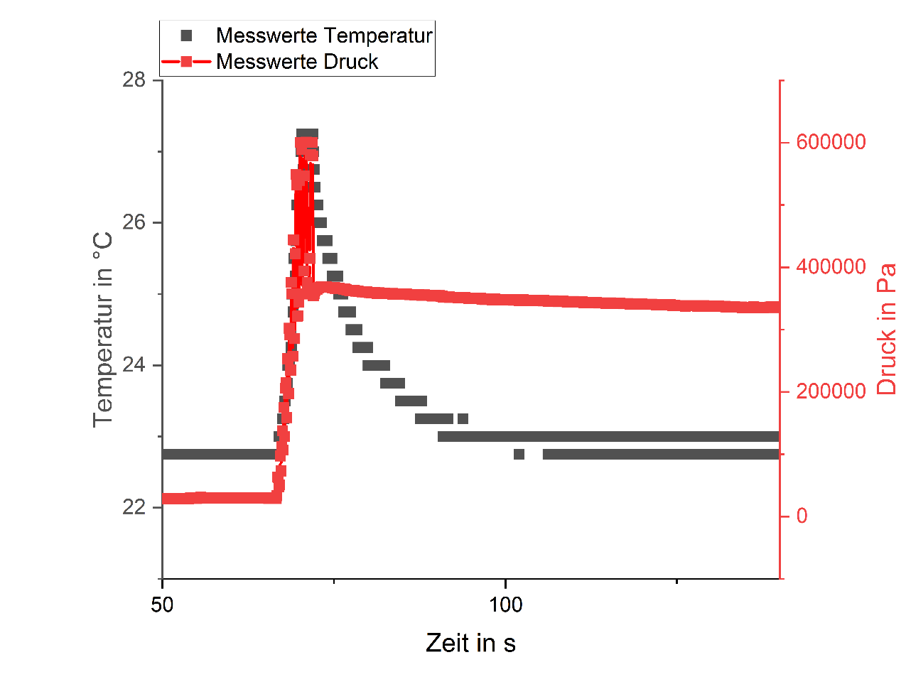

Abbildung 7: Schaubild einer gesamten Messung über der Zeit, ohne Fehlerangaben

 

Aus Gründen der Übersichtlichkeit sind die Messpunkte des Drucksensors mit einer Linie verbunden und Fehlerbalken unterdrückt. Die Druckspitzen waren durch die Mechanik der vorhandenen Kartuschenpresse bedingt, da diese nach Kompression einrasten musste. Hierdurch, und durch den stattgefundenen Luftverlust von 3 ml, ist der auszuwertende Bereich einzugrenzen und die Fehler anzupassen.  Wird der Druck über die Temperatur im relevanten Bereich dargestellt und eine lineare Kurvenanpassung vorgenommen, ergibt sich folgendes Schaubild.

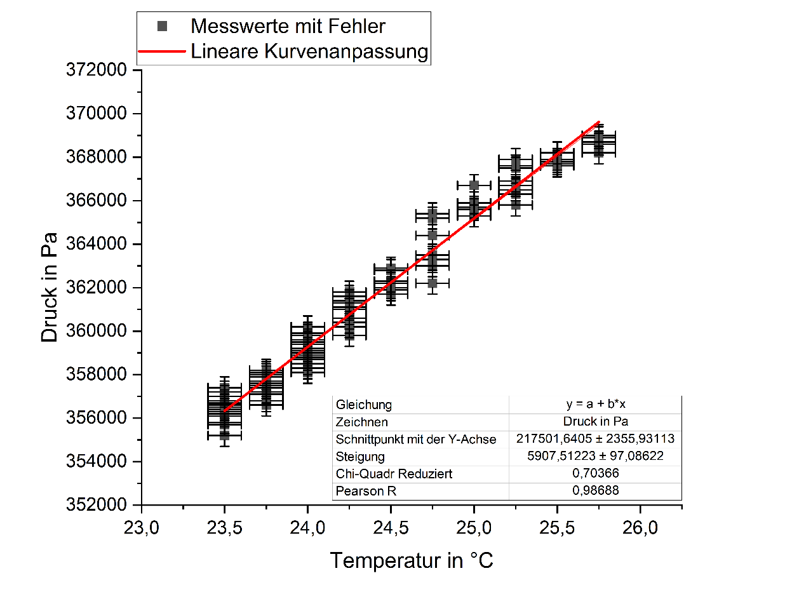

Abbildung 8: Anpassung einer linearen Funktion an den relevanten Messbereich

Bei einer isochoren Zustandsänderung sollte eine lineare Funktion zutage treten mit der folgenden Steigung:

Wird über das ideale Gasgesetz die Konstante berechnet, ergibt sich – im Gegensatz zur gemessenen Steigung – ein deutlich kleinerer Wert:

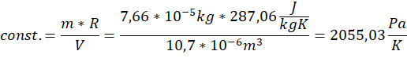

Die deutlich größere Steigung der linearen Anpassung, welche aus einem überproportionalen Druckabfall folgt, ist auf den Luftverlust der Spritze zurückzuführen.

Bei Anpassung der Fehler auf 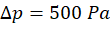  und 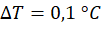  ergibt sich dennoch ein hinreichend genauer linearer Zusammenhang mit einem Chi²/Freiheitsgrad n von 0,7\.

Um eine solche Verfälschung der Messwerte durch Luftverlust zu vermeiden, wäre neben einer weiteren Modifikation des Prototyps das Einstellen eines geringeren Druckes zielführend.

#### Konklusion

Mit diesem Experiment kann die letzte der drei Abhängigkeiten, welche zum idealen Gasgesetz führen, dargestellt werden. Durch die Druckspitzen und den Luftverlust ist zwar der auszuwertende Bereich einzugrenzen und die Fehler anzupassen, jedoch kann eine nahezu konstante Verhältnismäßigkeit reproduziert werden. Mit anderen Kartuschenpressen können die beobachteten Druckspitzen wahrscheinlich vermieden werden. Das Durchführen des Experimentes von oder mit Beteilung der Lernenden fördert das aktive Rezipieren unter anderem durch das eigene „Fühlen“ des Druckes, welcher für eine Temperaturerhöhung notwendig ist. Durch die Möglichkeit, den aufgebauten Druck durch Betätigen eines Löse-Hebels schlagartig abzubauen, ist mit diesem Versuchsaufbau ebenso eine Quasi-adiabatische Expansion und die darauffolgende Abkühlung sehr gut darstellbar. Da isochore Zustandsänderungen besonders im Alltag und in der Technik wiederzufinden sind, bietet sich ein Transfer hierauf an.

  

****

### Adiabatische beziehungsweise isentrope Zustandsänderung

Mit diesem Experiment lässt sich eine quasi-isentrope beziehungsweise quasi-adiabatische Zustandsänderung anhand schwerer Gewichte, hoher Drücke und sichtbaren Temperaturerhöhungen veranschaulichen. Die Lernenden erhalten die Möglichkeit des Einblicks in das Wesen der Naturwissenschaft: Durch das Experimentieren und Betrachten des Verlaufs der Temperatur und des Drucks stellen sie Vermutungen zu der wechselseitigen Beziehung auf. Durch den Vergleich mit dem theoretisch erwarteten Verlauf stellen sie Vermutungen zu der Herkunft der Abweichungen auf, welche im Folgenden mathematisch fortgeführt werden können. Das Ausmaß der Diskussion der systematischen und statistischen Fehler ist hierbei selbstverständlich der Lehrkraft überlassen, ebenso die Gestaltungsfreiheit des gesamten Lernsettings (darbietend, genetisch, problemorientiert etc.).

#### Didaktische Kernpunkte

Hinweise:

- Das Vorwissen der Lernenden zum idealen Gasgesetz sollte durch die vorangegangenen Experimente vorhanden sein

- Der Begriff „isentrop“ oder „adiabat“ sollte höchstens zum Schluss erwähnt werden, um die Lernenden kognitiv nicht zu überfordern

Mögliche Ziele dieses Experiments:

- Formulieren von Vermutungen zum erwarteten Verlauf der Temperatur

- Annehmen eines Modells und Berechnen der erwarteten Temperatur nach der Kompression

- Erkennen eines Zusammenhangs zwischen Volumenreduktion, Druckerhöhung und Temperaturerhöhung

- Analyse der Ergebnisse und Vergleich mit dem angenommenen Modell

- Diskussion der Fehlerherkunft

- Für Fortgeschrittene: Überarbeiten des Modells und Erklären des Verlaufs anhand des neuen Modells

- Erkennen eines Zusammenhangs zu Vorkommnissen in Technik, Natur oder Alltag

#### Thermodynamischer Hintergrund

Die isentrope Zustandsänderung stellt ein idealisiertes Modell dar, nach welchem alle Vorgänge reversibel und adiabatisch ablaufen. Solch eine Zustandsänderung zeichnet aus, dass sie zu jeder Zeit Gleichgewichtszustände durchläuft (unendlich langsam stattfindet) und ideal isoliert von der Umgebung ist. Dass Prozesse dieser Art, obwohl sie in der Natur nicht vorkommen, näherungsweise nachgebildet werden können, ist eine gute Isolation von der Umgebung und/oder eine sehr schnelle Prozessdurchführung vonnöten (Reduktion der Wärmeabgabe an die Umgebung). Die bereits erwähnten mathematischen Zusammenhänge sind hier ebenso anwendbar und sollen an dieser Stelle nicht nochmals wiedergegeben werden. Eine Anwendung der Zusammenhänge auf das Experiment erfolgt im jeweiligen Abschnitt.

#### Durchführung

Für die Durchführung werden außer dem Versuchsgerät folgende **Hilfsmittel** benötigt:

- Raspberry Pi inklusive Sensoren/Elektrik und Programm PhyPiDAQ (inklusive vorgefertigter Konfigurationsdatei)

- Schweres Gewicht mit einer Masse von ca. 20 kg

- Ein Aufbau, mit welchem das Gewicht sicher und stabil auf dem Kolbenpleuel platziert werden kann. Beispielsweise mithilfe eines Stativfußes (z.B. von Phywe), einem Gefäß und Stäben wie in Abbildung 4 dargestellt.

**Vorgang**:

1. Starten der Messung über PhyPiDAQ

2. Belasten des Kolbens mit dem Gewicht und Beobachten des Druckes und der Temperatur, möglichst schnell und ohne Druckspitze (Achtung: Verletzungsgefahr!)

3. Entlasten des Kolbens, sobald die Temperatur sein Maximum erreicht hat. Wenn mit dem Entlasten gewartet wird, bis die Temperatur auf Umgebungstemperatur abgeklungen ist, kann diese Messung ebenfalls für eine anschließende Thematisierung des isobaren Prozesses genutzt werden

4. Zur Erhöhung der Reliabilität ist es empfehlenswert, die Schritte drei bis vier Mal zu wiederholen, um eine Fehlerbetrachtung durchführen zu können

5. Auswerten der Daten und Visualisieren als T/t- und T/p-Schaubild

#### Aufnahme und Analyse der Messungen

Für die Präsentation dieses Versuchs wurde die Belastung mit dem Gewicht sieben Mal wiederholt, um eine aussagekräftige Fehleranalyse durchführen zu können. Während der einzelnen Messungen lässt sich bereits in Echtzeit ein deutlicher Temperaturanstieg mit der Druckerhöhung erkennen, wie anhand einer Messung in folgender Abbildung veranschaulicht.

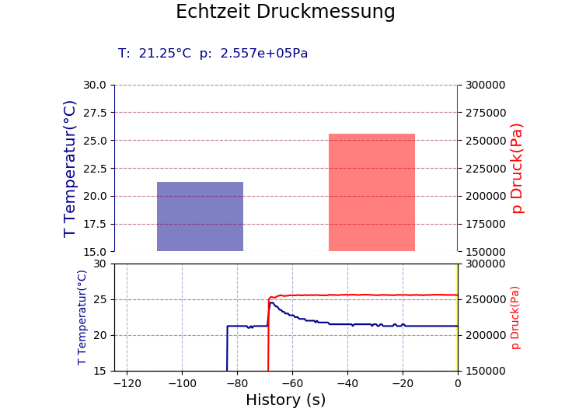

Abbildung 9: Ausschnitt aus der Messung einer isentropen/adiabaten Zustandsänderung

Werden die Messwerte nach den Messungen in ein Datenvisualisierungsprogramm importiert und vergrößert in einem T/t-Diagramm aufgetragen, lässt sich der leicht verzögerte Temperaturanstieg durch die Druckerhöhung erkennen:

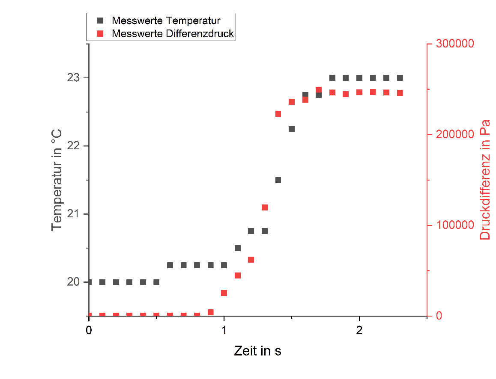

Abbildung 10: Visualisierte Messwerte der isentropen/adiabaten Zustandsänderung
(Messung von 200,0-202,3 s)

Bei allen Einzelversuchen zeigte sich ein ähnlicher wie der folgende Verlauf. Hierbei ist anzumerken, dass die einzelnen Wertepaare der Messreihen nicht zu Mittelwerten zusammengefasst werden konnten, da sie alle unterschiedliche Wertepaarungen aufwiesen.

Wird nun bei Betrachtung der Temperatur von einem isentropen Modell ausgegangen, kann dieses durch den isentropen Zusammenhang mit 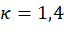  (trockene Luft als Medium) beschrieben werden:

Vom Anfangsdruck und der Anfangstemperatur aus beginnend (bei Annahme hinreichender Genauigkeit der anfänglichen Messwerte) ergibt sich der folgende theoretische Verlauf:

Abbildung 11: Vergleich der Messwerte einer Einzelmessung mit dem theoretischen Verlauf einer Ideal-isentropen Zustandsänderung mit Isentropen-Exponent κ=1,4

Hieraus ist zu erkennen, dass die Temperatur theoretisch deutlich höher ansteigen sollte, als es in den Messungen der Fall ist. Hierbei wurde auf die Angabe von Fehlern zwecks der Übersichtlichkeit verzichtet.

Zur Verdeutlichung kann die theoretische Endtemperatur ebenfalls berechnet werden: Mit einem üblichen Ausgangsdruck von 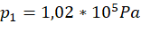 , einer Ausgangstemperatur von 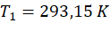  und einem maximalen Absolutdruck von 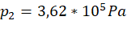  ergibt sich beispielsweise eine theoretische Temperatur von __ 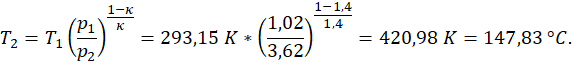__

Dies entspricht einer Temperaturdifferenz von 127,83 °C.

Die maximale, **gemessene** Temperaturdifferenz beträgt jedoch lediglich 3°C.

Im Folgenden sollen die Ursachen der Messabweichungen diskutiert und das ideale Modell, welches bisher angenommen wurde, durch ein realeres Modell ersetzt werden.

#### Fehleranalyse und Modellanpassung

**Analyse der Rahmenbedingungen**

Die bisherigen, idealisierenden Modellannahmen sind folgende:

- Ideales Gas

- Konstante Wärmekapazitäten

- Vernachlässigung der kinetischen und potentiellen Energien

- Isentrope Zustandsänderungen (adiabatisch und reversibel)

- Vernachlässigung des Einflusses eines eventuellen Massenstroms (Luftentweichen)

Im Allgemeinen kann das verwendete Arbeitsgas (Luft) hinreichend genau als ideales Gas aufgefasst und durch die geringe Dichte und das abgeschlossene System weiterhin die kinetische und potentielle Energie der Gasteilchen vernachlässigt werden. Die Wärmekapazitäten können ebenso aufgrund der geringen Druck- und Temperaturänderungen weiterhin als konstant aufgefasst werden. Der eventuelle Massenstrom sollte in dem auftretenden Ausmaß hauptsächlich einen Einfluss auf das Volumen haben, was jedoch bereits als „Fehler“/Messungenauigkeit berücksichtigt ist. Die Annahme, welche hierbei fallen gelassen werden muss, ist die isentrope. Jeder reale Prozess erzeugt Entropie, vor allem bei einer Abkühlung ist die isentrope Annahme unverhältnismäßig.

Da eine im Gegensatz zum (idealisiert) berechneten Wert eine deutlich geringere Temperatur gemessen wurde, erscheint es sinnvoll, als nächstes den Prozessraum näher zu betrachten. Das Gasvolumen ist im Gegensatz zu beispielsweise dem analogen Experiment „Mariotte’sche Flasche“ deutlich geringer, somit besteht eine größere Berührungsfläche zur Außenwand proportional zum Volumen, welche Wärme abführen kann. Da weiterhin die Wärmeleitung von den Eigenschaften der Wände/Bauteile abhängt, sollen diese ebenfalls betrachtet werden. Die mit dem Arbeitsgas unmittelbar in Kontakt stehenden Bauteile sind folgende:

- Teflon (Sockel)

- Polypropylen (Spritze)

- Messing (Schlauchtülle Drucksensor)

- Zinn (Thermoelement-Messspitze)

Während Teflon mit dem größten Volumen eine vergleichbar hohe Wärmekapazität wie Luft hat, weist das Messing der Drucksensor-Schlauchtülle und das Zinn des Thermoelements mit einem kleinen Volumen eine geringe Wärmekapazität auf. Dementsprechend leiten das Teflon und das PP im Gegensatz zum Zinn und Messing schlecht die entstehende Wärme und sollen deshalb vorerst nicht betrachtet werden. Eine Ausdifferenzierung erfolgt im Anhang. Trotz, dass die Zustandsänderung rapide erfolgt ist, scheint es Verluste durch Wärmeleitung zu geben. Diese sollen in einer neuen Modellannahme berücksichtigt werden.

**Annahme eines neuen Modells**

Der vorhandene Prozess soll statt als isentrope nun als polytrope Zustandsänderung betrachtet werden. Hierzu sollen die Messwerte in ein Datenanalyse-Programm eingegeben werden und eine Modellanpassung über den polytropen Zusammenhang stattfinden:

Wird 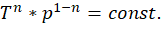  nach _T_ umgestellt, ergibt sich die Funktion  
mit welcher eine Modellanpassung über die Bestimmung des Parameters _n_ und der Konstante _const_ möglich ist. Mit den jeweiligen aus einer Fehlerrechnung stammenden statistischen und systematischen Fehlern ergibt sich das folgende Schaubild.

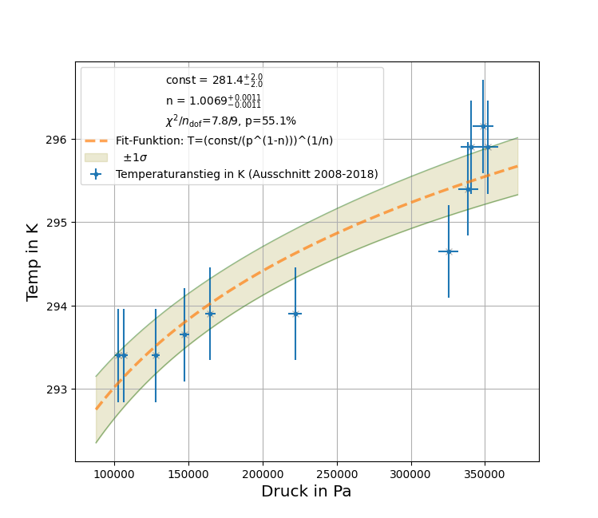

Abbildung 12: Messwerte mit Kurvenanpassung des polytropen Modells mit angepassten Fehlern

Das Verhalten der Messwerte, welche bei allen der sieben Messungen mit geringer Abweichung dasselbe ist, sollte theoretisch dem polytropen Modell entsprechen. Über den Verlauf lässt sich ein Rückschluss auf das Verhalten der Materialien des Prototyen im Allgemeinen und auf das Verhalten des Thermoelementes im Speziellen ziehen: Auf eine abrupte Temperaturerhöhung reagiert das Thermoelement zunächst mit einer geringen Verzögerung/Latenz. Neben der Erwärmung des Luftvolumens und der Wände/Bauteile verzögert die Erwärmung der Messspitze des Thermoelementes ebenso die Messung des Temperaturanstiegs. Während im weiteren Verlauf das Thermoelement der Temperaturerhöhung folgt, kühlt sich die Luft wieder durch Wärmeübertragung ab. Diese Umstände können zu dem vorgefundenen Verhalten geführt haben.

Die vom Datenanalyse-Programm ausgegebenen Werte können ebenso analytisch berechnet und nachvollzogen werden. An dieser Stelle soll auf den entsprechenden Anhang verwiesen werden. 

#### Konklusion

Dieses Experiment ermöglicht den Lernenden einen Einblick in das Wesen der Naturwissenschaften: Aus anfänglichen Hypothesen folgt ein Modell, dessen Wahrheitsgehalt durch Experimente falsifiziert werden muss. Falls das Modell den gemessenen Verlauf nicht hinreichend genau beschreibt, muss es durch eine anschließende Überprüfung und Eingrenzung der Annahmen angepasst werden, bis es die Messwerte hinreichend genau beschreibt. Hierbei bieten Fehler vielmehr das Potential, die Lernenden kognitiv zu aktivieren und in das Wesen der physikalischen Datenanalyse einzuführen, als dass sie als ein Indikator für eine eventuelle Schwäche des Experiments aufgefasst werden sollten. Da die hier gemessenen Wertepaare dem Modell lediglich beim Anfangs- und beim Enddruck entsprechen und für die Genauigkeit der Zwischenwerte multiple Einflussfaktoren verantwortlich sein können, ist für die schulische Anwendung im Sinne einer didaktischen Reduktion empfehlenswert, lediglich diese beiden Punkte vor dem Hintergrund des Modells zu betrachten. Da der isentrope beziehungsweise adiabate Prozess nicht im Lehrplan vermerkt und vom Schwierigkeitsgrad für die technische Oberschule zu komplex ist, ist dieser höchstens als Exkurs in stark vereinfachter Form unterrichtbar.

 

### Quasi-Adiabatische Expansion und isobare Erwärmung

Dieses Experiment kann beispielsweise im Anschluss an den isobaren Prozess oder gesondert erfolgen. Der wesentliche Effekt dieses Experiments besteht in der Veranschaulichung, dass ebenso wie die Kompression eines Gases die Temperatur erhöht, die Dekompression sie abfallen lässt. Mit einem geeigneten Aufbau kann dieses Experiment auch mit höheren Massen wie der Masse eines/einer Lernenden durchgeführt werden, da die Höhe der Masse die Höhe der Temperaturabsenkung bedingt. Eine quantitative Auswertung ist hierbei nicht angedacht, jedoch können Einflussgrößen auf den Verlauf der Temperatur diskutiert werden, basierend auf dem Vorwissen zur isobaren und adiabatischen Zustandsänderung. Da sich bei diesem Prozess alle drei bisher erwähnten Zustandsgrößen (Druck, Volumen und Temperatur) ändern, ist auch eine Quantifizierung und Anwendung des idealen Gasgesetzes möglich.

#### Didaktische Kernpunkte

Mögliche Ziele dieses Experiments:

- Formulieren von Hypothesen, Aufstellen von Vermutungen zum Verlauf, ausgehend vom ersten Hauptsatz der Thermodynamik für geschlossene Systeme

- Erkennen eines Zusammenhangs zwischen Expansion, Druck- und Temperaturabfall

- Auswertung und Visualisierung der Daten

- Überprüfen der Ergebnisse und Vergleich mit dem angenommenen Modell

- Übertragung auf Beispiele in Technik, Natur oder Alltag

Die jeweilige Auswahl und Tiefe der jeweiligen Lernziele sind abhängig von der Schwerpunktsetzung der jeweiligen Unterrichtseinheit. Es bietet sich an, durch die Thematisierung der Abkühlung das Prinzip der Kältemaschine (Kühlschrank) und das Themengebiet der Phasenübergänge zu motivieren. Durch eine rasche Expansion kann die kurzzeitige Bildung von Nebel in dem Prozessraum beobachtet werden, welcher sich aus dem in der Luft enthaltenem Wasser bildet. Dieser Vorgang kann verstärkt werden, indem Atemluft in den Prozessraum gepustet wird.

#### Thermodynamischer Hintergrund

**Die Quasi-adiabatische Zustandsänderung** lässt sich aus dem ersten Hauptsatz der Thermodynamik für geschlossene Systeme herleiten:

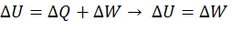

Hieraus können zwei Szenarien abgeleitet werden:

- Erhöhung der inneren Energie   durch Verrichten von Arbeit   am System

- Absenkung der inneren Energie   durch Verrichten von Arbeit   vom System

Das zweite Verfahren soll im Folgenden durchgeführt werden, da die erste Variante bereits im letzten Kapitel thematisiert wurde.

**Die isobare Erwärmung** stellt das Gegenteil der isobaren Abkühlung dar und verdeutlicht, dass die Zusammenhänge wie bei der quasi-adiabatischen Zustandsänderung auch bei einer Umkehrung des Prozesses gültig sind:

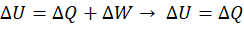

#### Durchführung

Für die Durchführung werden außer dem Versuchsgerät folgende **Hilfsmittel** benötigt:

- Raspberry Pi inklusive Sensoren/Elektrik und Programm PhyPiDAQ (inklusive vorgefertigter Konfigurationsdatei)

- Schweres Gewicht mit einer Masse von ca. 20 kg oder schwerer

- Ein Aufbau, mit welchem das Gewicht sicher und stabil auf dem Kolbenpleuel platziert werden kann, beispielsweise mithilfe eines Stativfußes (z.B. von Phywe), einem Gefäß und Stativ-Stäben.

**Vorgang**:

1. Belasten des Kolbens mit dem Gewicht

2. Starten der Messung über PhyPiDAQ, Notieren des Volumens

3. Schnelles Entlasten des Kolbens, Notieren des Volumens nach Expansion

4. Betrachten des Verlaufs der Temperatur und des Drucks

5. Wenn Temperatur bei Raumtemperatur angekommen ist: Beenden der Messung und Speichern/Exportieren der Messwerte

6. Notieren des Atmosphärendrucks, welcher zum Zeitpunkt der Messung vorliegt (für die Berechnungen)

7. Auswerten der Daten und Visualisieren als T/t-Schaubild

Wenn davon ausgegangen wird, dass in der kurzen Dekompressionszeit kein signifikanter Wärmeübertrag an die Außenwände und Bauteile erfolgt, dann muss die gesamte in der Kompression der Luft gespeicherte innere Energie   in Arbeit 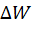  übergehen. Da das Gas am System Arbeit verrichtet, ist das Vorzeichen von   negativ, weshalb auch die innere Energie negativ sein muss. Die innere Energie stellt beim idealen Gas den Zusammenhang der Temperatur mit der Wärmekapazität   dar. Da die Wärmekapazität keinen negativen Wert annehmen kann, muss folglich die Temperatur fallen.

Um die Wärmeverluste durch Wärmeleitung während der Expansionsphase möglichst gering zu halten, ist auf eine zügige Dekompression zu achten. Wurde das Gewicht entfernt, ist zu erkennen, dass die Temperatur mit geringer Latenz rasch abfällt und sich gegebenenfalls kurzzeitig Nebel im Prozessraum bildet. Werden die Messwerte im Folgenden in ein Daten-Analyse-Programm eingegeben und über die Zeit dargestellt,
sollte sich ein ähnliches wie das folgende Bild ergeben:

Abbildung 13: Messwerte des quasi-adiabatischen und isobaren Prozesses ohne Fehleranpassung

Ausgehend von einem Differenzdruck von   auf   hat sich das Gas expandiert, sodass es sich von knapp   auf abgekühlt hat. Der Effekt würde noch höher sein, wenn zum einen eine höhere Druckdifferenz überwunden und zum anderen schneller dekomprimiert würde, wenn möglich auch in den Unterdruck. Technisch setzt die Temperaturmessung der Effektstärke ebenfalls Grenzen (Latenz aufgrund der Wärmekapazität der Thermoelement-Messspitze).

Im Anschluss kann die Erwärmung des Gases mit den Lernenden thematisiert werden, was als ein Transfer des idealerweise bereits gelernten isobaren Prozesses auf eine Erwärmung darstellt. Wird über ein Datenanalyse-Programm auf die Messwerte eine exponentielle Funktion angepasst, ergibt sich mit einem Fehler auf die Temperatur von   das folgende Schaubild.

Abbildung 14: Messwerte und exponentielle Kurvenanpassung des isobaren Prozesses mit Fehleranpassung

Die einzelnen Messpunkte, welche nicht auf der Kurve liegen, sind auf Fehlmessungen des Thermoelementes zurückzuführen. Der Fehler ist beim Thermoelement mit   angegeben, weshalb Fehlmessungen vorkommen können, obwohl die Temperaturmessung des Thermoelementes in der Regel präziser ist. Der Fehler von   wurde entsprechend gewählt, um eine bestmögliche Passung zur Funktion (_Chi²/Freiheitsgrad n_) zu erreichen. Die Kurvenanpassung des relevanten Bereichs zeigt hinreichend genau den Verlauf des isobaren Temperaturausgleichs.

#### Konklusion

Mit diesem Experiment, welches aus der quasi-adiabatischen Expansion (alle drei Zustandsgrößen p, V und T ändern sich) und der isobaren Erwärmung zusammengesetzt ist, lassen sich verschiedene Aspekte der Thermodynamik zeigen. Es wird empfohlen, das Experiment nach dem isobaren und dem adiabatischen Prozess in den Unterrichtsverlauf einzureihen, da einzelne Wissenselemente aus den beiden Experimenten nochmals aufgegriffen werden und weiter vertieft werden können. Da in der Natur viele Prozesse isobarer Natur sind, lässt sich ein Transfer auf den vom Bildungsplan vorgegebenen Schwerpunkt Klimaphysik gestalten. Durch die Anwendung des vereinfachten ersten Hauptsatzes der Thermodynamik wird zudem eine gedankliche Verbindung zum Energieerhaltungssatz der Mechanik hergestellt.

****
****

## Anhang 1 – Konstruktion und Fertigung des Versuchsgerätes

 Abbildung 15: FertiggestelltesVersuchsgerät

**Grundlegendes zur Fertigung**
Das Versuchsgerät besteht aus einer handelsüblichen Kunststoffspritze, welche an einen Teflonsockel geklebt ist, an dem zwei (oder ggf. drei) Eingänge vorgesehen sind: Einen für den Drucksensor (über eine Messingtülle verbunden), einen für das Thermoelement und ggf. einen für ein Drosselventil. Da das Drosselventil zu Undichtigkeiten geführt hat, wurde es letztendlich entfernt und die Bohrung verschlossen. Sinnvoll ist allerdings, eines für die Zu/Abfuhr von Gasen zu verwenden. In der folgenden Fertigungsanleitung ist der Einbau dieses Ventils deshalb belassen worden. Auf den folgenden Bildern ist statt einer Sacklochbohrung eine Durchgangsbohrung mit schwarzer Montagepaste zu sehen, da die Bilder von einer Vorgängerversion des Prototyps stammen. In der Anleitung wird jedoch die aktuelle Vorgangsweise beschrieben. Zum Nachbau des Versuchsgeräts wird die folgende Handlungsempfehlung gegeben, wobei anzumerken ist, dass dies keinen vorgegebenen Ablauf darstellt und gerne auch andere/weitere Schritte gegangen, Materialien verwendet oder Fertigungsweisen verfolgt werden können.

**Benötigte Materialien:**

Tabelle 1: Materialien für Versuchsgerät

| Bezeichnung | Präzisierung | Preis[[1]](#_ftn1) und Herkunft[[2]](#_ftn2) |
| --- | --- | --- |
| Teflon-Rundstab | Höhe  ,Durchmesser  (Sockel) | 2,63 €, [ebay](https://www.ebay.de/itm/322980107343?hash=item4b331d544f:g:KWQAAOSw79Zi2Pjt&var=513618673696) |
| Blech | Aus beispielsweise Aluminium, Stärke  , Abmaße     | 7,09 €, [ebay](https://www.ebay.de/itm/283343496803?hash=item41f896a663:g:7TEAAOSwSLljLFXI&amdata=enc%3AAQAHAAAA4G7XswmQzxZJBhIbAIYWNhpMVYJ59InCWdRDXHqBbqofG49xc6LZmAOhTK8TOJzN4twqgZhxk5Fc2ITTlcrya5uDcxl0HqSlxwIa3uJmB%2BfopA6paTlpIRR45m1xOQDoB1kAlvGuTHaWvxBqZSvqk1cTjbwenwHxEvZlQ7b509mA%2BTBrr4qWFSnnDQZEymQtm3P63TkjDbPzWOE2XDdodqQ2GeVNTdRe7zaYkiew0wL3otA4wLzpokOXYFNcUgRbRAHL5dAq3vVmUpc7WkpoRgm843x0%2Bh9xDybESZ1ptZQY%7Ctkp%3ABFBMopihmOFh) |
| Kunststoffspritze | PP, Inhalt: _V =_ 60 ml | 3,60 €, [ebay](https://www.ebay.de/itm/253747442202?hash=item3b1486b21a:g:vmgAAOSwSbxbRyXB&amdata=enc%3AAQAHAAAA0LutqjqDNS1Iqh%2B0xbCNN9tpI5Bh%2BF4HesAhDqdAoN%2FAtyity5E%2F1PJnS5Kqh3PqyG3LwpqXiMu0a4mdyFnIMdEkAXGw554tacLYSSI1Hej8%2Bg%2BVpBpl5sLvV754YwmVpPrYDTynBo%2BvIKezFAH%2F7cAaZArHKX%2Bx9vQMZma9BxJNofRPqy1ppEK%2FA84Sz2QjTrdYGqA%2FVgKDI31m9vpVMk2TnFjCWWF9DGYkty7vI7ccXVcS%2FPy6sh537kO1OnO3z0ms0YAWMheLZGwY9OaHgec%3D%7Ctkp%3ABk9SR9j01JjhYQ) |
| Drucksensor | mit Außengewinde G¼, 150 PSI | 13,92 €, [ebay](https://www.ebay.de/itm/402770412647?hash=item5dc6fcc467:g:vkUAAOSwfp1bq5PE&amdata=enc%3AAQAHAAAA4BiFGuhC3hTy1a9kn%2BXysy0SU8ByX6AR9kkig7ZkazsMgoeok%2FLJQzjqDZOyZ9E3UHtku47r7Y51g%2FWKo%2FQ4G0YV%2B8CB6h%2BdSB640eN5MfaGhvuaLOUzGZdaaUVjKwWjL%2BFP7cxbrWuzjeR8LYUt1SOsheRIl02DxZT5imWXyQsU3KZAss9qrYBBiMJkihUIghqxpfG50kquv%2FJeEJ85mwV7cUm%2BxutXhU2tV7N43OoOu1BUwnPSwQ0bBQB91rBppuX%2FGHikYrlSxyYnBQUW8BpHWQzqKZP%2FG0vt90C1aV84%7Ctkp%3ABFBMtKPjmOFh) |
| Thermoelement | Typ K | 9,99 €, [conrad](https://www.conrad.com/p/voltcraft-tp-202-air-probe-0-up-to-250-c-sensor-type-k-1661476) |
| Verstärkerboard | MAX31855 | 14,83 €, [exp-tech](https://www.exp-tech.de/sensoren/temperatur/4841/adafruit-thermocouple-amplifier-max31855-breakout-board-max6675-upgrade-v2.0) |
| Druckluft-Ventil | Mit Gewinde, z.B. M5, mind. 5 bar luftdicht | 3,99 €, [ebay](https://www.ebay.de/itm/124891176560?hash=item1d14181e70:g:UdsAAOSwA0Big5jn&amdata=enc%3AAQAHAAAAwHHS3rGMyFTbB%2BDrvnAvZ5EbkESTi2IiW8MkBmBEzMZXN4IShTZB9AvaRvzWiJ3YTMX%2FK3HPuqACfxJ61bOjV9unNgxr70LBs23fAHV%2Fp%2Bynh5gmDKNuhNxbGi%2Fwl7Tx3wzC6%2Bboa85BXDcz9Ow%2B3fFWGNOAvtXtWrfreTFtY%2F8REBKHarZetLJzi4fKPkBvA9%2Bxc0Mhl9rAqUlRfy3rXJnBfDDBV6BOc9quX%2BjdFdeq5Zwp2HNvOVoK4XLF2hS8qw%3D%3D%7Ctkp%3ABk9SR7L0sZnhYQ) |
| Sekundenkleber | _m_ < 20 g, mittelviskos | 3,80 €, [ebay](https://www.ebay.de/itm/261967784395?hash=item3cfe7f29cb:g:hdsAAOSwMyhiid~D&amdata=enc%3AAQAHAAAA0IR0gemyewvzR693zUm6HBcqPm7WbDkw46gnudVau2t5LZOceLdzjBLUxY1oLlwTyJt0ZTUI94sVFUSWqbxuOcL2IQb9C7tnDtlxJ4eSo1x6bdDkHId8xMKiVz7tjq6qiuSHt9%2BJxH58vof4GdJpyK6PI2h5Xj6uV0c3cfmoFoOJf1aHAg5glfgoEAePrMIjSn7ue%2BkKvYMfxkaupyGOJjah1%2BBvwxRoNJnYSXVJKdiuYej%2Fak%2BZiCCrnMOS%2FT5UJJQCpyzLuMgZj11juBrMO1A%3D%7Ctkp%3ABk9SR9q51JnhYQ) |
| Primer | Für Vorbereiten des Verklebens | 3,95 €, [ebay](https://www.ebay.de/itm/291308265832?hash=item43d3536168:g:IV4AAOSwYPtih7pT&amdata=enc%3AAQAHAAAA4FsmP0SSRdO04EzWmVoB2IOL%2BclP0yc3gwaWUO92Uad%2FdSkn4PjXo%2FvZTEGqw8UYilapXXbj9F0hBQ1TCvsd9VT%2FZIMzkQ9zhVX2hsez0Y3T3Pc%2Bw8ZsAqnCMuMjGAcG42B%2FHdQpbxZOA64kt0VO8%2BVoD8nC27eElnh0nwaJGgKMhU3elbZP0W%2BDLUbvND6sJYzi%2FBWwp5Lj9HRh6EVo1yxthx%2BsVXq8UapBVGCzDtD7bMSMJKO73zM4l2b2ywEwtLKgju2olMVpyr2c6aDk3QtEQduqlkTQCEIONt73SkMB%7Ctkp%3ABk9SR8Cy2pnhYQ) |
| Verbindungsschrauben | 3-4 Stk., klein, ca. 3x15 | 0,10 €, Baumarkt |

Das Ventil sollte höhere Drücke (> 5 bar) standhalten können. Ein Drossel- oder Einweg-Ventil für Pneumatik-Anwendungen wäre am sichersten). In den folgenden Bildern ist ein simples Aquarienventil abgebildet. Dieses bitte nicht benutzen, da es Undichtigkeiten aufwies (und später ausgebaut wurde).

**Werkzeug**

- Metallsäge, Halbrundfeile, Schleifpapier, Messer

- Bohrmaschine/Akkuschrauber, Stahlbohrer (Durchmesser: 2 mm, 4,7 mm, 6 mm, 10 mm), Gewindebohrer M5 und Kegelsenker (Anfertigen der Bohrungen)

- Einmalhandschuhe und Schutzbrille (Hantierung mit Sekundenkleber)

**Konstruktionszeichnung**

Abbildung 16: Konstruktionszeichnung, Erstellt durch Open-Source-Software FreeCAD

**Fertigungsanleitung**

1. Teflon-Sockel auf Maß trennen (h = 35 mm, Durchmesser = 32 mm (Spritzendurchmesser)) und eine Sacklochbohrung mit einem 10 mm-Bohrer durchführen

2. Ca. 10 mm über Sockelboden (am Ende der Sacklochbohrung) die zwei bis drei Bohr-Stellen anzeichnen, jeweils 90° oder 180° versetzt

3. Für Drucksensor-Durchgang Bohrung mit einem 6mm-Bohrer durchführen

4. Für Thermoelement-Durchgang Bohrung mit einem 1,5 mm-Bohrer durchführen

5. Für das Ventil mit dem entsprechenden Bohrer (in diesem Fall einem 4,7 mm-Bohrer) vorbohren und mit dem entsprechenden Gewindeschneider (in diesem Fall der Größe M5) behutsam ein Gewinde schneiden (Teflon ist sehr weich)

Abbildung 17: Vorbohren und Gewindeschneiden für das Ventilgewinde

6. Die Oberseite des Sockels mit einem scharfen Werkzeug anschrägen, sodass der Spritzenkopf an allen Kontaktflächen anliegt. Der Auslass der Spritze kann etwas gekürzt werden, falls dieser zu lang sei

7. Die anderen Bohrungen säubern und mit dem Primer vorbehandeln

8. Nach frühestens 15 min. das Gewinde des Ventils und das geschnittene Innengewinde des Sockels mit Sekundenkleber vernetzen und das Ventil bis zum Anschlag in den Sockel eindrehen

Abbildung 18: Vorbereiten der Kontaktflächen und Einkleben des Ventils

9. Die Schlauchtülle (Schlauch 6mm an G1/4-Innengewinde) und das (kalibrierte) Thermoelement mit Sekundenkleber an den jeweiligen Stellen mit dem Sockel verkleben. Hierbei bitte darauf achten, dass die Messspitze des Thermoelementes in der Mitte des Prozessraums positioniert ist und **nicht** mit Sekundenkleber benetzt wird

Abbildung 19: Mittiger Sitz der Thermoelement-Messspitze. Auf diesem Bild ist eine Montagepaste zu erkennen, welche hier jedoch nicht (mehr) vorgesehen ist, da statt einer Durchgangsbohrung eine Sacklochbohrung realisiert werden soll

10. **Optional**: Bodenplatte (Alu/Blech) auswählen (mind. 1 mm dick wegen Biegesteifigkeit), auf ca. 40x40 mm zuschneiden und entgraten. An drei bis vier Stellen ist das Blech mit einem 2mm-Bohrer zu durchbohren und die Bohrungen anzusenken, um eine stabile Verbindung zum Teflonsockel und eine gute Standsicherheit zu gewährleisten

Abbildung 20: Vorbereiten des Bleches (hier mit vier statt drei Bohrungen)

11. Nach einer Aushärtezeit von ca. einem Tag den Sockel an den drei bis vier Punkten der Blechbohrungen mit einem 2mm-Bohrer 15 mm tief vorbohren (**Achtung**: Nicht die seitlichen Eingänge anbohren!) und die Bodenplatte und den Sockel mit drei bis vier Schrauben (klein, ca. 3x15) verschrauben

12. Den Sockel säubern und die Kontaktfläche mit dem Spritzenzylinder mit Primer vorbehandeln

13. Nach frühestens 15 min. die Spritze und den Sockel mithilfe von Sekundenkleber verkleben.

Abbildung 21: Verklebte Spritze

**Zusatzinfo**: Falls die Verbindung von Sockel zu Spritze noch zu instabil ist (wie auf obigem Bild zu sehen ist), kann mit Epoxidharz oder Heißkleber der verbleibende Zwischenraum verfüllt werden. Das lässt sich im Vorfeld vermeiden, indem der Sockels noch exakter an die Spritzenform angepasst wird

Abbildung 22: Verfüllter Zwischenraum

14. Nach einer Aushärtezeit von ca. einem Tag kann der Prototyp getestet werden

Wie bereits erwähnt, birgt die Abwandlung von den vorgeschlagenen Materialien und der Fertigung ggf. neue Anwendungsmöglichkeiten. Beispielsweise ist die Einbindung eines Sensors/Aktors, welcher das Volumen digitalisiert, möglich. Weiterhin könnten durch ein Verstärken des Prototyps Experimente mit Körpergewicht durchgeführt werden. Eine weitere interessante Erweiterung wäre die Realisierung eines Kreisprozesses, wofür an einer Stelle ein schneller Wärmeaustausch (Wärmereservoir) geschaffen werden müsste.

Das hier vorgestellte Modell hat sich jedoch als robust und verlässlich erwiesen und ermöglicht trotz einem (derzeitig) geringen Luftentweichen reproduzier- und verwertbare Messwerte. 

## Anhang 2 – Überprüfung und Auswahl passender Temperatursensoren

### Vergleich von ausgewählten Temperatursensoren

Da für die Temperaturmessung prinzipiell viele Sensoren infrage kommen würden, soll eine Auswahl an Temperatursensoren anhand ihrer Eigenschaften und hinsichtlich ihrer Eignung, die Temperatur eines Gases zu messen, miteinander verglichen werden, um den adäquatesten Sensor für diesen Versuch zu finden. Eine Gegenüberstellung von breit eingesetzten Temperatursensoren soll durch folgende Tabelle veranschaulicht und nachfolgend ausdifferenziert werden. Statt eine Übersicht über sämtliche Temperatursensoren darzustellen, soll weiterführend auf diverse Internetseiten, wie [mikrocontroller.net](https://www.mikrocontroller.net/articles/Temperatursensor) verwiesen werden. 

Tabelle 2: Vergleich ausgewählter Temperatursensoren

| Sensoren | Messbereich | Genauigkeit | Wasserresistenz | Weitere Infos |
| --- | --- | --- | --- | --- |
| PT100 | -30-105 °C |    | Vorhanden | Benötigt Verstärkerboard MAX31865 |
| DS18B20 | -55-125 °C |  | Vorhanden | Digitales Ausgangssignal |
| Thermoelement | -200-700 °C |  | Nicht vorhanden | Benötigt Verstärkerboard MAX31855 |

Ergänzend sei anzumerken, dass die Werte und Angaben zu den Sensoren lediglich auf die im Rahmen dieser Arbeit verwendeten Bauarten zutreffen und nicht allgemeingültig zu verstehen sind. Neben dem Messbereich und der Wasserresistenz, der von Bauart zu Bauart unterschiedlich sein kann, unterscheidet sich in vielen Fällen deutlich die Genauigkeit je nach Messbereich. Da die Sensoren prinzipiell alle für eine Temperaturmessung infrage kommen würden, sollen ihre Spezifika im Folgenden näher beleuchtet werden:

 **** 
**Zum PT100**
 
Abbildung 23: Beispielhafter PT100-Sensor inklusive Verstärkerboard MAX31865

* Der PT100 ist ein analoger Temperatursensor, dessen Effekt auf die temperaturabhängige Veränderung des elektrischen Widerstands von Platin zurückgeht.
* Bei 0 °C ist der Widerstand beim PT100 auf 100 Ω normiert. Der PT100 ist etwas schlechter auflösend als der ebenfalls weit verbreitete, aber geringfügig teurere PT1000, welcher bei 0 °C auf 1000 Ω normiert ist. Für diese Anwendung ist der PT100 jedoch ausreichend
* Aufgrund der kleinen Messspannung und der auftretenden Störgrößen muss das Ausgangssignal des PT100 über ein Verstärkerboard wie beispielsweise den MAX31865 verstärkt und Störgrößen kompensiert werden
* Anbindung und Datenübertragung erfolgt über die SPI-Schnittstelle[[3]](#_ftn3) des Raspberry Pi (Anschluss siehe [Adafruit](https://learn.adafruit.com/adafruit-max31865-rtd-pt100-amplifier/python-circuitpython).com)
* Sehr vorteilhaft im Vergleich zu anderen Sensoren ist seine fast lineare Kennlinie im näheren Temperaturbereich und seine Wasserresistenz
* Nachteilhaft ist hierbei, dass ein Verstärker-Board unbedingt benötigt wird, welches je nach Händler vor Gebrauch gelötet werden muss

**Zum DS18B20**
 <w:wrap type="tight"></w:wrap> :
Abbildung 24: Beispielhafter DS18B20-Sensor

* Der DS18B20 ist ein digitaler Temperatursensor, welcher die analoge Eingangsgröße in Form einer Spannung durch einen internen AD-Wandler in ein digitales Signal überträgt. Die bereits kalibrierten Werte werden im Folgenden über eine sogenannte
„One-Wire“-Verbindung an den Raspberry Pi weitergeleitet. Er hat eine eigene Sensor-Adresse, sodass mehrere seiner Art zeitgleich verbaut werden können, ohne dass das System diese vertauscht.
Für eine Verminderung der Störsignale ist der Einbau eines Pull-up-Widerstands[[4]](#_ftn4) sinnvoll.
* Auflösung je nach Art zwischen 9-12 Bit, Messbereich -55 bis 125 °C, wobei lediglich zwischen -10 °C und 85 °C eine Genauigkeit von bis zu 0,5 °C vorliegt
* Vorteile: Sensor bereits kalibriert, hohe Genauigkeit, 1-Wire-Ausgang (mehrere derselben Bauart verwendbar)
* Nachteile: Pullup-Widerstand muss gegebenenfalls nachträglich verbaut werden, Datenpin muss im Raspberry Pi – System definiert werden (Verändern der Config.txt), was jedoch mit Anleitungen wie beispielsweise von [tutorials-raspberrypi.de](https://tutorials-raspberrypi.de/raspberry-pi-temperatur-mittels-sensor-messen/) für Jedermann möglich ist

**Zum Thermoelement (mit MAX31855):**

Abbildung 26: Beispielhaftes Thermoelement mit Verstärkerboard MAX31855
* Das Thermoelement nutzt den Seebeck- beziehungsweise thermoelektrischen Effekt zweier unterschiedlicher Leiter aus, welche an einem Ende verlötet sind: Wird der verbundene Leiter erwärmt, kann eine elektrische Spannung als Funktion der Temperatur an der Vergleichsstelle gemessen werden
* Da die Messspannung mit einigen 10 µV pro °C sehr klein und somit sehr störanfällig ist, ist das Thermoelement auf die Leistungen eines Verstärkerboards angewiesen. Im Rahmen dieser Arbeit hat sich das Verstärkerboard MAX31855 bewährt, welches zum einen breit verfügbar ist und zum anderen bereits in PhyPiDAQ implementiert ist. Im Rahmen dieser Arbeit wurden vier verschiedene MAX31855 unterschiedlicher Hersteller und Preisklassen getestet, wobei sich das etwas höherpreisiges Modell von Adafruit bewährt hat. Dies heißt jedoch nicht, dass auch günstigere Alternativen akkurate Ergebnisse liefern könnten.
* Das verwendete Thermoelement besteht, wie folgende Abbildung ersichtlich, aus einer silikonummantelten Litze mit einer Messspitze und zwei Drähten zum Anschluss an das Verstärker-Board. Diese Bauart kann durch den bloßen Metallkontakt nicht in flüssigen Medien eingesetzt werden, zeichnet sich jedoch durch eine geringe Wärmekapazität und damit einer schnellen Temperaturdetektion aus. Die Thermoelemente (engl. „Thermocouple“) werden neben ihrer Bauart anhand ihrer Materialien unterschieden. Die im Rahmen dieser Arbeit zum Einsatz kommende Thermoelement-Paarung ist die hinreichend genaue und breit eingesetzte Typ K – Paarung, welche aus einer Nickel-Chrom-Legierung einerseits und einem Nickeldraht andererseits besteht. Eine höhere Genauigkeit versprechen lediglich höherpreisige Thermoelemente der Typen T, R und S für besondere technische Anwendungen, welche für diese Anwendung jedoch nicht eingesetzt werden sollen.
* Die durch das Thermoelement ausgelöste analoge Spannung wird durch einen integrierten AD-Wandler im Verstärker-Board in ein digitales Signal umgewandelt, verstärkt, geglättet und mit der Vergleichstemperatur eines ebenfalls integrierten Temperaturfühlers verglichen (Kaltstellen-Kompensation), bevor sie als Temperatur über die SPI-Schnittstelle ausgegeben wird
* Vorteile: Messung schneller Temperaturänderungen möglich, Ausführung in verschiedenen Bauformen, hoher möglicher Messbereich, manche Verstärker-Boards sind bereits kalibriert, breiter technischer Einsatz, auch von Lehrmittelfirmen oft verbaut
* Nachteile: Verstärker-Board notwendig, nicht wasserfest (eingesetztes Modell)

Inwiefern sich die Temperatursensoren im praktischen Einsatz unterscheiden, soll im folgenden Kapitel erprobt werden.

### Test und Kalibrierung der Temperatursensoren

Um die Temperatursensoren auf ihre Funktion und Eignung hin zu prüfen und gegebenenfalls zu kalibrieren, bietet es sich an, hierfür ein Wasserbad zu nutzen. Weiterhin ist ein kalibriertes Referenz-Thermometer notwendig, welches in diesem Fall ein Thermoelement der Lehrmittelfirma MAEY darstellt. Die Vorgehensweise sei im Folgenden kurz erläutert:

1. Anschließen der Temperatursensoren beispielsweise gemäß Anleitung hier im Anhang

2. Vorbereiten der Temperaturmessungen in PhyPiDAQ:

a. Öffnen der Demo-Konfigurationsdatei („Demo-Config“)

b. Aktivieren der entsprechenden Devices (z.B. DS18B20, MAX31865, MAX31855) und Einstellen weiterer Parameter wie den beispielsweise den bei der Messung anzuzeigenden Wertebereich der Temperatur

c. Laden der Geräte durch Betätigen des Buttons „Load Device Config(s) und Verändern einzelner Befehle, falls nötig

d. Abspeichern der neuen Config unter neuem Namen

3. Starten der Messungen, Anschließen und Anschalten des Referenzthermometers, Überprüfen und notieren der Messwerte bei Raumtemperatur

4. Ummanteln des Thermoelementes mit Klarsichtfolie, um es vor Wasser zu schützen

5. Erhitzen von Wasser in einem Topf auf einer Heizplatte bis zur Siedetemperatur

6. Entfernen der Wärmequelle

7. Eintauchen der Temperatursensoren in das Wasserbad, an einem Punkt konzentriert, Abwarten, bis alle Temperatursensoren einen statischen Wert erreicht haben, Notieren der Temperaturen

8. Zugabe von kaltem Wasser, bis die Temperatur um einige °C (z.B. 5°C) abgeklungen ist, Umrühren des Wasserbades, Abwarten eines statischen Temperaturwertes und Notieren der Temperaturen

9. Wiederholen des letzten Schrittes, bis annähernd Raumtemperatur erreicht ist

**<u>PT100</u>**

Durch anfängliche Probleme mit dem PT100 und dem MAX31865 können folgende Hinweise nachdrücklich gegeben werden:

- Durch eine Widerstandsprüfung ist die Art des PT-Sensors festzustellen, da die angegebene Produktart (PT100, PT200, PT1000 etc.) von der tatsächlichen abweichen kann

- Ob der jeweilige MAX31865 für den PT-Sensor geeignet ist, lässt sich durch die Bezeichnung auf dem Vorwiderstand, welcher auf die Platine gelötet ist, ablesen

- Die entsprechenden Lötstellen sind vor Benutzung zu verbinden oder gegebenenfalls aufzutrennen

- Auf den korrekten Anschluss der Kabel an das Board und das Board an den Raspberry Pi ist zu achten

Eine ausführliche Anleitung ist auf [Adafruit.com](https://learn.adafruit.com/adafruit-max31865-rtd-pt100-amplifier/overview) nachzulesen.

Für diese Arbeit konnte eine Kalibration mit dem PT100 nach obiger Methode durchgeführt werden, dessen Ergebnisse in folgender Tabelle ersichtlich sind.

Tabelle 3: Ergebnisse der PT100 - Kalibration

| Referenztemperatur in °C | PT100 in °C | Rel. Fehler in % |
| --- | --- | --- |
| 100,00 | 95,06 | 4,9 |
| 82,5 | 80,45 | 2,5 |
| 72,5 | 71,38 | 1,5 |
| 64,1 | 63,8 | 0,5 |
| 55,5 | 55,5 | 0,0 |
| 45,1 | 45,45 | 0,8 |
| 35,3 | 35,39 | 0,3 |
| 29,5 | 29,56 | 0,2 |
| 23,7 | 23,00 | 3,0 |

Weitere Versuche zeigten einen analogen Verlauf. Zur groben Angabe der Fehler wurde ein relativer Fehler angegeben. Auf eine ausführliche Fehlerrechnung wurde an dieser Stelle verzichtet. Der Sensor zeigte ab Werk ein weitgehend akzeptables Verhalten mit einem relativen Fehler von meist unter 2 %. Lediglich bei hohen Temperaturen und bei vollständiger Abkühlung auf Raumtemperatur ließen sich größere Abweichungen feststellen. Die ansteigenden Abweichungen bei höheren Temperaturen können durch Messfehler (instationäre Temperatur) und durch das zunehmende nichtlineare Verhalten der Kennlinie des PT100 zustande gekommen sein. Die Abweichung bei Raumtemperatur kann durch den Verdunstungseffekt des restlichen Wassers am Sensor zustande gekommen sein. Für den in diesem Rahmen relevanten Temperaturbereich ist die Genauigkeit jedoch hinreichend zufriedenstellend.

**<u>Thermoelement und DS18B20</u>**

Die Funktion des Thermoelements in Verbindung mit dem ersten Verstärkerboard (MAX31855 (1), welches einem günstigen, dem Original nachempfundenen Modell entspricht), wurde zusammen mit zwei DS18B20-Sensoren getestet. Die Ergebnisse sind folgendem Schaubild zu entnehmen.

Abbildung 27: Veranschaulichung der DS18B20- und MAX31855 (1) - Kalibration

Aus dem Schaubild ist deutlich zu erkennen, dass die Messpunkte der beiden DS18B20-Sensoren sehr nah an den Referenzwerten liegen, das Thermoelement jedoch einen deutlich höheren Offset und eine andere Steigung aufweist.

Aus den Daten geht hervor, dass beim ersten DS18B20 eine leicht geringere Abweichung vom Referenzwert auftrat als beim zweiten. Eine Betrachtung der relativen Fehler zeigt, dass in den meisten Fällen die Fehler im unkritischen Bereich liegen. Die gering größere Abweichung beim letzten Messwert kann durch die hohe Latenz der DS18B20-Sensoren im Gegensatz zum Thermoelement des Referenz-Thermometers zustande gekommen sein (Temperatursensoren gegebenenfalls noch zu warm im Vergleich zur Umgebungstemperatur).

Die Aufnahme der Messwerte des Thermoelements gestaltete sich schwierig, da die Werte stark schwankten (  ). Eventuell kann diesem Effekt durch einen Bypass-Kondensator zwischen den Drähten des Thermoelementes vermieden werden. Der originale MAX31855 von Maxim Integrated oder Adafruit hat diesen und weitere sinnvolle Bauteile bereits ab Werk verbaut. Trotzdem zeigte der getestete MAX31855 (1) einen nahezu linearen Verlauf mit einem anderen Offset und einer anderen Steigung. Insofern dieses Verhalten reproduzierbar ist, könnte es durch eine Kalibration für den Einsatz im Experiment angepasst werden. Jedoch wurde die Arbeit mit diesem Thermoelement-Verstärker beendet, da im weiteren Verlauf weitere Thermoelement-Verstärker wie der MAX31855 (2) und der MAX31855 von Adafruit korrektere Werte zeigten, wie im folgenden Kapitel nahegelegt wird.

### Vergleich der Thermoelement-Verstärker

Da der bisherig vorhandene MAX31855 (1) mangelhaft erschien, wurde ein originaler MAX31855 von Adafruit (im Folgenden i.V. mit rot ummanteltem Thermoelement) und ein weiterer günstiger MAX31855 (2) testweise beschaffen. Die Messpunkte sollen im Folgenden anhand der Messwerte des Referenzthermometers verglichen werden.

Durch auftretende Interferenzen bei gleichzeitiger Anbindung von zwei oder mehr MAX31855 an die SPI-Schnittstelle war es nicht möglich, die Thermoelemente zusammen zu kalibrieren, weshalb sie infolgedessen einzeln kalibriert wurden.

Folgende Tabelle legt die Messpunkte des Vergleichs zwischen den Werten des Referenz-Thermometers (Leybold) und denen des MAX31855 (Adafruit) dar.

Tabelle 4: Ergebnisse der MAX31855 (Adafruit) - Kalibration

| Referenztemp. in °C | MAX Adafruit in °C | Rel. Fehler in % |
| --- | --- | --- |
| 99,3 | 97,75 | 1,56 |
| 85,1 | 85 | 0,12 |
| 73 | 73 | 0,00 |
| 61,4 | 61,5 | 0,16 |
| 51,5 | 51,75 | 0,49 |
| 44,5 | 44,5 | 0,00 |
| 39,5 | 39,5 | 0,00 |
| 31,2 | 31 | 0,64 |
| 28 | 28,5 | 1,79 |
| 19 | 19,5 | 2,63 |

Der teurere Thermoelement-Verstärker MAX31855 von Adafruit zeigt bereits ein kalibriertes Verhalten. Der Fehler liegt bei maximal 2,6 % und ist somit für den hier vorliegenden Anwendungsfall akzeptabel.

Ein Vergleich des nachbestellten, günstigen Thermoelement-Verstärkers MAX31855 (2) mit den Temperaturen des Referenz-Thermometers von Leybold ergab die folgenden Werte:

Tabelle 5: Ergebnisse der MAX31855 (2) - Kalibration

| Referenztemperatur in °C | MAX (2) in °C | Rel. Fehler in % |
| --- | --- | --- |
| 79,9 | 79,75 | 0,19 |
| 67 | 66,5 | 0,75 |
| 58,3 | 58,25 | 0,09 |
| 48,3 | 48,5 | 0,41 |
| 38,7 | 39 | 0,78 |
| 20 | 20,5 | 2,50 |

Auch bei diesem günstigeren Modell scheint eine Kalibration bereits von Werk aus erfolgt zu sein, der Fehler liegt lediglich bei maximal 2,5 % und ist somit ebenfalls akzeptabel für den hier vorliegenden Anwendungsfall. Da jedoch das Verstärkerboard von Adafruit bereits vorliegt, soll dieses vorrangig für zukünftige Messungen eingesetzt werden.

Zum Schluss dieses Unterkapitels sei angemerkt, dass eine Kalibration auch komplett über PhyPiDAQ geschehen kann, indem ein kalibrierter Sensor die wahren Werte liefert, während die Rohdaten aus den zu kalibrierenden Sensoren ausgelesen werden. Die Messwerte können in eine Datei exportiert werden, woraus die Daten für die Kalibration (ChanCalib) gewonnen werden. Hierbei ist lediglich darauf zu achten, dass aufgrund etwaiger unterschiedlicher Latenzen der Sensoren jeweils nur bei Temperatur-Gleichgewichtszuständen gemessen werden sollte.

### Überprüfung der Latenzen der Temperatursensoren

Da die Messung von Zustandsgrößen an Gasen durch ihre geringe Dichte an Teilchen besondere Anforderungen an die entsprechenden Sensoren stellt, sind diese in Bezug auf die in diesem Einsatzbereich entscheidenden Merkmale hin zu vergleichen, um ein adäquates Modell auswählen zu können. Um in Gasen schnelle Temperaturänderung detektieren zu können, wird ein Temperatursensor mit besonders schneller Anspruchszeit beziehungsweise möglichst geringer Latenz benötigt. Das demnach entscheidende Merkmal, eine geringe Latenz, wird in diesem Fall als maßgebendes Kriterium für die Sensorauswahl definiert, auch wenn andere Sensoren gegebenenfalls bessere Eigenschaften in anderen Bereichen zeigen. Da der Drucksensor bei der Kalibration eine maximale Latenz von 100 ms zeigte, sollen nun die Temperatursensoren PT100, DS18B20 und das Thermoelement auf dieses Merkmal hin verglichen werden.

Hypothetisch kann angenommen werden, dass die Latenz zum einen vom Material des Temperaturfühlers (Masse und Wärmekapazität) und zum anderen von der Übertragungsgeschwindigkeit von Signaleingang bis zur Ausgabe abhängen muss, wobei der erstere Grund der entscheidendere sei. Da im Experiment schnelle Temperaturänderungen von Gasen gemessen werden sollen, ist eine möglichst geringe Latenz wünschenswert, wenn nicht sogar obligatorisch für das Gelingen des Experiments an sich.

Hierzu kann folgendermaßen vorgegangen werden:

1. Sensoren in eine PhyPiDAQ-Config integrieren und Datenausgabe als .csv-Datei aktivieren

2. Messung testweise starten, um Funktion und Werte zu prüfen

3. Heißes Wasser einer definierten Temperatur bereitstellen und mit Referenz-Thermometer die Temperatur kontrollieren

4. Sensoren vorbereiten: Thermoelement mit wasserdichtem, ab dünnem Material ummanteln (z.B. Klarsichtfolie, da Sensor nicht wasserdicht), Sensoren bündeln (gleichzeitige Temperaturerhöhung)

5. Messung starten

6. Sensoren gleichzeitig in das heiße Wasser tauchen und die Temperaturen über der Zeit beobachten

7. Vorgang beenden, sobald die Temperatur-Ausgaben aller Sensoren im gleichen Bereich liegen und einen konstanten Wert annehmen

Für ein Vergleich der Latenzen wurden anhand dieser Vorgehensweise ausgehend von Umgebungstemperatur (Luft) von 22,7 °C die Sensoren zuerst in das siedende Wasser mit einer Temperatur von 100 °C getaucht, um sie anschließend wieder bei Umgebungstemperatur abkühlen zu lassen. Die Auswertungen der Ergebnisse seien im Folgenden dargestellt.

**Erwärmung (auf Wassertemperatur)**

Die Ergebnisse der Vergleichsmessung der Erwärmung auf Wassertemperatur sind in folgender Tabelle dargestellt.

Tabelle 6: Latenzen der Temperatursensoren bei Erwärmung

| Sensoren | Latenz in s |
| --- | --- |
| DS18B20 | 8,3 |
| PT100 mit MAX31865 | 3,7 |
| Thermoelement mit MAX31855 (2) | 3,5 |

Die Messpunkte als Funktion der Zeit sollen zum Zwecke der Visualisierung in folgendem Schaubild dargestellt werden.

Abbildung 28: Grafische Veranschaulichung der Latenzen der Temperatursensoren bei Erwärmung

Der exponentielle Verlauf ist bereits ohne Quantisierung zu erkennen und soll an dieser Stelle nicht näher thematisiert werden, da der Sinn dieses Schaubilds in dem Erkennen des qualitativen Verlaufs der Latenzen liegt. Zu sehen ist, dass das Thermoelement eine geringere Latenz als die anderen Sensoren aufweist, wobei der PT100-Sensor eine sehr ähnliche Reaktionsfähigkeit aufweist. Hierbei sei anzumerken, dass die Reaktionsfähigkeit des Thermoelementes durch die Ummantelung (Gummihandschuh) einer Verzögerung unterlag und vermutlich bei direktem Wasserkontakt noch schneller reagiert hätte.

**Abkühlung (auf Umgebungstemperatur):**

Die Ergebnisse der Vergleichsmessung der anschließenden Abkühlung auf Umgebungstemperatur sind in folgender Tabelle dargestellt.

Tabelle 7: Latenzen der Temperatursensoren bei Abkühlung

| Sensoren | Latenz in s |
| --- | --- |
| DS18B20 | > 60 |
| PT100 mit MAX31865 | 55,4 |
| Thermoelement mit MAX31855 (2) | 30,2 |

Die Messpunkte als Funktion der Zeit sollen wie bei der Erwärmung zum Zwecke der Visualisierung in folgendem Schaubild dargestellt werden. Wie bei der Erwärmung wurde auch bei diesem Schaubild bewusst auf die Darstellung von Fehlerangaben und Kurvenanpassungen verzichtet, da es hierbei lediglich um die qualitativen Verläufe geht.

Abbildung 29: Grafische Veranschaulichung der Latenzen der Temperatursensoren bei Abkühlung

Qualitativ lässt sich feststellen, dass auch bei der Abkühlung das Thermoelement am schnellsten, der PT100-Sensor am zweitschnellsten und der DS18B20 am langsamsten die Temperaturänderung detektierte, was durch die Massen und Wärmekapazitäten der Sensoren bedingt sein müsste. Diese Vermutung wird nochmal dadurch verstärkt, dass im direkten Vergleich der Messspitzen der Sensoren PT100 und DS18B20 die Messspitze des DS18B20 deutlich größer und schwerer als die des PT100 ist.

Aus den Ergebnissen lässt sich schließen, dass das Thermoelement trotz seiner Nachteile aufgrund seiner geringen Latenz und seiner geringen Masse an der Messspitze am besten für eine Temperaturmessung in Gasen geeignet ist und in nicht nur in Produkten von diversen Lehrmittelherstellern, sondern auch in allen hier entworfenen Prototypen Einsatz findet.

****

### Vergleich der Thermoelement-Verstärker

Da der bisherig vorhandene MAX31855 (1) mangelhaft erschien, wurde ein originaler MAX31855 von Adafruit (im Folgenden i.V. mit rot ummanteltem Thermoelement) und ein weiterer günstiger MAX31855 (2) testweise beschaffen. Die Messpunkte sollen im Folgenden anhand der Messwerte des Referenzthermometers verglichen werden.

Durch auftretende Interferenzen bei gleichzeitiger Anbindung von zwei oder mehr MAX31855 an die SPI-Schnittstelle war es nicht möglich, die Thermoelemente zusammen zu kalibrieren, weshalb sie infolgedessen einzeln kalibriert wurden.

Folgende Tabelle legt die Messpunkte des Vergleichs zwischen den Werten des Referenz-Thermometers (Leybold) und denen des MAX31855 (Adafruit) dar.

Tabelle 4: Ergebnisse der MAX31855 (Adafruit) - Kalibration

| Referenztemp. in °C | MAX Adafruit in °C | Rel. Fehler in % |
| --- | --- | --- |
| 99,3 | 97,75 | 1,56 |
| 85,1 | 85 | 0,12 |
| 73 | 73 | 0,00 |
| 61,4 | 61,5 | 0,16 |
| 51,5 | 51,75 | 0,49 |
| 44,5 | 44,5 | 0,00 |
| 39,5 | 39,5 | 0,00 |
| 31,2 | 31 | 0,64 |
| 28 | 28,5 | 1,79 |
| 19 | 19,5 | 2,63 |

Der teurere Thermoelement-Verstärker MAX31855 von Adafruit zeigt bereits ein kalibriertes Verhalten. Der Fehler liegt bei maximal 2,6 % und ist somit für den hier vorliegenden Anwendungsfall akzeptabel.

Ein Vergleich des nachbestellten, günstigen Thermoelement-Verstärkers MAX31855 (2) mit den Temperaturen des Referenz-Thermometers von Leybold ergab die folgenden Werte:

Tabelle 5: Ergebnisse der MAX31855 (2) - Kalibration

| Referenztemperatur in °C | MAX (2) in °C | Rel. Fehler in % |
| --- | --- | --- |
| 79,9 | 79,75 | 0,19 |
| 67 | 66,5 | 0,75 |
| 58,3 | 58,25 | 0,09 |
| 48,3 | 48,5 | 0,41 |
| 38,7 | 39 | 0,78 |
| 20 | 20,5 | 2,50 |

Auch bei diesem günstigeren Modell scheint eine Kalibration bereits von Werk aus erfolgt zu sein, der Fehler liegt lediglich bei maximal 2,5 % und ist somit ebenfalls akzeptabel für den hier vorliegenden Anwendungsfall. Da jedoch das Verstärkerboard von Adafruit bereits vorliegt, soll dieses vorrangig für zukünftige Messungen eingesetzt werden.

Zum Schluss dieses Unterkapitels sei angemerkt, dass eine Kalibration auch komplett über PhyPiDAQ geschehen kann, indem ein kalibrierter Sensor die wahren Werte liefert, während die Rohdaten aus den zu kalibrierenden Sensoren ausgelesen werden. Die Messwerte können in eine Datei exportiert werden, woraus die Daten für die Kalibration (ChanCalib) gewonnen werden. Hierbei ist lediglich darauf zu achten, dass aufgrund etwaiger unterschiedlicher Latenzen der Sensoren jeweils nur bei Temperatur-Gleichgewichtszuständen gemessen werden sollte.

### Überprüfung der Latenzen der Temperatursensoren

Da die Messung von Zustandsgrößen an Gasen durch ihre geringe Dichte an Teilchen besondere Anforderungen an die entsprechenden Sensoren stellt, sind diese in Bezug auf die in diesem Einsatzbereich entscheidenden Merkmale hin zu vergleichen, um ein adäquates Modell auswählen zu können. Um in Gasen schnelle Temperaturänderung detektieren zu können, wird ein Temperatursensor mit besonders schneller Anspruchszeit beziehungsweise möglichst geringer Latenz benötigt. Das demnach entscheidende Merkmal, eine geringe Latenz, wird in diesem Fall als maßgebendes Kriterium für die Sensorauswahl definiert, auch wenn andere Sensoren gegebenenfalls bessere Eigenschaften in anderen Bereichen zeigen. Da der Drucksensor bei der Kalibration eine maximale Latenz von 100 ms zeigte, sollen nun die Temperatursensoren PT100, DS18B20 und das Thermoelement auf dieses Merkmal hin verglichen werden.

Hypothetisch kann angenommen werden, dass die Latenz zum einen vom Material des Temperaturfühlers (Masse und Wärmekapazität) und zum anderen von der Übertragungsgeschwindigkeit von Signaleingang bis zur Ausgabe abhängen muss, wobei der erstere Grund der entscheidendere sei. Da im Experiment schnelle Temperaturänderungen von Gasen gemessen werden sollen, ist eine möglichst geringe Latenz wünschenswert, wenn nicht sogar obligatorisch für das Gelingen des Experiments an sich.

Hierzu kann folgendermaßen vorgegangen werden:

1. Sensoren in eine PhyPiDAQ-Config integrieren und Datenausgabe als .csv-Datei aktivieren

2. Messung testweise starten, um Funktion und Werte zu prüfen

3. Heißes Wasser einer definierten Temperatur bereitstellen und mit Referenz-Thermometer die Temperatur kontrollieren

4. Sensoren vorbereiten: Thermoelement mit wasserdichtem, ab dünnem Material ummanteln (z.B. Klarsichtfolie, da Sensor nicht wasserdicht), Sensoren bündeln (gleichzeitige Temperaturerhöhung)

5. Messung starten

6. Sensoren gleichzeitig in das heiße Wasser tauchen und die Temperaturen über der Zeit beobachten

7. Vorgang beenden, sobald die Temperatur-Ausgaben aller Sensoren im gleichen Bereich liegen und einen konstanten Wert annehmen

Für ein Vergleich der Latenzen wurden anhand dieser Vorgehensweise ausgehend von Umgebungstemperatur (Luft) von 22,7 °C die Sensoren zuerst in das siedende Wasser mit einer Temperatur von 100 °C getaucht, um sie anschließend wieder bei Umgebungstemperatur abkühlen zu lassen. Die Auswertungen der Ergebnisse seien im Folgenden dargestellt.

**Erwärmung (auf Wassertemperatur)**

Die Ergebnisse der Vergleichsmessung der Erwärmung auf Wassertemperatur sind in folgender Tabelle dargestellt.

Tabelle 6: Latenzen der Temperatursensoren bei Erwärmung

| Sensoren | Latenz in s |
| --- | --- |
| DS18B20 | 8,3 |
| PT100 mit MAX31865 | 3,7 |
| Thermoelement mit MAX31855 (2) | 3,5 |

Die Messpunkte als Funktion der Zeit sollen zum Zwecke der Visualisierung in folgendem Schaubild dargestellt werden.

Abbildung 28: Grafische Veranschaulichung der Latenzen der Temperatursensoren bei Erwärmung

Der exponentielle Verlauf ist bereits ohne Quantisierung zu erkennen und soll an dieser Stelle nicht näher thematisiert werden, da der Sinn dieses Schaubilds in dem Erkennen des qualitativen Verlaufs der Latenzen liegt. Zu sehen ist, dass das Thermoelement eine geringere Latenz als die anderen Sensoren aufweist, wobei der PT100-Sensor eine sehr ähnliche Reaktionsfähigkeit aufweist. Hierbei sei anzumerken, dass die Reaktionsfähigkeit des Thermoelementes durch die Ummantelung (Gummihandschuh) einer Verzögerung unterlag und vermutlich bei direktem Wasserkontakt noch schneller reagiert hätte.

**Abkühlung (auf Umgebungstemperatur):**

Die Ergebnisse der Vergleichsmessung der anschließenden Abkühlung auf Umgebungstemperatur sind in folgender Tabelle dargestellt.

Tabelle 7: Latenzen der Temperatursensoren bei Abkühlung

| Sensoren | Latenz in s |
| --- | --- |
| DS18B20 | > 60 |
| PT100 mit MAX31865 | 55,4 |
| Thermoelement mit MAX31855 (2) | 30,2 |

Die Messpunkte als Funktion der Zeit sollen wie bei der Erwärmung zum Zwecke der Visualisierung in folgendem Schaubild dargestellt werden. Wie bei der Erwärmung wurde auch bei diesem Schaubild bewusst auf die Darstellung von Fehlerangaben und Kurvenanpassungen verzichtet, da es hierbei lediglich um die qualitativen Verläufe geht.

Abbildung 29: Grafische Veranschaulichung der Latenzen der Temperatursensoren bei Abkühlung

Qualitativ lässt sich feststellen, dass auch bei der Abkühlung das Thermoelement am schnellsten, der PT100-Sensor am zweitschnellsten und der DS18B20 am langsamsten die Temperaturänderung detektierte, was durch die Massen und Wärmekapazitäten der Sensoren bedingt sein müsste. Diese Vermutung wird nochmal dadurch verstärkt, dass im direkten Vergleich der Messspitzen der Sensoren PT100 und DS18B20 die Messspitze des DS18B20 deutlich größer und schwerer als die des PT100 ist.

Aus den Ergebnissen lässt sich schließen, dass das Thermoelement trotz seiner Nachteile aufgrund seiner geringen Latenz und seiner geringen Masse an der Messspitze am besten für eine Temperaturmessung in Gasen geeignet ist und in nicht nur in Produkten von diversen Lehrmittelherstellern, sondern auch in allen hier entworfenen Prototypen Einsatz findet.

 

  

****

## Anhang 3 – Kalibrierung des Drucksensors

Um eine Aussage über den Verlauf des Druckes über den gesamten relevanten Wertebereich treffen zu können, muss dieser bei der Kalibration bereits entsprechend berücksichtigt werden. Im Hinblick auf die Einbindung in PhyPiDAQ ist es sinnvoll, möglichst viele Kalibrationswerte im relevanten Bereich (0 – 10 bar) aufzunehmen, um die Aussagefähigkeit der Kalibrationswerte über das Verhalten des Drucksensors zu verstärken. Da bei der Erprobung ebenfalls negative Druckwerte auftreten können, ist es sinnvoll, auch im negativen Druckbereich Kalibrationswerte aufzunehmen oder diese abzuschätzen. Zur Kalibration selbst wird folgendes benötigt:

- Fahrrad-Luftpumpe mit hinreichend genauem Manometer (Referenz-Messgerät)

- Schlauchtülle mit einem Innengewinde von G1/4“ und einem Tüllendurchmesser vom Innendurchmesser des Fahrrad-Luftpumpen-Schlauchs inklusive eines Dichtungsrings

- Gegebenenfalls Hand-Vakuum-Pumpe mit Schlauch des angegebenen Innendurchmessers (Referenz-Messgerät)

Die folgende Abbildung zeigt den im Zuge dieser Arbeit verwendeten Luftpumpenaufbau.

  

Abbildung 30: Fahrrad-Luftpumpe mit Manometer und Drucksensor

Die Kalibration kann mithilfe dieses Systems (Raspberry Pi in Verbindung mit PhyPiDAQ) erfolgen, oder unabhängig von diesem, wobei die Kalibration über PhyPiDAQ generell zu bevorzugen ist, da im weiteren Verlauf auch hiermit gearbeitet wird.

Wird die Kalibration über den Raspberry Pi mit dem Programm PhyPiDAQ durchgeführt, werden folgende Hilfsmittel benötigt:

- Analog-Digital-Wandler (AD-Wandler), beispielsweise der in PhyPiDAQ bereits implementierte ADS1115

- Widerstand von 10 kΩ

- 5 Jumper-Kabel

Wird die Kalibration hingegen unabhängig von diesem System durchgeführt, werden außer den bereits erwähnten Hilfsmitteln für die Kalibration selbst folgende benötigt:

- Netzteil mit regelbarer Spannung

- 3 Bananenstecker-Kabel mit Krokodilklemmen

- Multimeter zur Spannungssignalausgabe

Jede Kalibration verläuft im Allgemeinen ähnlich. Die Messwerte eines unkalibrierten Sensors werden mithilfe eines hinreichend genau kalibrierten Sensors/Messgeräts verglichen, um die Messwerte an den Referenzwerten auszurichten. Der Ablauf der Kalibration über das verwendete System aus Raspberry Pi und PhyPiDAQ gestaltet sich wie folgt:

1. Sicherstellen der richtigen Verkabelung des Drucksensors und des AD-Wandlers (Verkabelung siehe Anhang)

2. Konfigurieren in PhyPiDAQ:

a. Einbinden des zu kalibrierenden Sensors in die Muster-Haupt-Config. Falls ein kalibrierter Referenz-Sensor vorliegt, welcher ebenfalls an den Raspberry angeschlossen werden kann, so kann dieser ebenfalls eingebunden werden

b. Anpassen der Haupt-Config auf die Kalibration (Channel, ChanLabels, …), wie in der folgenden Abbildung beispielhaft dargestellt

Abbildung 31: Haupt-Konfigurationsdatei der Drucksensor-Kalibration

c. Vorbereiten der Oberfläche, in welche die Referenz- und Messwerte eingespeichert werden können: Zur Erfassung der Wertepaare bietet sich ein Tabellenkalkulationsprogramm an. Falls ein kalibrierter Druck-Sensor in PhyPiDAQ eingebunden ist, kann dies über PhyPiDAQ geschehen: Wichtig ist hierbei, dass die entsprechenden Befehle angepasst werden: „NHistoryPoints“ auf eine hohe Zahl der Datenpunkte und „DataFile“ aktivieren, um die Daten- und Referenzpunkte in eine .csv-Datei exportieren zu lassen

d. Anpassen der Device-Config des AD-Wandlers, indem der entsprechende Kanal („Channel“) ausgewählt wird und DifModeChan auf „False“ gesetzt wird wie in der folgenden Abbildung beispielhaft dargestellt.

e. Abspeichern der gesamten Config

f. Anschließen der Hilfsmittel an den Drucksensor, Druckausgleich

Abbildung 32: Geräte-Konfigurationsdatei der Drucksensor-Kalibration

3. Starten der Messung durch Betätigen des „Run“-Buttons auf der PhyPiDAQ-Startseite. Bei Verwendung eines externen Referenz-Manometers schließen sich folgende Schritte an:

a. Notieren der Spannung, welche von PhyPiDAQ ausgegeben wird, bei aktuell vorliegendem Druck, welcher recherchiert werden muss (Atmosphärendruck) in die Arbeitsmappe des Tabellenkalkulationsprogramms

b. Stückweises Erhöhen des Drucks je nach Messbereich des Referenz-Manometers, sodass insgesamt mindestens 8 Spannungswerte gemessen werden können. Notieren des vorliegenden Druckes und der Spannung

c. Wiederholen des vorherigen Schrittes, bis der zukünftige Messbereich (maximal 8-9 bar) durch Messungen abgedeckt ist

d. Anschluss der Vakuum-Luftpumpe und Fortführen der Messungen bis ein Unterdruck von bis zu -800‘000 Pa erzeugt wurde. Für den hauptsächlichen Gebrauch im positiven Druckbereich ist auch ein maximaler Unterdruck von -100‘000 bar ausreichend. Alternativ können bei hinreichend bestimmter Kalibrationsfunktion (im Besten Fall eine Gerade) die Wertepaare im negativen Bereich bestimmt werden

e. Beenden der Messung

4. Eingabe der Messdaten in eine neue Haupt-Config unter dem Befehl „ChanCalib“ in Form von [[Referenzwert1, Referenzwert2, …], [Sensorwert1, Sensorwert2, …]] wie beispielsweise in folgender Abbildung ersichtlich

   

Abbildung 33: Haupt-Konfigurationsdatei nach der Drucksensor-Kalibration

5. Abspeichern der neuen Config unter einem entsprechenden Namen, wie beispielsweise „Drucksensor-Kalibration“

Wird ein kalibrierter, in PhyPiDAQ integrierter Drucksensor als Referenz verwendet, so erfolgt das Auslesen der Wertepaare anhand der erzeugten CSV-Datei, welche direkt in die neue Config eingegeben werden können. Da der AD-Wandler gegen Masse geschaltet ist, findet bei jeder Messung mit dem neu kalibrierten Drucksensor eine Relativdruckmessung statt. Wird mit den Messwerten gerechnet, so ist darauf zu achten, dass der Atmosphärendruck gegebenenfalls hinzugerechnet werden muss.

Wird nicht mithilfe von PhyPiDAQ kalibriert, geschieht dies ähnlich. Im Vorfeld dieser Arbeit wurde dieser Weg gewählt und soll im Folgenden ergänzend dargestellt werden. Hierbei können folgende Schritte empfohlen werden:

1. Sicherstellen der richtigen Verkabelung des Drucksensors mit dem Multimeter und der Spannungsversorgung, Verbinden des Drucksensors über die Schlauchtülle mit dem Referenz-Gerät, wie in folgender Abbildung am Beispiel der Vakuum-Luftpumpe dargestellt. Hierzu muss das grüne Kabel mit dem Eingang des Multimeters (mittig im Bild) und das schwarze Kabel mit der Masse des Multimeters und der Spannungsquelle verbunden werden. Um eine eventuelle Spannungs-Überversorgung des Drucksensors zu vermeiden, ist es empfehlenswert, das rote Kabel des Sensors erst nach Einschalten des Netzgerätes (Spannungsquelle, oben im Bild) und Einstellen der Versorgungsspannung (5 V) mit diesem zu verbinden.

   

Abbildung 34: Oben: Experimenteller Aufbau der Drucksensor-Kalibration;
Unten: Verkabelung in Nahansicht

2. Einschalten des Multimeter und des Netzgerätes, Verbinden des roten Kabels mit dem Netzgerät. Ablesen und Eingeben des vom Multimeter detektierten Spannungswerts als Wertepaar mit dem aktuell vorliegenden Atmosphärendruck in eine PC-Anwendung, wie beispielsweise ein Tabellenkalkulationsprogramm. Der Atmosphärendruck kann über Recherche von Wetterdiensten hinreichend genau ermittelt werden. In obiger Abbildung ist eine Mess-Spannung von knapp 500 mV bei dem Atmosphärendruck, welcher zum Zeitpunkt der Messung vorlag, ersichtlich.

3. Durch Erhöhen und Absenken des Druckes sind im Bereich von mindestens -0,1 bis 8 bar hinreichend viele Wertepaare aufzuzeichnen, um die Aussagefähigkeit der Kalibration zu erhöhen. Im Falle der oben ersichtlichen Kalibration des Drucksensors wurden im negativen wie im positiven Druckbereich (ausgehend vom Atmosphärendruck) insgesamt 19 Wertepaare aufgenommen. Im Folgenden wird der Negativdruckbereich genauer untersucht, da mit der Vakuumpumpe exaktere Drücke einstellbar waren als mit der Fahrradluftpumpe. Um eine Aussage über die statistischen Fehler/Abweichungen treffen zu können, ist es sinnvoll, in mehreren Messreihen die Spannungen bei gleichen Drücken aufzunehmen. Im Rahmen dieser Arbeit wurden vier Messreihen im negativen Relativdruckbereich aufgestellt und die Mittelwerte und Standardabweichungen __ berechnet. Hieraus ergab sich eine sehr geringe maximale Streuung (Standardabweichung) von  . Alternativ kann die Berechnung des statistischen Fehlers auch durch das Visualisierungsprogramm erfolgen (in Folgenden Schritten dargelegt).

4. Unter Berücksichtigung der systematischen Fehler/Messunsicherheiten, welche aus dem Datenblatt des Multimeters und des Drucksensors hervorgehen, werden mithilfe eines Visualisierungsprogramms die Messwerte visualisiert und die Spannung über dem Druck dargestellt. Im Zuge dieser Arbeit wurden hierfür die Programme Origin und ein Python-basiertes Visualisierungsskript namens PhyPraKit genutzt. Kostenlose und Open-Source-Programme, mit denen dies auch möglich ist, sind beispielsweise LabPlot2 und SciDAVis

5. Entsprechend des Verlaufs der Wertepaare ist im Folgenden die Anpassung einer Funktion an die Wertepaare nötig, um das Verhalten des Drucksensors quantifizieren zu können. Im Falle des vorhandenen Drucksensors zeigte der Drucksensor, wie die folgende Abbildung des negativen Relativdruckbereichs zeigt, nahezu einen idealen linearen Verlauf. Um seine Linearität zu überprüfen, ist mit einer quadratischen Funktion angenähert worden. Der kleine quadratische Term _q_ attestiert in diesem Fall eine sehr gute Linearität

Abbildung 35: Schaubild der Drucksensor-Kalibrationsfunktion

6. Die ermittelte Funktion muss im Folgenden näher betrachtet werden: Die vom Programm ausgegebene Funktion   stellt in diesem Fall keine Ursprungsgerade dar, sondern weist einen geringen Offset auf, welcher aber auch von Sensor zu Sensor unterschiedlich sein kann und eine Absolutwert-Kalibrierung als nicht zweckmäßig erscheinen lässt. Darum soll die Druckmessung in diesem Rahmen als Relativdruckkalibrierung erfolgen, wodurch die Güte lediglich von der Steigung der Geraden und ihren Fehlern abhängt. Die Steigung _m_ der Geraden beträgt somit   und kann für künftige Messungen verwendet werden

7. Für künftige Messungen muss die ermittelte Funktion in das entsprechende Messprogramm eingespeichert werden. Da nur die Differenzdrücke entscheidend sind, muss die Spannung, die bei Atmosphärendruck vorliegt, berücksichtigt werden:

a. Messen und notieren der Spannung bei Atmosphärendruck

b. Eingeben der nach dem Druck umgestellten Funktion   in das Feld „ChanFormula“ der neu erstellten Haupt-Config, mit welcher künftig gemessen werden soll

c. Eingeben des Atmosphärendrucks in die Formel. Dies kann folgende Form annehmen:   mit   als Messkanal und   als Atmosphärendruck in V

Hierdurch werden die gemessenen Spannungen in zukünftigen Messungen automatisch mit der Formel umgerechnet.

## Anhang 4 – Quantifizierung des Druckverlusts des Versuchsgeräts

Der am Aquarien-Ventil aufgetretene, (eigentlich) unerwünschte Luftverlust führte bei konstant gehaltenem Volumen, wie theoretisch zu erwarten ist, zu einem exponentiellen Druckverlust, welcher wiederum zu Unterrichtszwecken genutzt werden kann. Der Hergang der Quantifizierung und die Diskussion der Visualisierung dieses Druckverlusts soll im Folgenden wiedergegeben werden.

**Quantifizierung**

Um das mit dem Aquarien-Ventil auftretende Luftentweichen zu quantifizieren, wurden in 3 Durchläufen bei 2 verschiedenen Volumina nach unterschiedlichen Zeitdauern die Druck- und Volumendifferenz   gemessen. Das Anfangsvolumen betrug 60 ml bei einem Anfangsdruck von 0 Pa (Differenzmessung). Hieraus ergaben sich folgende Ergebnisse:

Tabelle 8: Messwerte des Luftentweichens

| Zeitdifferenz  | Endvolumen:   (Enddruck  ) | Endvolumen: (Enddruck  ) |
| --- | --- | --- |
| 10 s |    |    |    |    |
| 20 s |    |    |    |    |
| 30 s |    |    |    |    |
| 60 s |    |    |    |    |

Die Werte sind nur grobe Angaben, da sich zum einen die Messwerte des Drucksensor ständig ändern (vor allem bei der größeren Kompression) und zum anderen die Ablesung des Volumens auf dem Spritzenzylinder nicht fehlerfrei ist. Zudem wurde die Temperaturänderung unberücksichtigt gelassen.

Die Messung, welche eigentlich den Druckverlust über die Zeit feststellen sollte, veranschaulichte ebenso den exponentiellen Abfall des Druckes bei Luftentweichen durch einen Durchlass konstanten Querschnitts (am Luftventil). Hierzu wurde das Volumen auf 2/6 seines Anfangszustandes komprimiert und so lange gehalten, bis der Druck nahezu komplett abgefallen war. Ein Ausschnitt der laufenden Messung soll folgende Abbildung veranschaulichen.

Abbildung 36: Ausschnitt von laufender Messung (Luftentweichen)

Der Ausschnitt der Messung veranschaulicht den sprunghaften Anstieg des Drucks und der Temperatur. Die Visualisierung der Messwerte und Anpassung einer exponentiellen Kurve hieran soll das folgende Schaubild zeigen.

Abbildung 37: Darstellung der Messergebnisse über die Zeit mit exponentieller Kurvenanpassung

Das Schaubild verdeutlicht den Druckabfall, welcher bei einem konstanten Volumen mit annähernd konstanter Temperatur durch einen austretenden Luft-Massenstrom durch einen konstanten Querschnitt zustande kommt. Die größeren Abweichungen im oberen Druckbereich können durch den Temperaturabfall und Luftverwirbelungen zustande gekommen sein. Zur weiteren Quantisierung kann die Funktion zu weiteren Modellberechnungen genutzt werden, was an dieser Stelle jedoch nicht weiter thematisiert werden soll.

**Abschließende Hinweise**

Die Messwerte verdeutlichen, dass durch den rapiden Druckabfall ein Ausbau oder Austausch des Ventils unumgänglich ist.

Im weiteren Verlauf erfolgte am Versuchsgerät ein Ausbau des Ventils, nachdem ein weiteres Ventil (Drosselventil für Pneumatik-Anwendungen) ebenfalls Undichtigkeiten aufwies. Die Undichtigkeit des Drosselventils war auf Materialmängel zurückzuführen. Jedoch ist es im Allgemeinen vor allem für den Einsatz im Unterricht interessant, mit einem Drosselventil die Luftzu- und abfuhr regeln zu können, weshalb ein Einbau grundsätzlich empfohlen wird.

****

## Anhang 5 – Differenzierte Betrachtung der Wärmeleitung des Versuchsgeräts

Aus dem Vergleich der theoretisch ermittelten und der gemessenen Werte ergab sich, dass eine große Differenz zwischen den idealen und realen Werten besteht. Das angenommene Modell und die getroffenen Annahmen waren zu weit gefasst. Ein isentroper Fall kann nicht näherungsweise angenommen werden und soll stattdessen durch einen polytropen Fall präzisiert werden. Hierzu soll die Annahme fallen gelassen werden, dass das System adiabatisch ist. Zwar ist ein allzu großer Wärmetransport über die Wände in der kurzen Zeitspanne (< 1 s) unwahrscheinlich, soll aber dennoch berechnet werden.

**Abschätzung Wärmeverlust Q aus 1\. HS**

Da es sich bei dem Prototyp um ein geschlossenes System handelt und der Einfluss der kinetischen und potentiellen Energie der Teilchen vernachlässigbar ist, vereinfacht sich der allgemeine 1\. Hauptsatz der Thermodynamik

zu  .

Für die Arbeit   vom Zustand 0 (V = 62,5 ml) zum Zustand 1 (V = 16,7 ml) ergibt sich folgendes:  

Die innere Energie lässt sich beim idealen Gas unter den gegebenen Zuständen mit   vereinfacht beschreiben, da Druck im komprimierten Zustand konstant gehalten wird und ergibt bei einer totalen (gemessenen) Temperaturdifferenz von 3,5 K folgendes:  

Die obige Formel des vereinfachten 1\. Hauptsatzes zur Wärmemenge Q umgestellt ergibt nun mit allen berechneten Werten:

Das negative Vorzeichen zeigt an, dass das System diese Energie in Form von Wärme verliert.

**Abschätzung Wärmeleitung durch Kunststoffoberflächen**

Im Folgenden soll die Wärmeleitung der Kunststoffoberflächen grob abgeschätzt werden. Da die beiden Flächen des Teflons und des PP‘s parallel angeordnet mit derselben Temperaturdifferenz in Kontakt sind, lässt sich ihr gesamter Wärmestrom   aus ihren einzelnen Wärmeströmen   abschätzen:

**Wärmestrom der PE-Spritze bei 20 kg Belastung:**

  
ergibt mit dem Wärme-Widerstand

den Wärmestrom

wobei als   die Resthöhe von 23 mm (von Boden Spritze bis Kolben) und   wieder großzügig mit 3,5 K angesetzt wurde.

**Wärmestrom des Teflon-Sockels bei 20 kg Belastung:** Der Wärmestrom

ergibt mit dem Wärme-Widerstand

 den Wärmestrom

wobei als   die Sockelhöhe von 35 mm gewählt wurde (von Boden bis Spritzenboden). Eine genauere Betrachtung wäre hierbei möglich, da die Spritzentülle eine Strecke in den Sockel hineinragt, jedoch soll dieser Einfluss an dieser Stelle vernachlässigt werden.

**Auswertung der Wärmeströme**

Der gesamte Wärmestrom lässt sich somit zu   abschätzen.

Die Wärmemenge über die mittlere Zeit der Temperaturerhöhung bei Kompression von durchschnittlich   beträgt somit:

Im Vergleich zu dem vorherig bestimmten Wärmeverlust im Falle eines nicht-adiabatischen Prozesses von 8,3 J erscheint die über die Wände entweichende Wärme von ca. 3,1 J wie erwartet gering. Jedoch ist hierbei zu beachten, dass mit mehreren Näherungen gerechnet wurde:

- Homogene Verteilung der Wärme im Prozessraum ohne interne Temperaturdifferenzen

- Vernachlässigung der Wärmeleitung der Sensoranschlüsse

- Annahme eines idealen Gases, konstantem _Cp_ (obwohl Druck und Volumen sich ändern)

- Reversibilität für den gesamten Prozess, Reibungsfreiheit

- Gemittelte Werte für Temperatur und Zeit

**Wärme Q zur Erwärmung der Thermoelementspitze**

Die erforderliche Wärmemenge, die benötigt wird, um die gelötete Messspitze des Thermoelementes um 3,5 K zu erwärmen, beträgt angenähert bei einem Radius von 0,5 mm und Literaturwerten für Zinn (aus [schweizer-fn.de](https://www.schweizer-fn.de/stoff/wkapazitaet/wkapazitaet_metall.php)):

Durch den kleinen Beitrag fällt dieser kaum/nicht ins Gewicht.

**Konklusion der Erkenntnisse**

Hieraus lässt sich schließen, dass ein wesentlicher Teil der Energie, die durch Volumenänderung in das System eingebracht wurde, nur zu einem Bruchteil in innere Energie umgesetzt wird und teilweise durch Wärmeverluste an Oberflächen wieder abgeführt wird. Weiterhin ist die geringe Wärmekapazität der Luft und die Latenz des Thermoelements entscheidende Faktoren, warum die Temperaturdifferenz so gering ausfällt.

**Weitere Diskussion der Fehler der Messungen**

Die hohe Abweichung der gemessenen Temperatur von der theoretisch nach gewähltem Modell (Isentrop) berechneten lässt sich ebenfalls auf das **geringe Luftvolumen** im Prozessraum zurückführen. Durch das geringe Luftvolumen und die dementsprechend größere räumliche Nähe zu kälteren Objekten/Wänden wird ein höherer Temperaturanstieg durch Wärmeübertragung gebremst. Um dem idealen Modell Rechnung zu tragen, müsste die Druckerhöhung und Messung unendlich schnell bei einem unendlich großen Luftvolumen ohne Reibungsverluste, Entropieerzeugung und Wärmeabfuhr erfolgen. Da dies nicht möglich ist, wird im Folgenden mit dem realitätsnahem, polytropen Modell versucht, das Verhalten zu beschreiben.

Darauf hinführend sollen im Folgenden die Wärmekapazitäten der in Kontakt mit dem Gas stehenden Materialien betrachtet werden, um den Wert des Polytropenexponenten abschätzen zu können.

Wird der Prozessraum als inhomogener Körper (bestehend aus Luft, Oberflächen aus Kunststoff und Metall) beschrieben, kann durch die Regel von Neumann-Kopp die gesamte Wärmekapazität als Summe der einzelnen Wärmekapazitäten aufgefasst werden:  . Zusätzlich müssen für die folgende Berechnung/Abschätzung die Massen der jeweiligen Elemente einbezogen werden:

   

Der Massenanteil der Messingtülle basiert lediglich auf einer Schätzung, da nur ein kleiner Teil der Tülle im Prozessraum ist.

Zusammen ergibt sich eine kombinierte Wärmekapazität von

 

mit Literaturwerten für Zinn und Messing aus [schweizer-fn.de](https://www.schweizer-fn.de/stoff/wkapazitaet/wkapazitaet_metall.php).

Die reine Wärmekapazität der Luftmasse im Prozessraum beträgt hingegen lediglich  .

Das Verhältnis beider Wärmekapazitäten ist  . Somit beträgt die angenommene Wärmekapazität der Luft im Verhältnis zur Gesamtkapazität   und ist damit 6 mal kleiner.

Die innere Energie des Gesamtkomplexes berechnet sich somit zu:  . Diese Berechnungen stellen eine grobe Abschätzung dar, da von konstanten Wärmekapazitäten, homogener Wärmeleitung und der gemessenen Temperatur ausgegangen wurde. Da zumindest kurzzeitig die Temperaturdifferenz höher gewesen sein müsste, sollte die innere Energie, zumindest kurz nach Kompression, theoretisch ebenso höher sein.

****

## Anhang 6 – Berechnung der Variablen der polytropen Zustandsänderung

An dieser Stelle soll eine mögliche analytische Berechnung des Polytropenexponenten _n_ und der Konstanten _const_ erfolgen.

**Polytropenexponent**

Unter Zuhilfenahme der Formel  , welche aus der Beziehung   folgt, kann durch Umstellen der Formel der Polytropenexponent berechnet werden:

Hieraus folgt für die <u>gemessenen</u> Drücke und Temperaturen bezüglich einer exemplarischen Messreihe für den Polytropenexponent:

Obwohl an dieser Stelle mit einzelnen Messwertepaaren gerechnet wurden, werde selbst Fehlern unterliegen, hat sich ein mit der Ausgabe des Datenanalyse-Programms identischer Wert ergeben.  

Weiterhin könnte die Konstante _const_ durch Einsetzen des Polytropenexponenten und eines Messwertepaares in obige Formel bestimmt werden, allerdings liefert die Anpassungsfunktion hierfür einen deutlich genaueren Wert, da die einzelnen Messwerte deutlich streuen.

  

****

## Anhang 7 - Weitere Informationen zur eingesetzten Sensorik und elektrischen Bauteilen

Nachfolgend sollen weiterführende Informationen zu den verwendeten Sensoren und elektronischen Bauteilen, sowie eine Hilfestellung zur Anbindung an den Raspberry Pi zur Verfügung gestellt werden.

- **ADS1115** (für analoge Eingangsgrößen) siehe [Adafruit](https://learn.adafruit.com/adafruit-4-channel-adc-breakouts/python-circuitpython):

  

Abbildung 38: Anbindung des ADS1115 an den Raspberry Pi (Quelle: [Adafruit](https://learn.adafruit.com/adafruit-4-channel-adc-breakouts/python-circuitpython))

 

Info zu PhyPiDAQ-Device-Config: Differential Mode: Wenn aktiviert, dann wird die Spannung zwischen zwei analogen Eingängen (z.B. A0 und A1) gemessen. In diesem Fall müssen A0 und A1 auch verkabelt sein. Über den Single-Ended-Mode wird die Spannung zwischen dem analogen Eingang und der Masse (Ground) gemessen. In der Regel ist dieser deaktiviert.

Bei starken Schwankungen des Eingangssignals empfiehlt es sich, einen Widerstand (z.B. 10 kOhm) zwischen den analogen Eingang und der Masse/Ground zu schalten. Zusätzlich kann mit einem Kondensator in Reihe mit dem Widerstand das Signal geglättet werden (Auslegung gemäß τ = R*C à C = τ/R, bei 0,1 sek und R=10 kOhm à C = 10 µF)

- **MAX31855** (für Thermoelement Typ K) siehe [Adafruit](https://learn.adafruit.com/thermocouple/python-circuitpython) (statt an D5, Sensor an CE0 anschließen):

Abbildung 39: Anbindung des MAX31855 an den Raspberry Pi (Quelle: [Adafruit](https://learn.adafruit.com/thermocouple/python-circuitpython))

Bei mehreren MAX31855 ist die Verkabelung identisch, jedoch bekommt jeder MAX seinen eigenen Eingang beim Chip-Select (MAX1/Ch0 à SPICE0, MAX2/Ch1 à SPICE1)

- **MAX31865** (für PT100/PT1000, je nach Referenzwiderstand) siehe [Adafruit](https://learn.adafruit.com/adafruit-max31865-rtd-pt100-amplifier/python-circuitpython):

Abbildung 40: Anbindung des MAX31865 an den Raspberry Pi (Quelle: [Adafruit](https://learn.adafruit.com/adafruit-max31865-rtd-pt100-amplifier/python-circuitpython))

- **DS18B20** (digitaler Temperatursensor) siehe [tutorials-raspi](https://tutorials-raspberrypi.de/raspberry-pi-temperatur-mittels-sensor-messen/):

  

Abbildung 41: Oben: Anbindung des DS18B20 an den Raspberry Pi (Quelle: [tutorials-raspi](https://tutorials-raspberrypi.de/raspberry-pi-temperatur-mittels-sensor-messen/)), Unten: Verkabelung zweier DS18B20 an einem GPIO-Pin

Verkabelung: VCC zu 3,3 V-Pin, Ground zu Ground-Pin, Datenpin zu einem GPIO-Pin (z.B. GIPO 26). Der Widerstand ist bereits am Sensor verbaut. Datenpin muss jedoch in RasPi-Config.txt definiert werden! Siehe beispielhafte [Anleitung](https://tutorials-raspberrypi.de/raspberry-pi-temperatur-mittels-sensor-messen/).

- **Drucksensor an ADS1115** )

Abbildung 42: Anbindung des Drucksensors über den ADS1115 an den Raspberry Pi (Eigendarstellung)

Der Anschluss erfolgt wie in der Abbildung ersichtlich:

Tabelle 9: Anschluss des Drucksensors und des ADS1115 an den Raspberry Pi

| Raspberry Pi | --> | ADS1115 | --> | Drucksensor |
| --- | --- | --- | --- | --- |
| 3,3 V |  | VDD |  | Rot: Stromversorgung |
| GND |  | GND |  | Schwarz: Ground |
| SCL |  | SCL |  |  |
| SDA |  | SDA |  |  |
| GND über R=10 kOhm |  | A0 |  | Grün: A0 |

 

Bei andersfarbigen Litzen des Drucksensors sind dem Datenblatt entsprechend die jeweiligen Anschlüsse zu bestimmen. Der 10 kOhm-Widerstand wird benötigt, um die Störgrößen zu mildern. Bei starkem Rauschen kann ein 10 µF-Kondensator zusätzlich in Reihe verbaut werden. Der vorhandene Drucksensor könnte theoretisch auch an 5V betrieben werden.

* * *
[[1]](#_ftnref1) Zum Zeitpunkt der Konzipierung (2023), ohne Versandkosten.
[[2]](#_ftnref2) Da einzelne Bauteile bei der Konzeption bereits vorhanden waren, musste nicht alles bestellt werden.
[[3]](#_ftnref3) SPI (engl.): Serial Peripheral Interface – Art der Datenübertragung
[[4]](#_ftnref4) Ein Pull-up-Widerstand (engl. pull up = “Hochziehen”) zieht den Signal-Pegel konstant auf „HIGH“, wodurch Signalstörungen deutlich vermindert werden
