# Leitfaden für die Vorbereitung und Durchführung von Experimenten mit PhyPiDAQ

## Einführende Hinweise

Dieser Leitfaden soll einen einfachen Einstieg in die Arbeit mit diesem System ermöglichen, um einen reibungslosen, effizienten und zielsicheren Einsatz zu gewährleisten. Ergänzend hierzu kann zusätzliche Literatur, wie das offizielle Einführungsbuch der Raspberry Pi Foundation (kostenlos als E-Book unter [magpi.raspberrypi.com](https://magpi.raspberrypi.com/books/beginners-guide-4th-ed-de) beziehbar), hinzugezogen werden. Als Kommunikationsstil wird hierfür die in der Support-Community übliche direkte Gesprächsform verwendet.

**Gliederung**:

- Einführende Hinweise

- Empfehlung zur Beschaffung der erforderlichen Artikel

- Hinweise zum Einrichten des Systems

- Arbeit mit dem Betriebssystem

- Ordnerstruktur und Projektorganisation

- Verkabeln der elektronischen Bauteile

- Ansteuerung/Auslesung der Devices

- Ansteuerung/Auslesung der Devices in PhyPiDAQ

- Kalibration von Sensoren

- Steuern des Messvorgangs

- Auslesen und Weiterverarbeiten der Messdaten

- Weiterführende Tipps zur Vorbereitung von Experimenten

**Begriffslegende**

Tabelle 1: Legende der im Folgenden genutzten Begriffe

| Config | Konfigurationsdatei, bestehend aus Haupt-Config und Device-Config |
| --- | --- |
| Haupt-Config | .cfg-Datei, in welcher in Textform Befehle aufgeführt sind, welche die Charakteristika der Messung determinieren |
| Device-Config | .yml-Datei, in welcher in Textform Befehle aufgeführt sind, welche die Auslesung der angeschlossenen Geräte (z.B. Sensoren) ermöglichen |
| Devices | (engl.): Geräte, womit alle angeschlossenen Bauteile gemeint sind, wie Sensoren, Aktoren, USB-Oszilloskope, Verstärkerplatinen und weiteres. |
| GPIO-Pin | (engl.): General Purpose Input/Output – Pin, Anschluss-Pins für Devices |
| Breadboard | Steckplatine, auf welcher schnell und ohne Lötaufwand eine elektrische Verbindung zwischen Bauteilen hergestellt werden kann |
| Breakoutboard | Leiterplatte (Träger für elektronische Bauteile), welcher als Erweiterung für Mikrocontroller und Einplatinen-Computer dient und die Ansteuerung/Auslesung von Sensorik/Aktorik ermöglicht |
| Bibliothek | Vorprogrammierter Code, welcher bestimmte Aktionen durchführt, sobald er über Befehle im Überprogramm aufgerufen wird |
| IDE | (engl.): Integrated Development Environment – Programmierumgebung |

Die folgenden Ausführungen werden in der Mehrzahl, vor allem in Verbindung mit „Devices“ getätigt. Falls nur der Plural zutreffen sollte, übertragen Sie dies einfach hierauf.

## Empfehlung zur Beschaffung der erforderlichen Artikel

Für den Einsatz im Unterricht wird für <u>ein</u> System die Anschaffung folgender Artikel empfohlen:

Tabelle 2: Benötigte Artikel für das grundlegende experimentelle Setup

| Quantität | Bezeichnung | Spezifizierung | Richtpreis pro Stk. |
| --- | --- | --- | --- |
| 1 | Raspberry Pi | Modell 3 oder 4, ab 2 GB RAM <u>oder</u> Pi 400 (inkl. Zubehör) | [65,50 €](https://www.berrybase.de/raspberry-pi/raspberry-pi-computer/)[ bzw. 126,00 €](https://www.berrybase.de/raspberry-pi-400-de-kit?c=2411) |
| 1 | SD-Karte | Ab 32 GB | [10,00 €](https://www.mediamarkt.de/de/product/_sandisk-extreme%C2%AE-2256497.html) |
| 1 | Netzteil | z.B. GOO 56746 | [14,00 €](https://www.conrad.com/p/goobay-56746-usb-charger-mains-socket-max-output-current-3100-ma-1-x-usb-20-connector-micro-b-1537839) |
| >1 | Breadboard | Mit mindestens 400 Kontakten | [1,50 €](https://www.berrybase.de/search?sSearch=breadboard) |
| >1 | Jumperkabel | In verschiedenen Farben | [1,60 €](https://www.berrybase.de/40pin-jumper/dupont-kabel-male-male-trennbar) |
| 1 | GPIO-Extension-Board |  | [8,70 €](https://www.ebay.de/itm/143411990560?hash=item2164055020:g:TjQAAOSwdUJgk9FL&var=442350419488) |
| 1-2 | Devices von jeder Art | Sensoren/Breakoutboards/Platinen etc. | 1-20 € |

Grundsätzlich kann auch ein anderer Einplatinen-Computer gewählt werden, allerdings sollten Sie darauf achten, dass dieser gleichwertige Spezifikationen aufweist.

## Hinweise zum Einrichten des Systems

Für die **grundsätzliche Einrichtung** des Systems (Vorbereiten der SD-Karte mit dem Betriebssystem, Einrichten des Betriebssystems, Herunterladen von PhyPiDAQ) bietet sich der Leitfaden auf [github.com](https://github.com/PhyPiDAQ/EducatorsGuide/blob/main/Anleitung.md) an, welcher ab Kapitel 3.1 diesen Vorgang hinreichend genau beschreibt.

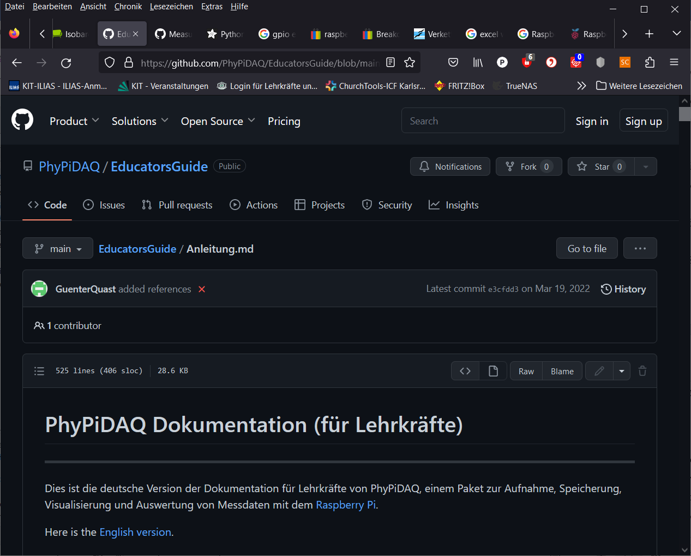

Abbildung 1: Öffentlich zugängliche Github-Seite von PhyPiDAQ

## Arbeit mit dem Betriebssystem

Da das Raspberry Pi – Betriebssystem eine Linux-basierte Distribution (Abwandlung) darstellt, ist es hierbei ebenso sinnvoll und nötig, über das **Terminal** (Eingabeaufforderung) Befehle einzugeben. Hierdurch sind weitreichende Aktionen möglich, welche **mit der Maus nur bedingt oder nicht durchführbar** sind. Es bietet sich an, einige, grundlegende Befehle als Text-Dokument abgespeichert zu haben. Eine Übersicht über die gängigsten Befehle ist ebenfalls in dem obigen Leitfaden (verfügbar auf [github.com](https://github.com/PhyPiDAQ/EducatorsGuide/blob/main/Anleitung.md)) gegeben.

 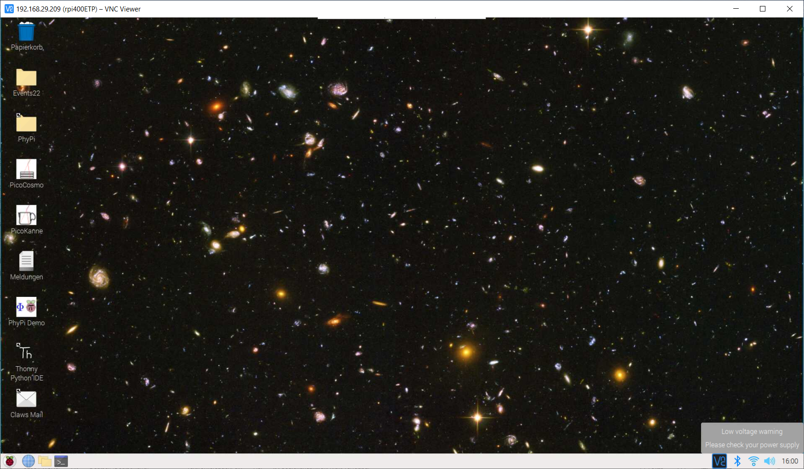

Abbildung 2: Startseite/Desktop des Raspberry Pi - Betriebssystems

## Ordnerstruktur und Projektorganisation

**Wer nutzt das Gerät?**

Wird das Gerät hauptsächlich von Ihnen genutzt, ist das Anlegen von Benutzerkonten und Definieren von Zugangsrechten obsolet. Werden mehrere Geräte für Schülerversuche eingerichtet, bietet es sich an, Benutzerkonten (wie unter Windows) einzurichten und Nutzerrechte zu vergeben (zur Abkapselung des Systems und Vermeidung von ungewollter Manipulation). Eine Anleitung hierzu ist unter [elektronik-kompendium.de](https://www.elektronik-kompendium.de/sites/raspberry-pi/2007011.htm) beispielsweise abrufbar.

**Wie kann eine sinnvolle Ordnerstruktur aussehen?**

Nachdem Sie den Raspberry gemäß dem obigen Leitfaden ([github.com](https://github.com/PhyPiDAQ/EducatorsGuide/blob/main/Anleitung.md)) eingerichtet haben, sollte unter dem Nutzer (z.B. „pi“) neben dem Verzeichnis „git“, in welchem die Original-Version „PhyPiDAQ“ liegt, das Verzeichnis „PhyPi“ angelegt sein, welcher für die Arbeit genutzt werden sollte (zum Schutz vor ungewollter Manipulation des Programms).

 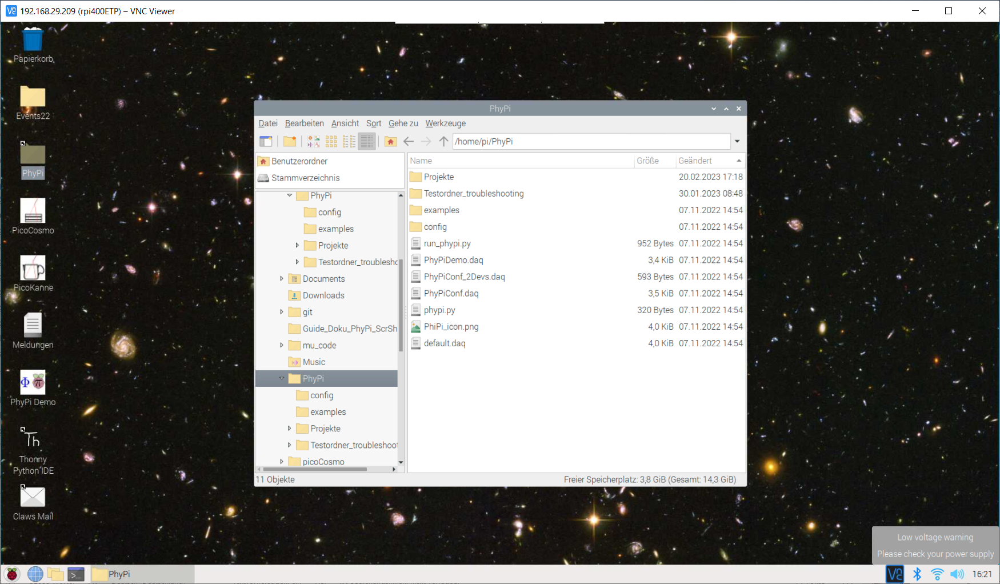

Abbildung 3: Ansicht des Verzeichnisses "PhyPi"

Innerhalb dieses Ordners empfiehlt es sich, zu Beginn eine Struktur an Ordnern zu erstellen, beginnend mit einem Sammelordner (z.B. „Projekte“), worin alle Projekte in jeweilige Unterordner abgelegt werden können.

**Projekte koordiniert abspeichern**

Falls Sie eigene lauffähige **Python-Programme** erstellt haben, speichern Sie diese am besten zentral zugreifbar unter dem Verzeichnis „pi“, in welchem „PhyPi“ vorzufinden ist, in hierfür erstellte Unterordner.

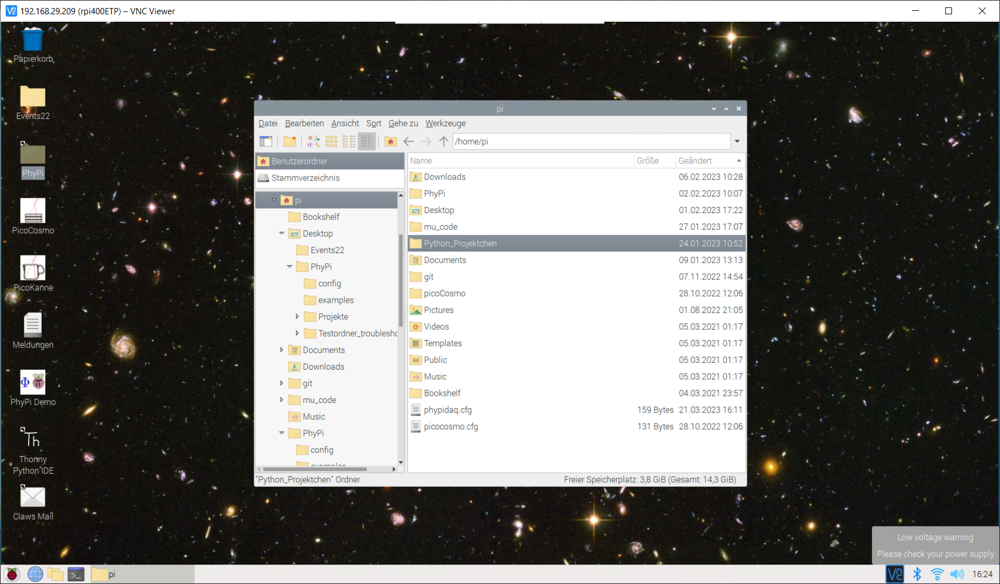

Abbildung 4: Ansicht des Verzeichnisses "pi" mit dem Ordner "Python_Projektchen"

Wenn Sie in **PhyPiDAQ** Config‘s erstellen oder ändern, speichern Sie diese (über „Save Config“) in einem erstellten Unterordner von „Projekte“, beispielsweise in „Temp und Druck“. Hierdurch wird die gesamte Config (Haupt-Config und die jeweilige(n) Device-Config(s)) an diesem Ort abgespeichert für eine spätere Verwendung.

Achtung: Vor dem Speichern sollten alle deklarierten Device-Config’s geladen sein, da sonst aufgrund der fehlenden Verknüpfung das Programm abstürzt.

Abbildung 5: Ansicht der PhyPiDAQ-Startseite

**Bewahren der Übersichtlichkeit und Struktur**

Wenn viel im Vorfeld experimentiert/getestet wird, ist es ratsam, einen Ordner (z.B. „WorkDir aller Projekte“) anzulegen, in welchem alle Arbeitsordner abgespeichert werden. Dies hat den Vorteil, dass alle Device-Config‘s, die PhyPiDAQ bei jeder „Start Run“-Ausführung erstellt, an einem Ort gespeichert werden und nicht die anderen Ordner verstopfen.

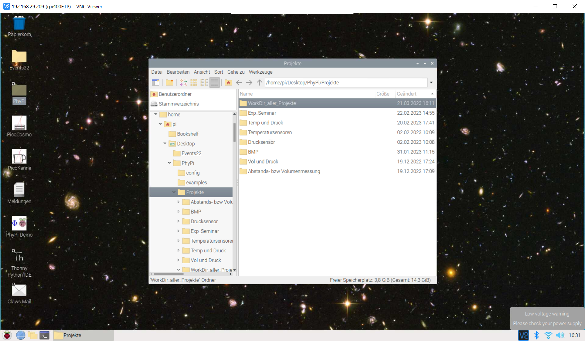

Abbildung 6: Ansicht des Ordners "WorkDir_aller _Projekte" im Verzeichnis "Projekte"

## Verkabeln der elektronischen Bauteile

Bevor Sie die Devices im System deklarieren, ist es empfehlenswert, die jeweiligen Geräte mit dem Raspberry Pi zu verbinden. Am einfachsten geht das über ein 
Steckbrett für Elektronikbauteile ("Breadboard") und einen mit einem Flachbandkabel
angeschlossenen Adapter für die GPIO-Leiste des Raspberry Pi, wie in der Abbildung
unten gezeigt. 

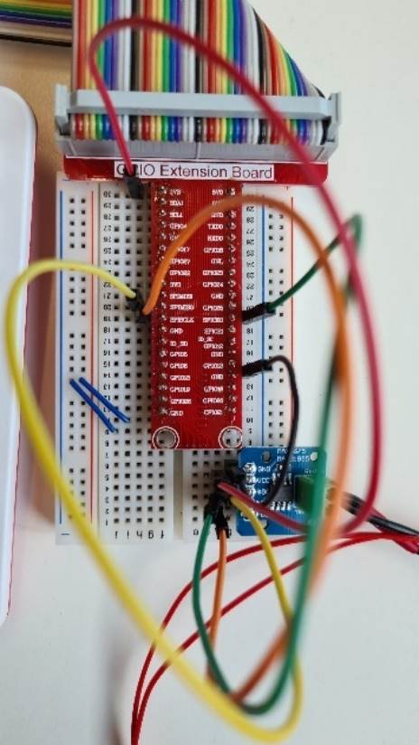 
Abbildung 7: Beispielhafte Verkabelung (Thermoelement mit MAX31855)

Hierbei ist auf die richtige Verkabelung der jeweiligen Devices zu achten, da sonst die Devices oder der Raspberry Pi beschädigt werden könnten. Für viele erhältliche Devices sind im Internet Anleitungen abrufbar. 

Am häufigsten tauschen Sensoren und Breakoutboards Daten mit dem Raspberry Pi über die Schnittstellen I²C und SPI aus. Etwas exotischer ist der One-Wire-Bus. Alle müssen im System aktiviert werden, wie in folgender Abbildung dargestellt.

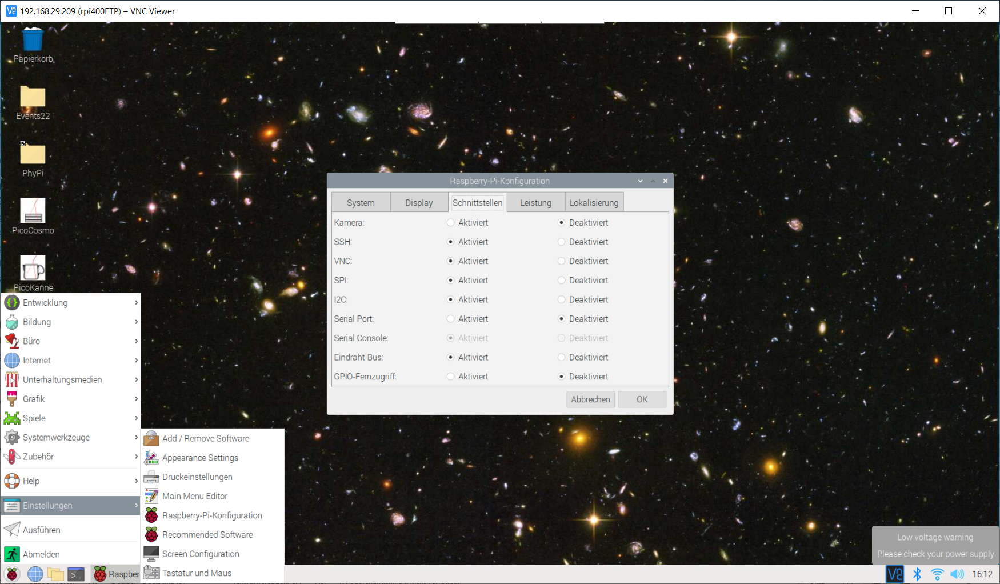

Abbildung 8: Aktivieren der relevanten Schnittstellen über "Einstellungen à Raspberry Pi-Konfiguration"

Im Folgenden soll Ihnen in Kürze ein Einblick hierin gegeben werden.

**I²C**

Viele Sensoren, Aktoren und Breakoutboards kommunizieren über den „Inter-Integrated Circuit-Bus“ (I²C, ausgesprochen „I-Quadrat-C“). Falls nicht bereits geschehen, muss diese im System aktiviert werden. Eine ausführliche Anleitung hierzu und weitere Informationen sind beispielsweise unter [einplatinencomputer.com](https://www.einplatinencomputer.com/raspberry-pi-i2c-aktivieren/) oder [sparkfun.com](https://learn.sparkfun.com/tutorials/raspberry-pi-spi-and-i2c-tutorial/all#spi-on-pi) abrufbar. Beispielhaft ist die Verkabelung des Breakoutboards ADS1115 (Analog-Digital-Wandler) im Folgenden dargestellt.

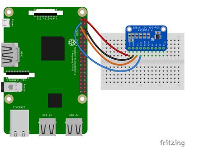  

Abbildung 9: Verkabelung des ADS1115 über I²C. Quelle: [Adafruit](https://learn.adafruit.com/adafruit-4-channel-adc-breakouts/python-circuitpython)

**SPI**

Eine weitere, verbreitet eingesetzte Schnittstelle ist das „Serial-Peripheral-Interface“ (SPI), welche ebenfalls, falls noch nicht geschehen, aktiviert werden muss. Eine ausführliche Anleitung hierzu und weitere Informationen sind beispielsweise unter [Codingworld.io](https://codingworld.io/spi-aktivieren-am-raspberry-pi/)  oder ebenfalls [sparkfun.com](https://learn.sparkfun.com/tutorials/raspberry-pi-spi-and-i2c-tutorial/all#spi-on-pi) abrufbar. Beispielhaft ist die Verkabelung des Breakoutboards MAX31855 im Folgenden dargestellt.

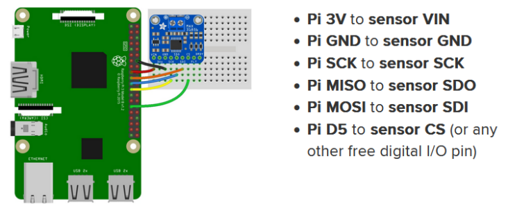

Abbildung 10: Verkabelung des MAX31855 über SPI. Quelle: [Adafruit](https://learn.adafruit.com/thermocouple/python-circuitpython)

**One-Wire-Bus**

Der One-Wire-Bus ist ein digitaler, serieller Bus, bei welchem lediglich eine Daten- Versorgungs- und eine Masseleitung verbunden werden muss. Die Schnittstelle muss ebenfalls im System konfiguriert werden, ebenso der GPIO-Pin, welcher hierfür genutzt werden soll. Die Anleitung hierzu und weitere Informationen sind beispielsweise unter [netzmafia.ee](https://netzmafia.ee.hm.edu/skripten/hardware/RasPi/Projekt-Onewire/index.html) abrufbar. Beispielhaft ist die Verkabelung zweier Temperatursensoren (DS18B20) über den One-Wire-Bus im Folgenden dargestellt. Da jeder Sensor eine eigene Adresse hat, können diese zusammen am im System deklarierten Pin angeschlossen werden (hier: GPIO 26).

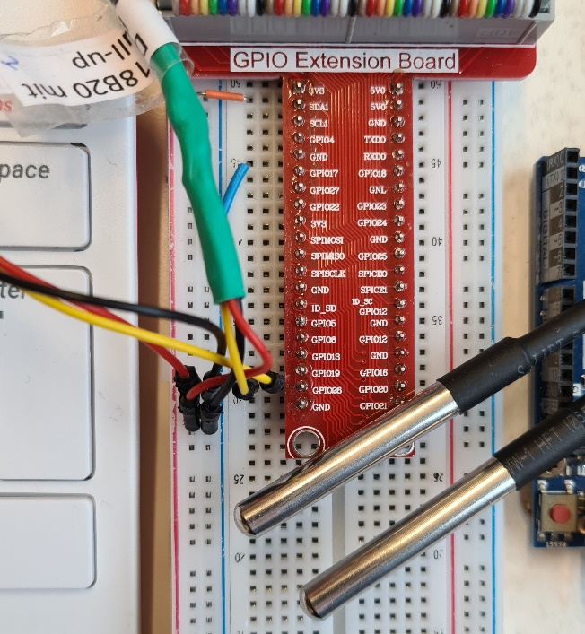

Abbildung 11: Verkabelung zweier DS18B20, welche über einen One-Wire-Bus ausgelesen werden

## Ansteuerung/Auslesung der Devices über ein selbstgeschriebenes Programm

**Möglichkeiten der Ansteuerung/Auslesung der Devices**

Als nächstes werden die Devices softwareseitig eingebunden, damit sie angesteuert/ausgelesen werden können. Hierfür stehen zwei Wege offen:

- Ansteuerung/Auslesung über ein selbstgeschriebenes Programm

- Ansteuerung/Auslesung über PhyPiDAQ (im nächsten Unterkapitel ausdifferenziert)

Die erste Variante ist vorteilig gegenüber der zweiten in der Hinsicht, dass Sie nicht an die in PhyPiDAQ vorkonfigurierte Device-Auswahl und -Version gebunden sind und meist ein einfaches Übernehmen von Code aus dem Internet ohne Probleme zum Ziele führt. Die zweite ist jedoch der ersten gegenüber in der Hinsicht im Vorteil, dass keine Programmierkenntnisse erforderlich sind und weiterführende Werkzeuge bereits integriert sind (Anpassen der Messwerte und Visualisierung, Anwenden von Funktionen, Ausgabe als CSV-Datei und weitere). 

**Ansteuerung/Auslesung** **über ein selbstgeschriebenes Programm**

Für viele Devices sind im Internet bereits Anleitungen zur Verkabelung und lauffähige Programmcode-Blöcke abrufbar. Die geläufigste Programmiersprachefür den Raspberry Pi ist Python. Ein oft genutztes Tool ist die „Thonny IDE“, die einen zwar einfachen, aber meist ausreichenden Funktionsumfang vorweist. Beachtet werden muss beim Programmieren und Übernehmen von Code aus dem Internet folgendes:

- Die jeweilig genutzten Schnittstellen (SPI, I²C, …) müssen aktiviert sein

- Wenn Bibliotheken (erkennbar an „import“) genutzt werden, müssen diese vorher gegebenenfalls über die Konsole heruntergeladen werden (meist in den Anleitungen beschrieben)

Abbildung 12: IDE des Programms "Thonny" mit einem lauffähigen Code zur Auslesung eines Thermoelements über ein MAX31855-Verstärkerboard

## Ansteuerung/Auslesung der Devices in PhyPiDAQ

**Starten von PhyPiDAQ**

Starten Sie PhyPiDAQ über die Verknüpfung auf dem Desktop oder über den Pfad „PhyPi/phypi.py“ (in der Konsole!), erscheint eine Konsole und die Start-Oberfläche, über die das Programm gesteuert wird:

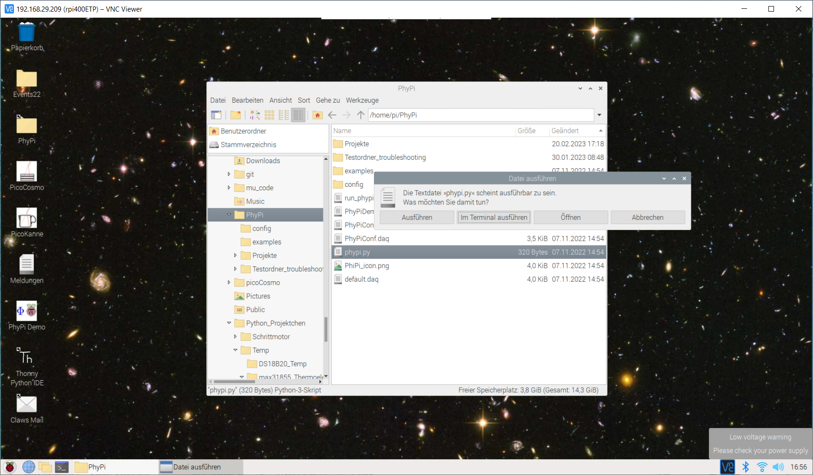

Abbildung 13: Öffnen von PhyPiDAQ über die Desktop-Verknüpfung oder das Ausführen des Programms "phypi.py"

Wählen Sie zuerst eine Config (z.B. die Default-Config) über „DAQ-Config“ aus, welche geöffnet werden soll

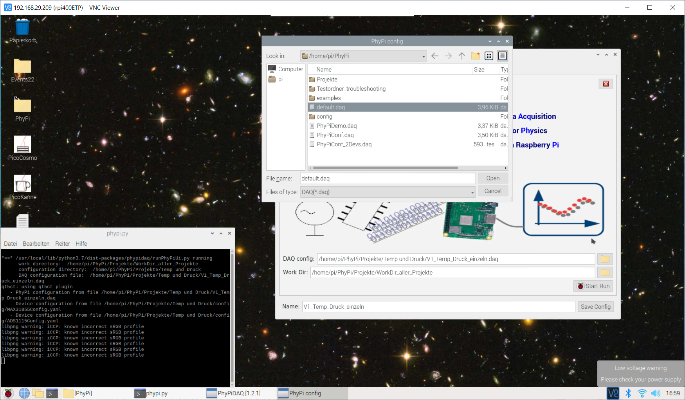

Abbildung 14: Auswahl der "Default"-Config über das Ordner-Symbol der Leiste "DAQ Config"

Dann geben Sie über „Work Dir“ einen Pfad an, wohin die Config‘s und ggf. Messwerte der einzelnen Messungen gespeichert werden sollen (z.B. „WorkDir aller Projekte“)

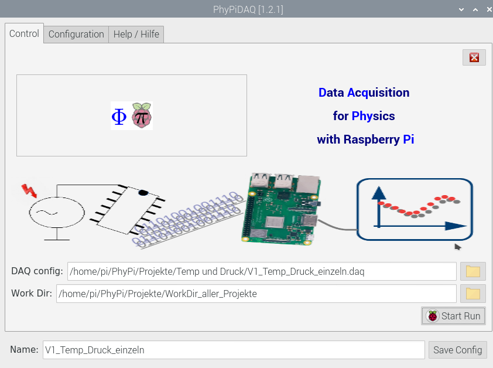

Abbildung 15: Auswahl des Pfades in „Work Dir“, worin die erstellten Projekte inklusive aller Messwerte und Grafiken gespeichert werden sollen

Wechseln Sie im Folgenden von „Control“ auf den Tab „Configuration“, um die Haupt-Config zu bearbeiten. Alle optionalen Befehle sind standardmäßig auskommentiert (erkennbar an dem vorangestellten Raute-Zeichen (#)), damit sie vom Programm nicht ausgeführt werden.

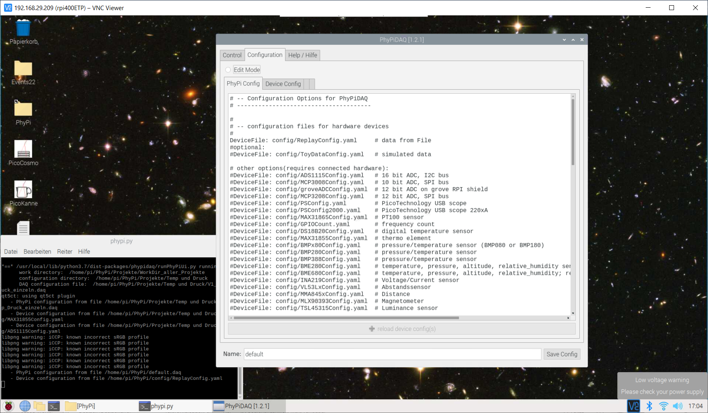

Abbildung 16: Ausschnitt aus der Default-Haupt-Config

 **** 

**Konfigurieren der Haupt-Config**

Ne nachdem, wie Ihre Messung aussehen soll und welche Devices Sie verwenden wollen, müssen Sie die Default-Config dem Bedarf entsprechend anpassen. Aktivieren Sie hierfür zuerst das Feld „Edit Mode“ am oberen Rand des Fensters. Im Nachhinein sind die Angaben weiterhin manipulierbar, falls sich andere Parameter als sinnvoller erweisen sollten. Alle nicht benötigte, standardmäßig auskommentierte Befehle können zur Wahrung der Übersichtlichkeit gelöscht werden. Die jeweiligen Befehle in den Konfigurationsdateien sind für versierte Nutzer ausreichend kommentiert, sollen hier jedoch trotzdem zum Verständnis oberflächlich erläutert werden.

- DeviceFile – Auswahl der zu verwendenden Geräte/Sensoren (Devices) durch Entfernen der Raute oder Zusammenfassung in ein Array (Eckige Klammern) bei mehreren Geräten

- ChanLimits – Definition des Wertebereichs der Diagramme bei der Messung

- ChanCalib – Möglichkeit der Eingabe von Werten, welche aus der Kalibrierung eines Gerätes stammen und sein Verhalten in dem relevanten Messbereich beschreiben. Das Programm generiert hieraus eine Funktion und interpretiert die Mess-Eingangsgrößen entsprechend diesem Verlauf

- ChanFormula – Möglichkeit, auf die Mess-Eingangsgrößen eine Formel anzuwenden, damit das Programm selbstständig die berichtigte Messgröße berechnet und grafisch darstellt

- ChanLabels, -Units, -Colors – Definierung der Darstellung und Bezeichnung der Messgrößen, je nach Kanal

- Interval – Angabe des Mess-Intervalls in Sekunden. Die Größe dieses Wertes ist individuell einzustellen je nach Anwendungsfall

- NHistoryPoints – Anzahl der Datenpunkte, die zwischengespeichert werden. Bei dem Betätigen des Buttons „Save Data“ während der Messung werden die jeweils letzten N Datenpunkte abgespeichert

- DisplayModule – Auswahl der Darstellungsform der Messgrößen, ob als Graph oder als reine Datenausgabe

- Chan2Axes und XY-Mode – Einstellmöglichkeit der Visualisierung, falls mehrere Mess-Kanäle aktiv sind

Das folgende Bild soll eine beispielhafte Haupt-Config für eine Temperaturmessung mit PhyPiDAQ darstellen.

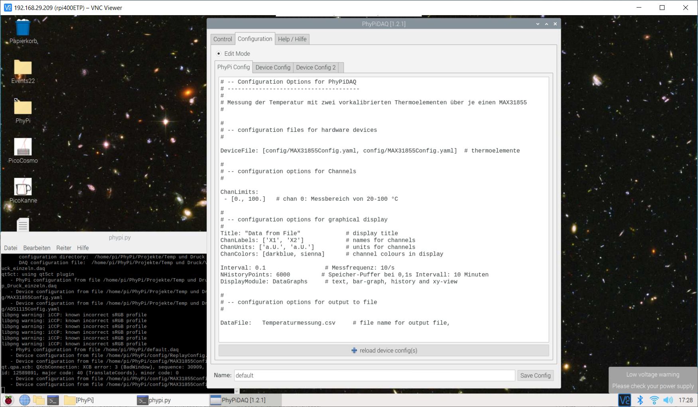

Abbildung 17: Für die Temperaturmessung mit einem Thermoelement angepasste Haupt-Config

Generell erweist es sich als sinnvoll, dass Sie in das obige Kommentarfeld die Bezeichnung der forcierten Verwendung und gegebenenfalls Einzelheiten hineinschreiben, Ihre aktivierten Befehle mit Zusatzinformationen kommentieren, damit Sie bei einer im Nachgang die von Ihnen verfolgte Absicht nachvollziehen können.

**Konfigurieren der Device-Config’s**

Aktivieren Sie die Devices über PhyPiDAQ, welche Sie ansteuern/auslesen möchten, falls sie hierin vorkonfiguriert sind, indem Sie das Raute-Zeichen (#) vor dem jeweiligen Device entfernen und den Button „Load Device-Config“ betätigen. Über den hinzugefügten Tab am oberen Rand des Fensters wechseln Sie auf die jeweilige Device-Config (im späteren Verlauf thematisiert)

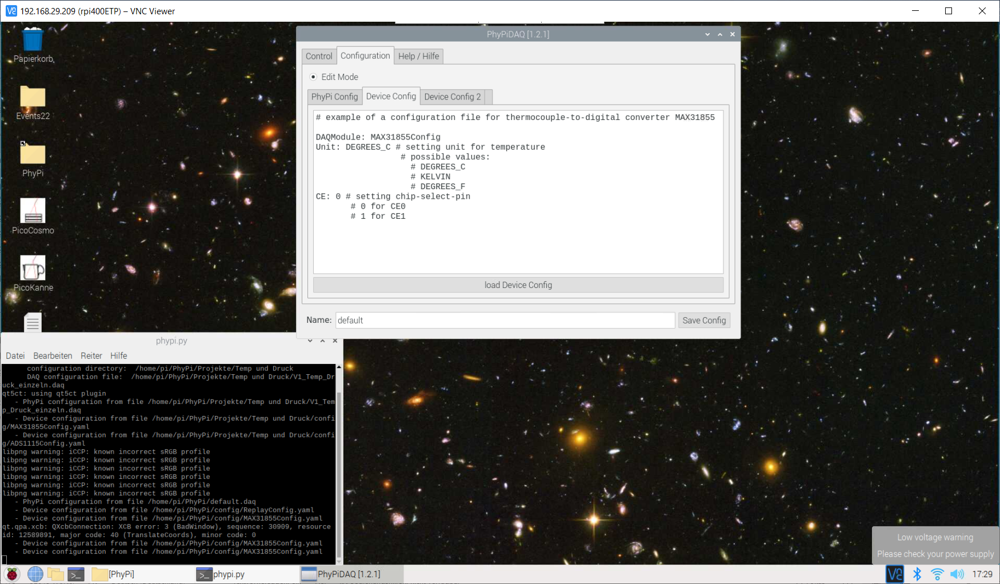

Abbildung 18: Device-Config des MAX31855, über welchen ein Thermoelement ausgelesen werden kann

Indem Sie einzelne Befehle manipulieren, können Sie die Ansteuerung/Auslesung des Devices anpassen, falls dies nötig sein sollte.

## Kalibration von Sensoren

**Allgemeines**

Die Kalibration der Sensoren können Sie am einfachsten über PhyPiDAQ und beispielsweise ein Tabellenkalkulationsprogramm wie Microsoft Excel oder OpenOffice Calc vollziehen. Hierzu bietet es sich an, dass Sie sich nach der in [Anhang 02](#_Anhang_02_–) gezeigten Kalibrationsabfolge richten. Die folgenden Empfehlungen werden an einigen Stellen auf das Beispiel der Drucksensor-Kalibration angewandt.

**Vorgang**

In der Regel werden bei der Kalibration nur einige wenige Wertepaare aufgenommen (über 10  Messwerte), welche für eine Regression ausreichen. Diese können Sie während der Messung direkt in eine Haupt-Config eintippen.

Hierzu kopieren Sie die Default-Haupt-Config in das jeweilige, angelegte Verzeichnis (z.B. unter dem Pfad „pi/PhyPi/Projekte/Kalibrierte_Sensoren“), ändern den Namen zu z.B. „Druckmessung“ und öffnen Sie diese mit einem Rechtsklick in einem Texteditor.

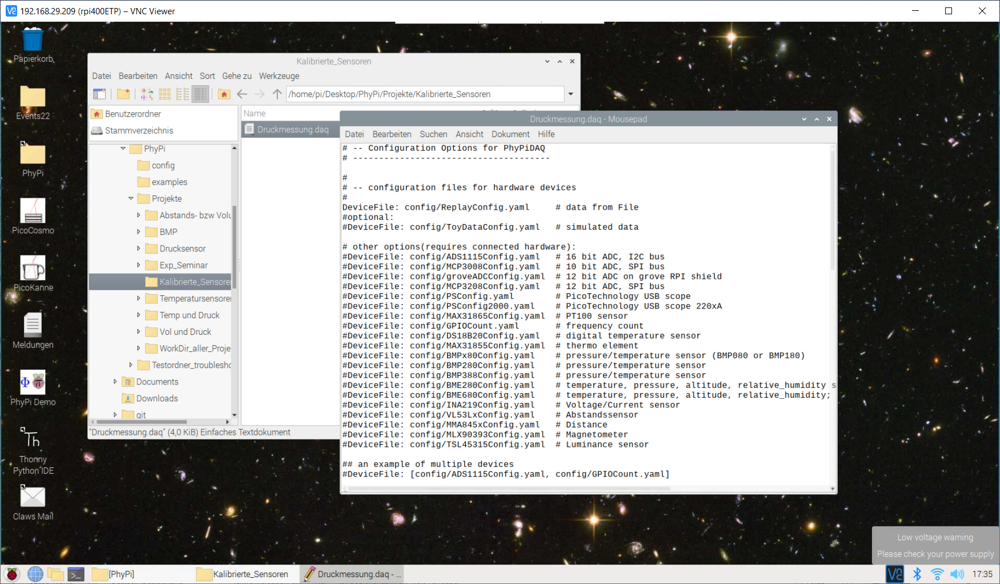

Abbildung 19: In einem Texteditor geöffnete Haupt-Config

Geben Sie in **ChanCalib** die jeweiligen Wertepaare in folgender Form ein:

[[Referenzwert1, Referenzwert2, …], [Sensorwert1, Sensorwert2, …]]

Achten Sie darauf, dass die Dezimaltrennzeichen statt Kommata wie im englischen/amerikanischen Raum in Form von Punkten erfolgen. Bei diesem Beispiel sei anzumerken, dass die Referenzwerte als x-Werte (horizontale Achse) und die Sensorwerte als y-Werte (vertikale Achse) aufgefasst werden. Falls ganze Zahlen auftreten, sollten diese ebenfalls mit einem Punkt versehen werden (programmseitige Gründe). Passen Sie die Befehle und Kommentare in dem Zuge gleich mit an.

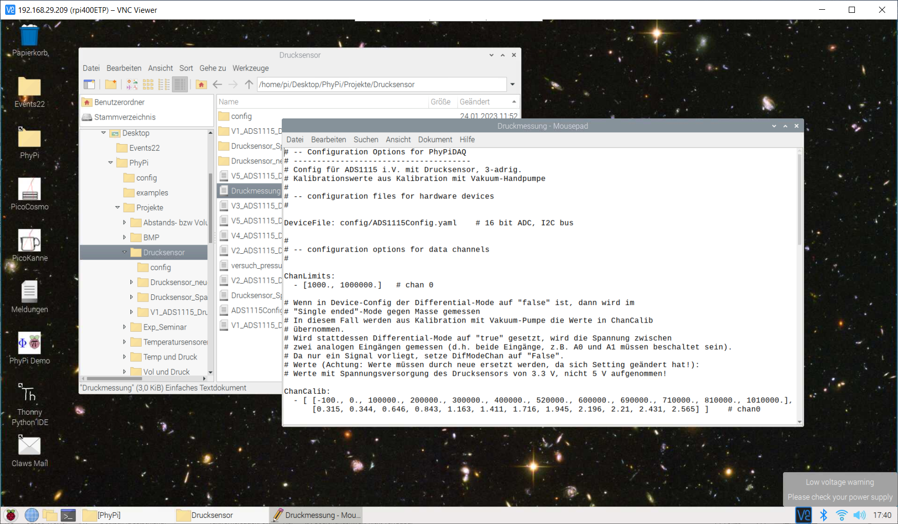

Abbildung 20: Anpassung der Haupt-Config durch Eingeben der Kalibrationswerte, Löschen/Aktivieren von Befehlen und Anpassen der Kommentare

Die soeben erstellte und abgespeicherte Haupt-Config öffnen Sie mit PhyPiDAQ, laden den entsprechenden Sensor und starten probeweise die Messung.

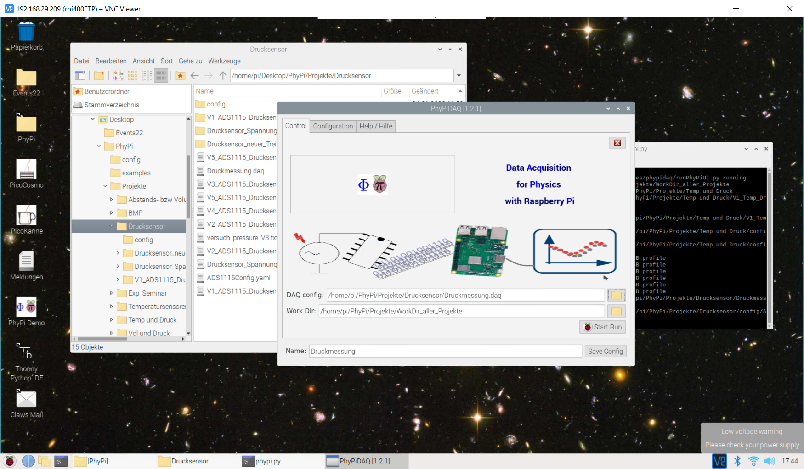

Abbildung 21: In PhyPiDAQ geladene, soeben angepasste Haupt-Config

## Steuern des Messvorgangs

Wenn Sie das jeweilige Setting der Messung konfiguriert haben, können Sie die Messung starten. Falls in der Konsole ein Fehler den Start verhindert, versuchen Sie über die dort angegebene Fehlermeldung die Ursache zu identifizieren und in der Config zu beheben. Sobald sich das Fenster der Messung öffnet, kann mit der Messung begonnen werden. Über die Buttons am unteren Rand des Fensters ist eine Steuerung der Messung möglich.

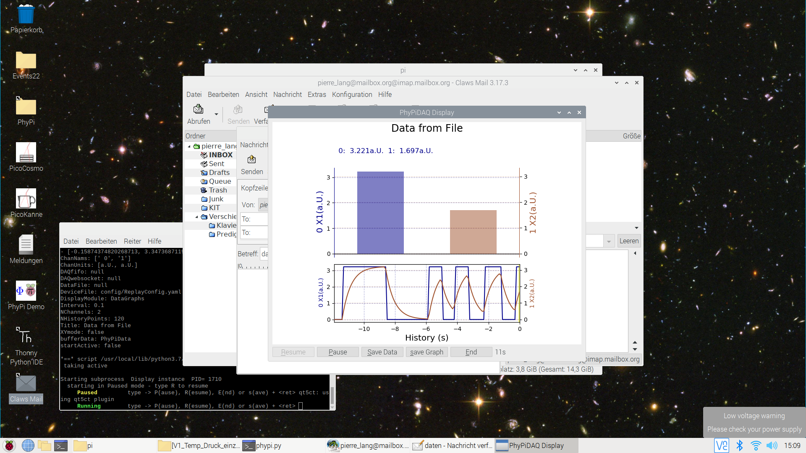

Abbildung 22: Ausschnitt einer beispielhaften Messung der Versorgungsspannung (blau) und der Kondensatorspannung (braun) beim An- und Ausschalten

Neben den selbsterklärenden Buttons „Pause“, save Graph“ und „End“ ist erwähnenswert, dass bei Betätigen des Buttons „Save Data“ lediglich die letzten Datenpunkte gespeichert werden. Die Anzahl dieser Datenpunkte ist in der Haupt-Config unter „NHistoryPoints“ festzulegen. Es ist empfehlenswert, in diesem Feld einen hohen Wert einzugeben, damit nicht aus Versehen wichtige Daten verworfen werden. Falls Sie die Anzeige der Messwerte grundlegend verändern möchten, ist dies über das direkte Verändern des jeweiligen Programmcodes möglich (für fortgeschrittene Nutzer). Andernfalls ist voreingestellt, dass die Höhe der jeweiligen Eingangssignale im oberen Bereich als Balkendiagramme und im unteren Bereich als Funktion der Zeit aufgetragen wird. Hierdurch wird Ihnen die Veranschaulichung im Experiment auf zwei Arten ermöglicht.  

## Auslesen und Weiterverarbeiten der Messdaten

Haben Sie in der Config die Ausgabe als CSV-Datei aktiviert, können Sie die gewonnenen Messdaten beispielsweise in einem Datenanalyse- oder einem Tabellenkalkulationsprogramm auswerten. Das Erstere sei hierbei zu bevorzugen, da mit diesem weiterführende Funktionen möglich sind (Angabe von Fehlern, Kurvenanpassung/Fit mit Fehlern und Gewichtung uvm.). Hierfür bieten sich vor allem Open-Source-Lösungen wie [SciDAVis](https://scidavis.sourceforge.net/) oder [LabPlot](https://labplot.kde.org/) an, da diese in der Regel kostenlos und lizenzfrei sind und meistens ein umfangreiches Funktionsspektrum vorweisen. Für die einfache Auswertung von Messwerten durch Schülerinnen und Schüler ist jedoch auch ein Tabellenkalkulationsprogramm verwendbar.

## Weiterführende Tipps zur Vorbereitung von Experimenten

**Vorbereitung**:

- Bereiten Sie das Experiment hinreichend gut vor und notieren Sie sich gegebenenfalls verwendete Hardware und Programme.

- Falls mehrere Experimente an einem Tag vorgeführt werden sollen, ist es sinnvoll, auf verschiedenen Breadboards die jeweiligen Verkabelungen herzustellen, sodass im Unterricht selbst dies nicht mehr passieren muss.

- Speichern Sie die Configs der einzelnen Experimente an Orten, die Sie leicht wiederfinden. Erstellen Sie gegebenenfalls eine Verknüpfung auf dem Desktop.

Weiterführende Informationen finden Sie im „Educator’s Guide“ auf [Github](https://github.com/PhyPiDAQ/). Eine Einführung in die Arbeit mit PhyPiDAQ und Experimente finden Sie ergänzend hierzu auf [Youtube](https://youtube.com/@wissen_tut_nicht_weh?si=3PuPcoavyUXHY5Yw).
  

****

# Anhang 1 – Bestimmung eines passenden Temperatursensors

## Vergleich von ausgewählten Temperatursensoren

Da für die Temperaturmessung prinzipiell viele Sensoren infrage kommen würden, soll eine Auswahl an Temperatursensoren anhand ihrer Eigenschaften und hinsichtlich ihrer Eignung, die Temperatur eines Gases zu messen, miteinander verglichen werden, um den adäquatesten Sensor für diesen Versuch zu finden. Eine Gegenüberstellung von breit eingesetzten Temperatursensoren soll durch folgende Tabelle veranschaulicht und nachfolgend ausdifferenziert werden. Statt eine Übersicht über sämtliche Temperatursensoren darzustellen, soll weiterführend auf diverse Internetseiten, wie [mikrocontroller.net](https://www.mikrocontroller.net/articles/Temperatursensor) verwiesen werden. 

Tabelle 3: Vergleich ausgewählter Temperatursensoren

| Sensoren | Messbereich | Genauigkeit | Wasserresistenz | Weitere Infos |
| --- | --- | --- | --- | --- |
| PT100 | -30-105 °C |    | Vorhanden | Benötigt Verstärkerboard MAX31865 |
| DS18B20 | -55-125 °C |  | Vorhanden | Digitales Ausgangssignal |
| Thermoelement | -200-700 °C |  | Nicht vorhanden | Benötigt Verstärkerboard MAX31855 |

Neben dem Messbereich und der Wasserresistenz, der von Bauart zu Bauart unterschiedlich sein kann, unterscheidet sich in vielen Fällen deutlich die Genauigkeit je nach Messbereich. Da die Sensoren prinzipiell alle für eine Temperaturmessung infrage kommen würden, sollen ihre Spezifika im Folgenden näher beleuchtet werden:

 **** 

- **Zum PT100**:

Abbildung 23: Beispielhafter PT100-Sensor inklusive Verstärkerboard MAX31865 

o Der PT100 ist ein analoger Temperatursensor, dessen Effekt auf die temperaturabhängige Veränderung des elektrischen Widerstands von Platin zurückgeht.

o Bei 0 °C ist der Widerstand beim PT100 auf 100 Ω normiert. Der PT100 ist etwas schlechter auflösend als der ebenfalls weit verbreitete, aber geringfügig teurere PT1000, welcher bei 0 °C auf 1000 Ω normiert ist. Für diese Anwendung ist der PT100 jedoch ausreichend

o Aufgrund der kleinen Messspannung und der auftretenden Störgrößen muss das Ausgangssignal des PT100 über ein Verstärkerboard wie beispielsweise den MAX31865 verstärkt und Störgrößen kompensiert werden

o Anbindung und Datenübertragung erfolgt über die SPI-Schnittstelle[[1]](#_ftn1) des Raspberry Pi (Anschluss siehe [Adafruit](https://learn.adafruit.com/adafruit-max31865-rtd-pt100-amplifier/python-circuitpython).com)

o Sehr vorteilhaft im Vergleich zu anderen Sensoren ist seine fast lineare Kennlinie im näheren Temperaturbereich und seine Wasserresistenz

o Nachteilhaft ist hierbei, dass ein Verstärker-Board unbedingt benötigt wird, welches je nach Händler vor Gebrauch gelötet werden muss

- **Zum DS18B20**:
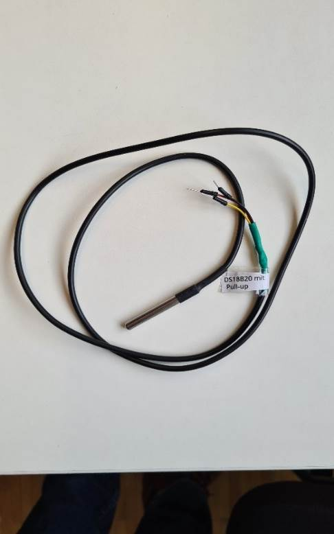 
Abbildung 24: Beispielhafter DS18B20-Sensor

o Der DS18B20 ist ein digitaler Temperatursensor, welcher die analoge Eingangsgröße in Form einer Spannung durch einen internen AD-Wandler in ein digitales Signal umsetzt. Die bereits kalibrierten Werte werden im Folgenden über eine sogenannte
„One-Wire“-Verbindung an den Raspberry Pi weitergeleitet. Er hat eine eigene Sensor-Adresse, sodass mehrere seiner Art zeitgleich verbaut werden können, ohne dass das System diese vertauscht.
Für eine Verminderung der Störsignale ist der Einbau eines Pull-up-Widerstands sinnvoll.

o Auflösung je nach Art zwischen 9-12 Bit, Messbereich -55 bis 125 °C, wobei lediglich zwischen -10 °C und 85 °C eine Genauigkeit von bis zu 0,5 °C vorliegt 

o Vorteile: Sensor bereits kalibriert, hohe Genauigkeit, 1-Wire-Ausgang (mehrere derselben Bauart verwendbar)

o Nachteile: Pullup-Widerstand muss gegebenenfalls nachträglich verbaut werden, Datenpin muss im Raspberry Pi – System definiert werden (Verändern der Config.txt), was jedoch mit Anleitungen wie beispielsweise von [tutorials-raspberrypi.de](https://tutorials-raspberrypi.de/raspberry-pi-temperatur-mittels-sensor-messen/) für Jedermann möglich ist

- **Zum Thermoelement (mit MAX31855):**

o Das Thermoelement nutzt den Seebeck- beziehungsweise thermoelektrischen Effekt zweier unterschiedlicher Leiter aus, welche an einem Ende verlötet sind: Wird der verbundene Leiter erwärmt, kann eine elektrische Spannung als Funktion der Temperatur an der Vergleichsstelle gemessen werden

**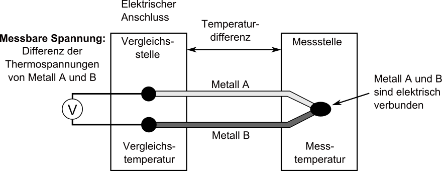**

Abbildung 25: Schematische Darstellung eines Thermoelementes (Quelle: Wikipedia, 2023)

o Da die Messspannung mit einigen 10 µV pro °C sehr klein und somit sehr störanfällig ist, ist das Thermoelement auf die Leistungen eines Verstärkerboards angewiesen. Im Rahmen dieser Arbeit hat sich das Verstärkerboard MAX31855 bewährt, welches zum einen breit verfügbar ist und zum anderen bereits in PhyPiDAQ implementiert ist. Im Rahmen dieser Arbeit wurden vier verschiedene MAX31855 unterschiedlicher Hersteller und Preisklassen getestet, wobei sich das etwas höherpreisiges Modell von Adafruit bewährt hat. Dies heißt jedoch nicht, dass auch günstigere Alternativen akkurate Ergebnisse liefern könnten.

o Das verwendete Thermoelement besteht, wie folgende Abbildung ersichtlich, aus einer silikonummantelten Litze mit einer Messspitze und zwei Drähten zum Anschluss an das Verstärker-Board. Diese Bauart kann durch den bloßen Metallkontakt nicht in flüssigen Medien eingesetzt werden, zeichnet sich jedoch durch eine geringe Wärmekapazität und damit einer schnellen Temperaturdetektion aus. Die Thermoelemente (engl. „Thermocouple“) werden neben ihrer Bauart anhand ihrer Materialien unterschieden. Die im Rahmen dieser Arbeit zum Einsatz kommende Thermoelement-Paarung ist die hinreichend genaue und breit eingesetzte Typ K – Paarung, welche aus einer Nickel-Chrom-Legierung einerseits und einem Nickeldraht andererseits besteht. Eine höhere Genauigkeit versprechen lediglich höherpreisige Thermoelemente der Typen T, R und S für besondere technische Anwendungen, welche für diese Anwendung jedoch nicht eingesetzt werden sollen.

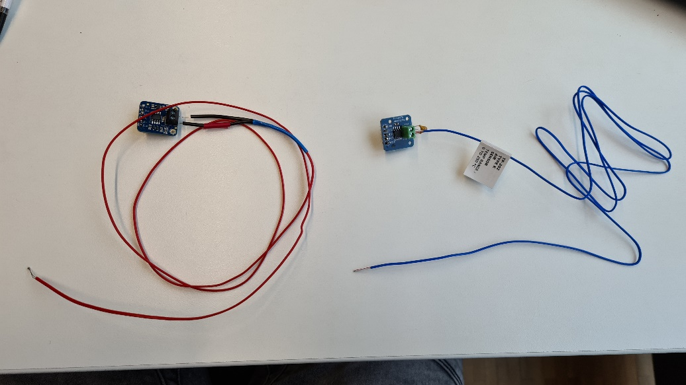

Abbildung 26: Beispielhaftes Thermoelement mit Verstärkerboard MAX31855

o Die durch das Thermoelement ausgelöste analoge Spannung wird durch einen integrierten AD-Wandler im Verstärker-Board in ein digitales Signal umgewandelt, verstärkt, geglättet und mit der Vergleichstemperatur eines ebenfalls integrierten Temperaturfühlers verglichen (Kaltstellen-Kompensation), bevor sie als Temperatur über die SPI-Schnittstelle ausgegeben wird

o Vorteile: Messung schneller Temperaturänderungen möglich, Ausführung in verschiedenen Bauformen, hoher möglicher Messbereich, manche Verstärker-Boards sind bereits kalibriert, breiter technischer Einsatz, auch von Lehrmittelfirmen oft verbaut

o Nachteile: Verstärker-Board notwendig, nicht wasserfest (eingesetztes Modell)

Inwiefern sich die Temperatursensoren im praktischen Einsatz unterscheiden, soll im folgenden Kapitel erprobt werden.

## Test und Kalibrierung der Temperatursensoren

Um die Temperatursensoren auf ihre Funktion und Eignung hin zu prüfen und gegebenenfalls zu kalibrieren, bietet es sich an, hierfür ein Wasserbad zu nutzen. Weiterhin ist ein kalibriertes Referenz-Thermometer notwendig, welches in diesem Fall ein Thermoelement der Lehrmittelfirma MAEY darstellt. Die Vorgehensweise sei im Folgenden kurz erläutert:

1. Anschließen der Temperatursensoren beispielsweise gemäß Anleitung im [Anhang](#_Anhang_xy_-_1)

2. Vorbereiten der Temperaturmessungen in PhyPiDAQ:

a. Öffnen der Demo-Konfigurationsdatei („Demo-Config“)

b. Aktivieren der entsprechenden Devices (z.B. DS18B20, MAX31865, MAX31855) und Einstellen weiterer Parameter wie den beispielsweise den bei der Messung anzuzeigenden Wertebereich der Temperatur

c. Laden der Geräte durch Betätigen des Buttons „Load Device Config(s) und Verändern einzelner Befehle, falls nötig

d. Abspeichern der neuen Config unter neuem Namen

3. Starten der Messungen, Anschließen und Anschalten des Referenzthermometers, Überprüfen und notieren der Messwerte bei Raumtemperatur

4. Ummanteln des Thermoelementes mit Klarsichtfolie, um es vor Wasser zu schützen

5. Erhitzen von Wasser in einem Topf auf einer Heizplatte bis zur Siedetemperatur

6. Entfernen der Wärmequelle

7. Eintauchen der Temperatursensoren in das Wasserbad, an einem Punkt konzentriert, Abwarten, bis alle Temperatursensoren einen statischen Wert erreicht haben, Notieren der Temperaturen

8. Zugabe von kaltem Wasser, bis die Temperatur um einige °C (z.B. 5°C) abgeklungen ist, Umrühren des Wasserbades, Abwarten eines statischen Temperaturwertes und Notieren der Temperaturen

9. Wiederholen des letzten Schrittes, bis annähernd Raumtemperatur erreicht ist

**<u>PT100</u>**

Durch anfängliche Probleme mit dem PT100 und dem MAX31865 können folgende Hinweise nachdrücklich gegeben werden:

- Durch eine Widerstandsprüfung ist die Art des PT-Sensors festzustellen, da die angegebene Produktart (PT100, PT200, PT1000 etc.) von der tatsächlichen abweichen kann

- Ob der jeweilige MAX31865 für den PT-Sensor geeignet ist, lässt sich durch die Bezeichnung auf dem Vorwiderstand, welcher auf die Platine gelötet ist, ablesen

- Die entsprechenden Lötstellen sind vor Benutzung zu verbinden oder gegebenenfalls aufzutrennen

- Auf den korrekten Anschluss der Kabel an das Board und das Board an den Raspberry Pi ist zu achten

Eine ausführliche Anleitung ist auf [Adafruit.com](https://learn.adafruit.com/adafruit-max31865-rtd-pt100-amplifier/overview) nachzulesen.

Für diese Arbeit konnte eine Kalibration mit dem PT100 nach obiger Methode durchgeführt werden, dessen Ergebnisse in folgender Tabelle ersichtlich sind.

Tabelle 4: Ergebnisse der PT100 - Kalibration

| Referenztemperatur in °C | PT100 in °C | Rel. Fehler in % |
| --- | --- | --- |
| 100,00 | 95,06 | 4,9 |
| 82,5 | 80,45 | 2,5 |
| 72,5 | 71,38 | 1,5 |
| 64,1 | 63,8 | 0,5 |
| 55,5 | 55,5 | 0,0 |
| 45,1 | 45,45 | 0,8 |
| 35,3 | 35,39 | 0,3 |
| 29,5 | 29,56 | 0,2 |
| 23,7 | 23,00 | 3,0 |

Weitere Versuche zeigten einen analogen Verlauf. Zur groben Angabe der Fehler wurde ein relativer Fehler angegeben. Auf eine ausführliche Fehlerrechnung wurde an dieser Stelle verzichtet. Der Sensor zeigte ab Werk ein weitgehend akzeptables Verhalten mit einem relativen Fehler von meist unter 2 %. Lediglich bei hohen Temperaturen und bei vollständiger Abkühlung auf Raumtemperatur ließen sich größere Abweichungen feststellen. Die ansteigenden Abweichungen bei höheren Temperaturen können durch Messfehler (instationäre Temperatur) und durch das zunehmende nichtlineare Verhalten der Kennlinie des PT100 zustande gekommen sein. Die Abweichung bei Raumtemperatur kann durch den Verdunstungseffekt des restlichen Wassers am Sensor zustande gekommen sein. Für den in diesem Rahmen relevanten Temperaturbereich ist die Genauigkeit jedoch hinreichend zufriedenstellend.

**<u>Thermoelement und DS18B20</u>**

Die Funktion des Thermoelements in Verbindung mit dem ersten Verstärkerboard (MAX31855 (1), welches einem günstigen, dem Original nachempfundenen Modell entspricht), wurde zusammen mit zwei DS18B20-Sensoren getestet. Die Ergebnisse sind folgendem Schaubild zu entnehmen.

Aus der Tabelle ist deutlich zu erkennen, dass die Messpunkte der beiden DS18B20-Sensoren sehr nah an den Referenzwerten liegen, das Thermoelement jedoch einen deutlich höheren Offset und eine andere Steigung aufweist.

Aus den Daten geht hervor, dass beim ersten DS18B20 eine leicht geringere Abweichung vom Referenzwert auftrat als beim zweiten. Eine Betrachtung der relativen Fehler zeigt, dass in den meisten Fällen die Fehler im unkritischen Bereich liegen. Die gering größere Abweichung beim letzten Messwert kann durch die hohe Latenz der DS18B20-Sensoren im Gegensatz zum Thermoelement des Referenz-Thermometers zustande gekommen sein (Temperatursensoren gegebenenfalls noch zu warm im Vergleich zur Umgebungstemperatur).

Die Aufnahme der Messwerte des Thermoelements gestaltete sich schwierig, da die Werte stark schwankten, um die 1,5 °C. Eventuell kann diesem Effekt durch einen Bypass-Kondensator zwischen den Drähten des Thermoelementes vermieden werden. Der originale MAX31855 von Maxim Integrated oder Adafruit hat diesen und weitere sinnvolle Bauteile bereits ab Werk verbaut. Trotzdem zeigte der getestete MAX31855 (1) einen nahezu linearen Verlauf mit einem anderen Offset und einer anderen Steigung. Insofern dieses Verhalten reproduzierbar ist, könnte es durch eine Kalibration für den Einsatz im Experiment angepasst werden. Jedoch wurde die Arbeit mit diesem Thermoelement-Verstärker beendet, da im weiteren Verlauf weitere Thermoelement-Verstärker wie der MAX31855 (2) und der MAX31855 von Adafruit korrektere Werte zeigten, wie im folgenden Kapitel nahegelegt wird.

## Vergleich der Thermoelement-Verstärker

Da der bisherig vorhandene MAX31855 (1) mangelhaft erschien, wurde ein originaler MAX31855 von Adafruit (im Folgenden i.V. mit rot ummanteltem Thermoelement) und ein weiterer günstiger MAX31855 (2) testweise beschaffen. Die Messpunkte sollen im Folgenden anhand der Messwerte des Referenzthermometers verglichen werden.

Durch auftretende Interferenzen bei gleichzeitiger Anbindung von zwei oder mehr MAX31855 an die SPI-Schnittstelle war es nicht möglich, die Thermoelemente zusammen zu kalibrieren, weshalb sie infolgedessen einzeln kalibriert wurden.

Folgende Tabelle legt die Messpunkte des Vergleichs zwischen den Werten des Referenz-Thermometers (Leybold) und denen des MAX31855 (Adafruit) dar.

Tabelle 5: Ergebnisse der MAX31855 (Adafruit) - Kalibration

| Referenztemp. in °C | MAX Adafruit in °C | Rel. Fehler in % |
| --- | --- | --- |
| 99,3 | 97,75 | 1,56 |
| 85,1 | 85 | 0,12 |
| 73 | 73 | 0,00 |
| 61,4 | 61,5 | 0,16 |
| 51,5 | 51,75 | 0,49 |
| 44,5 | 44,5 | 0,00 |
| 39,5 | 39,5 | 0,00 |
| 31,2 | 31 | 0,64 |
| 28 | 28,5 | 1,79 |
| 19 | 19,5 | 2,63 |

Der teurere Thermoelement-Verstärker MAX31855 von Adafruit zeigt bereits ein kalibriertes Verhalten. Der Fehler liegt bei maximal 2,6 % und ist somit für den hier vorliegenden Anwendungsfall akzeptabel.

Ein Vergleich des nachbestellten, günstigen Thermoelement-Verstärkers MAX31855 (2) mit den Temperaturen des Referenz-Thermometers von Leybold ergab die folgenden Werte:

  

Tabelle 6: Ergebnisse der MAX31855 (2) - Kalibration

| Referenztemperatur in °C | MAX (2) in °C | Rel. Fehler in % |
| --- | --- | --- |
| 79,9 | 79,75 | 0,19 |
| 67 | 66,5 | 0,75 |
| 58,3 | 58,25 | 0,09 |
| 48,3 | 48,5 | 0,41 |
| 38,7 | 39 | 0,78 |
| 20 | 20,5 | 2,50 |

Auch bei diesem günstigeren Modell scheint eine Kalibration bereits von Werk aus erfolgt zu sein, der Fehler liegt lediglich bei maximal 2,5 % und ist somit ebenfalls akzeptabel für den hier vorliegenden Anwendungsfall. Da jedoch das Verstärkerboard von Adafruit bereits vorliegt, soll dieses vorrangig für zukünftige Messungen eingesetzt werden. 

Zum Schluss dieses Unterkapitels sei angemerkt, dass eine Kalibration auch komplett über PhyPiDAQ geschehen kann, indem ein kalibrierter Sensor die wahren Werte liefert, während die Rohdaten aus den zu kalibrierenden Sensoren ausgelesen werden. Die Messwerte können in eine Datei exportiert werden, woraus die Daten für die Kalibration (ChanCalib) gewonnen werden. Hierbei ist lediglich darauf zu achten, dass aufgrund etwaiger unterschiedlicher Latenzen der Sensoren jeweils nur bei Temperatur-Gleichgewichtszuständen gemessen werden sollte.

## Überprüfung der Latenzen der Temperatursensoren

Da die Messung von Zustandsgrößen an Gasen durch ihre geringe Dichte an Teilchen besondere Anforderungen an die entsprechenden Sensoren stellt, sind diese in Bezug auf die in diesem Einsatzbereich entscheidenden Merkmale hin zu vergleichen, um ein adäquates Modell auswählen zu können. Um in Gasen schnelle Temperaturänderung detektieren zu können, wird ein Temperatursensor mit besonders schneller Anspruchszeit beziehungsweise möglichst geringer Latenz benötigt. Das demnach entscheidende Merkmal, eine geringe Latenz, wird in diesem Fall als maßgebendes Kriterium für die Sensorauswahl definiert, auch wenn andere Sensoren gegebenenfalls bessere Eigenschaften in anderen Bereichen zeigen. Da der Drucksensor bei der Kalibration eine maximale Latenz von 100 ms zeigte, sollen nun die Temperatursensoren PT100, DS18B20 und das Thermoelement auf dieses Merkmal hin verglichen werden.

Hypothetisch kann angenommen werden, dass die Latenz zum einen vom Material des Temperaturfühlers (Masse und Wärmekapazität) und zum anderen von der Übertragungsgeschwindigkeit von Signaleingang bis zur Ausgabe abhängen muss, wobei der erstere Grund der entscheidendere sei. Da im Experiment schnelle Temperaturänderungen von Gasen gemessen werden sollen, ist eine möglichst geringe Latenz wünschenswert, wenn nicht sogar obligatorisch für das Gelingen des Experiments an sich.

Hierzu kann folgendermaßen vorgegangen werden:

1. Sensoren in eine PhyPiDAQ-Config integrieren und Datenausgabe als .csv-Datei aktivieren

2. Messung testweise starten, um Funktion und Werte zu prüfen

3. Heißes Wasser einer definierten Temperatur bereitstellen und mit Referenz-Thermometer die Temperatur kontrollieren

4. Sensoren vorbereiten: Thermoelement mit wasserdichtem, ab dünnem Material ummanteln (z.B. Klarsichtfolie, da Sensor nicht wasserdicht), Sensoren bündeln (gleichzeitige Temperaturerhöhung)

5. Messung starten

6. Sensoren gleichzeitig in das heiße Wasser tauchen und die Temperaturen über der Zeit beobachten

7. Vorgang beenden, sobald die Temperatur-Ausgaben aller Sensoren im gleichen Bereich liegen und einen konstanten Wert annehmen

Für ein Vergleich der Latenzen wurden anhand dieser Vorgehensweise ausgehend von Umgebungstemperatur (Luft) von 22,7 °C die Sensoren zuerst in das siedende Wasser mit einer Temperatur von 100 °C getaucht, um sie anschließend wieder bei Umgebungstemperatur abkühlen zu lassen. Die Auswertungen der Ergebnisse seien im Folgenden dargestellt.

**Erwärmung (auf Wassertemperatur)**

Die Ergebnisse der Vergleichsmessung der Erwärmung auf Wassertemperatur sind in folgender Tabelle dargestellt.

Tabelle 7: Latenzen der Temperatursensoren bei Erwärmung

| Sensoren | Latenz in s |
| --- | --- |
| DS18B20 | 8,3 |
| PT100 mit MAX31865 | 3,7 |
| Thermoelement mit MAX31855 (2) | 3,5 |

Die Messpunkte als Funktion der Zeit sollen zum Zwecke der Visualisierung in folgendem Schaubild dargestellt werden.

Abbildung 28: Grafische Veranschaulichung der Latenzen der Temperatursensoren bei Erwärmung

Der exponentielle Verlauf ist bereits ohne Quantisierung zu erkennen und soll an dieser Stelle nicht näher thematisiert werden, da der Sinn dieses Schaubilds in dem Erkennen des qualitativen Verlaufs der Latenzen liegt. Zu sehen ist, dass das Thermoelement eine geringere Latenz als die anderen Sensoren aufweist, wobei der PT100-Sensor eine sehr ähnliche Reaktionsfähigkeit aufweist. Hierbei sei anzumerken, dass die Reaktionsfähigkeit des Thermoelementes durch die Ummantelung (Gummihandschuh) einer Verzögerung unterlag und vermutlich bei direktem Wasserkontakt noch schneller reagiert hätte.

**Abkühlung (auf Umgebungstemperatur):**

Die Ergebnisse der Vergleichsmessung der anschließenden Abkühlung auf Umgebungstemperatur sind in folgender Tabelle dargestellt.

Tabelle 8: Latenzen der Temperatursensoren bei Abkühlung

| Sensoren | Latenz in s |
| --- | --- |
| DS18B20 | > 60 |
| PT100 mit MAX31865 | 55,4 |
| Thermoelement mit MAX31855 (2) | 30,2 |

Die Messpunkte als Funktion der Zeit sollen wie bei der Erwärmung zum Zwecke der Visualisierung in folgendem Schaubild dargestellt werden. Wie bei der Erwärmung wurde auch bei diesem Schaubild bewusst auf die Darstellung von Fehlerangaben und Kurvenanpassungen verzichtet, da es hierbei lediglich um die qualitativen Verläufe geht.

Abbildung 29: Grafische Veranschaulichung der Latenzen der Temperatursensoren bei Abkühlung

Qualitativ lässt sich feststellen, dass auch bei der Abkühlung das Thermoelement am schnellsten, der PT100-Sensor am zweitschnellsten und der DS18B20 am langsamsten die Temperaturänderung detektierte, was durch die Massen und Wärmekapazitäten der Sensoren bedingt sein müsste. Diese Vermutung wird nochmal dadurch verstärkt, dass im direkten Vergleich der Messspitzen der Sensoren PT100 und DS18B20 die Messspitze des DS18B20 deutlich größer und schwerer als die des PT100 ist.

Aus den Ergebnissen lässt sich schließen, dass das Thermoelement trotz seiner Nachteile aufgrund seiner geringen Latenz und seiner geringen Masse an der Messspitze am besten für eine Temperaturmessung in Gasen geeignet ist und in nicht nur in Produkten von diversen Lehrmittelherstellern, sondern auch in allen hier entworfenen Prototypen Einsatz findet.

 

  

****

# Anhang 2 – Kalibrierung des Drucksensors

Um eine Aussage über den Verlauf des Druckes über den gesamten relevanten Wertebereich treffen zu können, muss dieser bei der Kalibration bereits entsprechend berücksichtigt werden. Im Hinblick auf die Einbindung in PhyPiDAQ ist es sinnvoll, möglichst viele Kalibrationswerte im relevanten Bereich (0 – 10 bar) aufzunehmen, um die Aussagefähigkeit der Kalibrationswerte über das Verhalten des Drucksensors zu verstärken. Da bei der Erprobung ebenfalls negative Druckwerte auftreten können, ist es sinnvoll, auch im negativen Druckbereich Kalibrationswerte aufzunehmen oder diese abzuschätzen. Zur Kalibration selbst wird folgendes benötigt:

- Fahrrad-Luftpumpe mit hinreichend genauem Manometer (Referenz-Messgerät)

- Schlauchtülle mit einem Innengewinde von G1/4“ und einem Tüllendurchmesser vom Innendurchmesser des Fahrrad-Luftpumpen-Schlauchs inklusive eines Dichtungsrings

- Gegebenenfalls Hand-Vakuum-Pumpe mit Schlauch des angegebenen Innendurchmessers (Referenz-Messgerät)

Die folgende Abbildung zeigt den im Zuge dieser Arbeit verwendeten Luftpumpenaufbau.

  

Abbildung 30: Fahrrad-Luftpumpe mit Manometer und Drucksensor

Die Kalibration kann mithilfe dieses Systems (Raspberry Pi in Verbindung mit PhyPiDAQ) erfolgen, oder unabhängig von diesem, wobei die Kalibration über PhyPiDAQ generell zu bevorzugen ist, da im weiteren Verlauf auch hiermit gearbeitet wird.

  

Wird die Kalibration über den Raspberry Pi mit dem Programm PhyPiDAQ durchgeführt, werden folgende Hilfsmittel benötigt:

- Analog-Digital-Wandler (AD-Wandler), beispielsweise der in PhyPiDAQ bereits implementierte ADS1115

- Widerstand von 10 kΩ

- 5 Jumper-Kabel

Wird die Kalibration hingegen unabhängig von diesem System durchgeführt, werden außer den bereits erwähnten Hilfsmitteln für die Kalibration selbst folgende benötigt:

- Netzteil mit regelbarer Spannung

- 3 Bananenstecker-Kabel mit Krokodilklemmen

- Multimeter zur Spannungssignalausgabe

Jede Kalibration verläuft im Allgemeinen ähnlich. Die Messwerte eines unkalibrierten Sensors werden mithilfe eines hinreichend genau kalibrierten Sensors/Messgeräts verglichen, um die Messwerte an den Referenzwerten auszurichten. Der Ablauf der Kalibration über das verwendete System aus Raspberry Pi und PhyPiDAQ gestaltet sich wie folgt:

1. Sicherstellen der richtigen Verkabelung des Drucksensors und des AD-Wandlers (Verkabelung siehe [Anhang](#_Anhang_xy_-_1))

2. Konfigurieren in PhyPiDAQ:

a. Einbinden des zu kalibrierenden Sensors in die Muster-Haupt-Config. Falls ein kalibrierter Referenz-Sensor vorliegt, welcher ebenfalls an den Raspberry angeschlossen werden kann, so kann dieser ebenfalls eingebunden werden

b. Anpassen der Haupt-Config auf die Kalibration (Channel, ChanLabels, …), wie in der folgenden Abbildung beispielhaft dargestellt

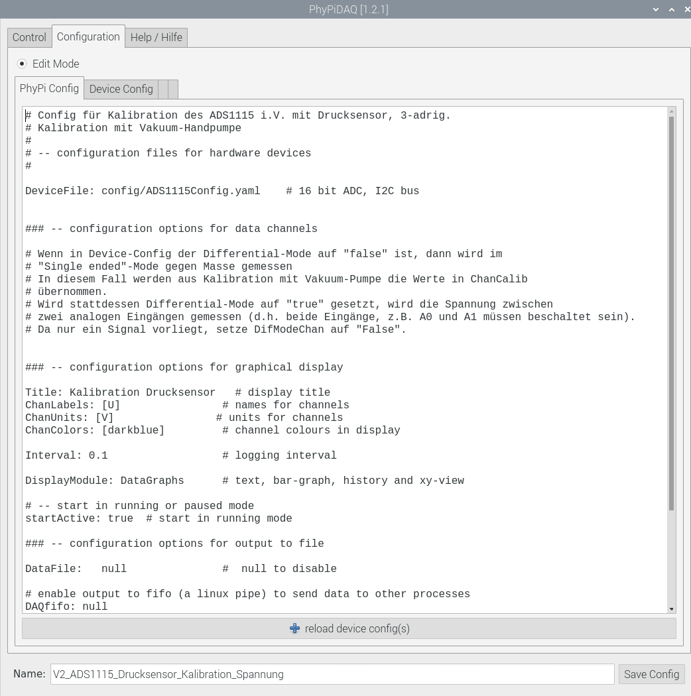

Abbildung 31: Haupt-Konfigurationsdatei der Drucksensor-Kalibration

c. Vorbereiten der Oberfläche, in welche die Referenz- und Messwerte eingespeichert werden können: Zur Erfassung der Wertepaare bietet sich ein Tabellenkalkulationsprogramm an. Falls ein kalibrierter Druck-Sensor in PhyPiDAQ eingebunden ist, kann dies über PhyPiDAQ geschehen: Wichtig ist hierbei, dass die entsprechenden Befehle angepasst werden: „NHistoryPoints“ auf eine hohe Zahl der Datenpunkte und „DataFile“ aktivieren, um die Daten- und Referenzpunkte in eine .csv-Datei exportieren zu lassen

d. Anpassen der Device-Config des AD-Wandlers, indem der entsprechende Kanal („Channel“) ausgewählt wird und DifModeChan auf „False“ gesetzt wird wie in der folgenden Abbildung beispielhaft dargestellt.

e. Abspeichern der gesamten Config

f. Anschließen der Hilfsmittel an den Drucksensor, Druckausgleich

Abbildung 32: Geräte-Konfigurationsdatei der Drucksensor-Kalibration

3. Starten der Messung durch Betätigen des „Run“-Buttons auf der PhyPiDAQ-Startseite. Bei Verwendung eines externen Referenz-Manometers schließen sich folgende Schritte an:

a. Notieren der Spannung, welche von PhyPiDAQ ausgegeben wird, bei aktuell vorliegendem Druck, welcher recherchiert werden muss (Atmosphärendruck) in die Arbeitsmappe des Tabellenkalkulationsprogramms

b. Stückweises Erhöhen des Drucks je nach Messbereich des Referenz-Manometers, sodass insgesamt mindestens 8 Spannungswerte gemessen werden können. Notieren des vorliegenden Druckes und der Spannung

c. Wiederholen des vorherigen Schrittes, bis der zukünftige Messbereich (maximal 8-9 bar) durch Messungen abgedeckt ist

d. Anschluss der Vakuum-Luftpumpe und Fortführen der Messungen bis ein Unterdruck von bis zu -800‘000 Pa erzeugt wurde. Für den hauptsächlichen Gebrauch im positiven Druckbereich ist auch ein maximaler Unterdruck von -100‘000 bar ausreichend. Alternativ können bei hinreichend bestimmter Kalibrationsfunktion (im Besten Fall eine Gerade) die Wertepaare im negativen Bereich bestimmt werden

e. Beenden der Messung

4. Eingabe der Messdaten in eine neue Haupt-Config unter dem Befehl „ChanCalib“ in Form von [[Referenzwert1, Referenzwert2, …], [Sensorwert1, Sensorwert2, …]] wie beispielsweise in folgender Abbildung ersichtlich

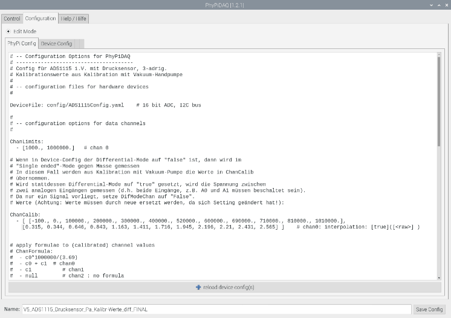  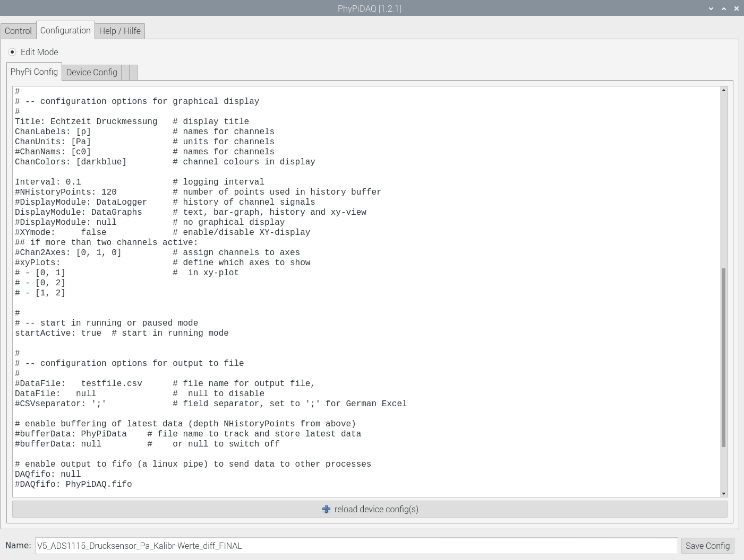 

Abbildung 33: Haupt-Konfigurationsdatei nach der Drucksensor-Kalibration

5. Abspeichern der neuen Config unter einem entsprechenden Namen, wie beispielsweise „Drucksensor-Kalibration“

Wird ein kalibrierter, in PhyPiDAQ integrierter Drucksensor als Referenz verwendet, so erfolgt das Auslesen der Wertepaare anhand der erzeugten CSV-Datei, welche direkt in die neue Config eingegeben werden können. Da der AD-Wandler gegen Masse geschaltet ist, findet bei jeder Messung mit dem neu kalibrierten Drucksensor eine Relativdruckmessung statt. Wird mit den Messwerten gerechnet, so ist darauf zu achten, dass der Atmosphärendruck gegebenenfalls hinzugerechnet werden muss.

Wird nicht mithilfe von PhyPiDAQ kalibriert, geschieht dies ähnlich. Hierbei können folgende Schritte ebenfalls zum Ziel führen:

1. Sicherstellen der richtigen Verkabelung des Drucksensors mit dem Multimeter und der Spannungsversorgung, Verbinden des Drucksensors über die Schlauchtülle mit dem Referenz-Gerät, wie in folgender Abbildung am Beispiel der Vakuum-Luftpumpe dargestellt. Hierzu muss das grüne Kabel mit dem Eingang des Multimeters (mittig im Bild) und das schwarze Kabel mit der Masse des Multimeters und der Spannungsquelle verbunden werden. Um eine eventuelle Spannungs-Überversorgung des Drucksensors zu vermeiden, ist es empfehlenswert, das rote Kabel des Sensors erst nach Einschalten des Netzgerätes (Spannungsquelle, oben im Bild) und Einstellen der Versorgungsspannung (5 V) mit diesem zu verbinden.

  
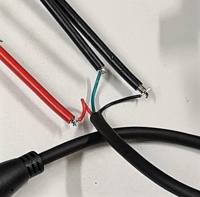

Abbildung 34: Oben: Experimenteller Aufbau der Drucksensor-Kalibration;
Unten: Verkabelung in Nahansicht

2. Einschalten des Multimeter und des Netzgerätes, Verbinden des roten Kabels mit dem Netzgerät. Ablesen und Eingeben des vom Multimeter detektierten Spannungswerts als Wertepaar mit dem aktuell vorliegenden Atmosphärendruck in eine PC-Anwendung, wie beispielsweise ein Tabellenkalkulationsprogramm. Der Atmosphärendruck kann über Recherche von Wetterdiensten hinreichend genau ermittelt werden. In obiger Abbildung ist eine Mess-Spannung von knapp 500 mV bei dem Atmosphärendruck, welcher zum Zeitpunkt der Messung vorlag, ersichtlich.

3. Durch Erhöhen und Absenken des Druckes sind im Bereich von mindestens -0,1 bis 8 bar hinreichend viele Wertepaare aufzuzeichnen, um die Aussagefähigkeit der Kalibration zu erhöhen. Im Falle der oben ersichtlichen Kalibration des Drucksensors wurden im negativen wie im positiven Druckbereich (ausgehend vom Atmosphärendruck) insgesamt 19 Wertepaare aufgenommen. Im Folgenden wird der Negativdruckbereich genauer untersucht, da mit der Vakuumpumpe exaktere Drücke einstellbar waren als mit der Fahrradluftpumpe. Um eine Aussage über die statistischen Fehler/Abweichungen treffen zu können, ist es sinnvoll, in mehreren Messreihen die Spannungen bei gleichen Drücken aufzunehmen. Im Rahmen dieser Arbeit wurden vier Messreihen im negativen Relativdruckbereich aufgestellt und die Mittelwerte und Standardabweichungen __ berechnet. Hieraus ergab sich eine sehr geringe maximale Streuung (Standardabweichung) von  und zeigt somit eine hinreichende Genauigkeit. Alternativ kann die Berechnung des statistischen Fehlers auch durch das Visualisierungsprogramm erfolgen (in Folgenden Schritten dargelegt).

4. Unter Berücksichtigung der systematischen Fehler/Messunsicherheiten, welche aus dem Datenblatt des Multimeters und des Drucksensors hervorgehen, werden mithilfe eines Visualisierungsprogramms die Messwerte visualisiert und die Spannung über dem Druck dargestellt. Im Zuge dieser Arbeit wurden hierfür die Programme Origin und ein Python-basiertes Visualisierungsskript namens PhyPraKit genutzt. Kostenlose und Open-Source-Programme, mit denen dies auch möglich ist, sind beispielsweise LabPlot2 und SciDAVis

5. Entsprechend des Verlaufs der Wertepaare ist im Folgenden die Anpassung einer Funktion an die Wertepaare nötig, um das Verhalten des Drucksensors quantifizieren zu können. Im Falle des vorhandenen Drucksensors zeigte der Drucksensor, wie die folgende Abbildung des negativen Relativdruckbereichs zeigt, nahezu einen idealen linearen Verlauf. Um seine Linearität zu überprüfen, ist mit einer quadratischen Funktion angenähert worden. Der kleine quadratische Term _q_ attestiert in diesem Fall eine sehr gute Linearität

Abbildung 35: Schaubild der Drucksensor-Kalibrationsfunktion

6. Die ermittelte Funktion muss im Folgenden näher betrachtet werden: Die vom Programm ausgegebene Funktion   stellt in diesem Fall keine Ursprungsgerade dar, sondern weist einen geringen Offset auf, welcher aber auch von Sensor zu Sensor unterschiedlich sein kann und eine Absolutwert-Kalibrierung als nicht zweckmäßig erscheinen lässt. Darum soll die Druckmessung in diesem Rahmen als Relativdruckkalibrierung erfolgen, wodurch die Güte lediglich von der Steigung der Geraden und ihren Fehlern abhängt. Die Steigung _m_ der Geraden beträgt somit  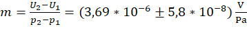  und kann für künftige Messungen verwendet werden

7. Für künftige Messungen muss die ermittelte Funktion in das entsprechende Messprogramm eingespeichert werden. Da nur die Differenzdrücke entscheidend sind, muss die Spannung, die bei Atmosphärendruck vorliegt, berücksichtigt werden:

a. Messen und notieren der Spannung bei Atmosphärendruck

b. Eingeben der nach dem Druck umgestellten Funktion   in das Feld „ChanFormula“ der neu erstellten Haupt-Config, mit welcher künftig gemessen werden soll

c. Eingeben des Atmosphärendrucks in die Formel. Dies kann folgende Form annehmen: 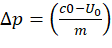  mit  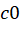  als Messkanal und    als Atmosphärendruck in V

Hierdurch werden die gemessenen Spannungen in zukünftigen Messungen automatisch mit der Formel umgerechnet.

  

# Anhang 3 - Weitere Informationen zur eingesetzten Sensorik und elektrischen Bauteilen

Nachfolgend sollen weiterführende Informationen zu den verwendeten Sensoren und elektronischen Bauteilen, sowie eine Hilfestellung zur Anbindung an den Raspberry Pi zur Verfügung gestellt werden.

- **ADS1115** (für analoge Eingangsgrößen) siehe [Adafruit](https://learn.adafruit.com/adafruit-4-channel-adc-breakouts/python-circuitpython):

  

Abbildung 36: Anbindung des ADS1115 an den Raspberry Pi (Quelle: [Adafruit](https://learn.adafruit.com/adafruit-4-channel-adc-breakouts/python-circuitpython))

 

Info zu PhyPiDAQ-Device-Config: Differential Mode: Wenn aktiviert, dann wird die Spannung zwischen zwei analogen Eingängen (z.B. A0 und A1) gemessen. In diesem Fall müssen A0 und A1 auch verkabelt sein. Über den Single-Ended-Mode wird die Spannung zwischen dem analogen Eingang und der Masse (Ground) gemessen. In der Regel ist dieser deaktiviert.

Bei starken Schwankungen des Eingangssignals empfiehlt es sich, einen Widerstand (z.B. 10 kOhm) zwischen den analogen Eingang und der Masse/Ground zu schalten. Zusätzlich kann mit einem Kondensator in Reihe mit dem Widerstand das Signal geglättet werden (Auslegung gemäß τ = R*C à C = τ/R, bei 0,1 sek und R=10 kOhm à C = 10 µF)

****

 **** 

****

- **MAX31855** (für Thermoelement Typ K) siehe [Adafruit](https://learn.adafruit.com/thermocouple/python-circuitpython) (statt an D5, Sensor an CE0 anschließen):

Abbildung 37: Anbindung des MAX31855 an den Raspberry Pi (Quelle: [Adafruit](https://learn.adafruit.com/thermocouple/python-circuitpython))

Bei mehreren MAX31855 ist die Verkabelung identisch, jedoch bekommt jeder MAX seinen eigenen Eingang beim Chip-Select (MAX1/Ch0 à SPICE0, MAX2/Ch1 à SPICE1)

- **MAX31865** (für PT100/PT1000, je nach Referenzwiderstand) siehe [Adafruit](https://learn.adafruit.com/adafruit-max31865-rtd-pt100-amplifier/python-circuitpython):

Abbildung 38: Anbindung des MAX31865 an den Raspberry Pi (Quelle: [Adafruit](https://learn.adafruit.com/adafruit-max31865-rtd-pt100-amplifier/python-circuitpython))

 **** 

- **DS18B20** (digitaler Temperatursensor) siehe [tutorials-raspi](https://tutorials-raspberrypi.de/raspberry-pi-temperatur-mittels-sensor-messen/):

  

Abbildung 39: Links: Anbindung des DS18B20 an den Raspberry Pi (Quelle: [tutorials-raspi](https://tutorials-raspberrypi.de/raspberry-pi-temperatur-mittels-sensor-messen/)), rechts: Verkabelung zweier DS18B20 an einem GPIO-Pin

Verkabelung: VCC zu 3,3 V-Pin, Ground zu Ground-Pin, Datenpin zu einem GPIO-Pin (z.B. GIPO 26). Der Widerstand ist bereits am Sensor verbaut. Datenpin muss jedoch in RasPi-Config.txt definiert werden! Siehe beispielhafte [Anleitung](https://tutorials-raspberrypi.de/raspberry-pi-temperatur-mittels-sensor-messen/).

- **Drucksensor an ADS1115** (Eigendarstellung)

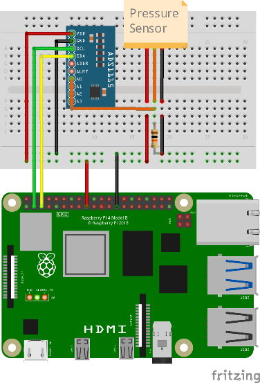

Abbildung 40: Anbindung des Drucksensors über den ADS1115 an den Raspberry Pi (Eigendarstellung)

Der Anschluss erfolgt wie in der Abbildung ersichtlich:

Tabelle 9: Anschluss des Drucksensors und des ADS1115 an den Raspberry Pi

| Raspberry Pi | à | ADS1115 | à | Drucksensor |
| --- | --- | --- | --- | --- |
| 3,3 V |  | VDD |  | Rot: Stromversorgung |
| GND |  | GND |  | Schwarz: Ground |
| SCL |  | SCL |  |  |
| SDA |  | SDA |  |  |
| GND über R=10 kOhm |  | A0 |  | Grün: A0 |

 

Bei andersfarbigen Litzen des Drucksensors sind dem Datenblatt entsprechend die jeweiligen Anschlüsse zu bestimmen. Der 10 kOhm-Widerstand wird benötigt, um die Störgrößen zu mildern. Bei starkem Rauschen kann ein 10 µF-Kondensator zusätzlich in Reihe verbaut werden. Der vorhandene Drucksensor könnte theoretisch auch an 5V betrieben werden.

****

* * *

