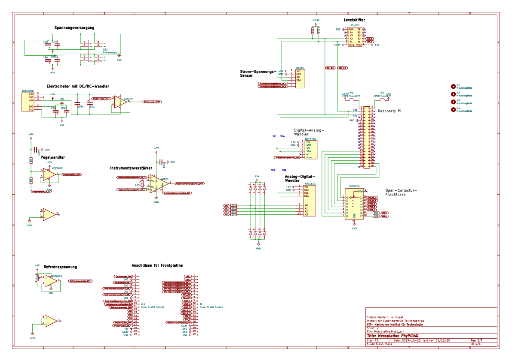

# Verstärkerplatine

Für viele Anwendungen werden Verstärkerschaltungen benötigt, um sehr kleine Spannungen
oder Spannungen von Quellen mit extrem hohem Innenwiderstand messen zu können. 

Beispiele für sehr kleine Spannungen sind Thermospannungen, Dehnungsmessstreifen oder Hall-Spannungen in der Physik oder EKG oder gar EEG in der Medizin. Für solche Anwendungen eigenen sich sogenannte "Instrumentenverstärker" die im Prinzip einem aus drei Operationsverstärkern aufgebauten Differenzverstärker mit regelbarem Verstärkungsfaktor entsprechen.  

Beispiele für sehr hochohmige Quellen sind z.B. Vakuum-Photozellen, Spannungsmessungen an geladenen Kondensatoren oder die Messung des Spannungsabfalls an einem 100MΩ- oder gar 1GΩ- Widerstand zur Messung der Leitfähigkeit von Luft oder an Geiger-Müller-Zählrohren. 
Für solche Anwendungen empfehlen sich Operationverstärker mit JFET-Transistoren an den Eingängen, mit denen Eingangswiderstände jenseits von 1TΩ realisiert
werden können.

In Verbindung mit einem hochauflösenden Analog-Digital-Wandler (ADC) wie dem
ADS1115 können mit wenig Aufwand sehr empfindliche Messungen von sehr kleinen Spannungen oder Strömen durchgeführt werden. Beispiele dafür sind an anderer Stelle in diesem Paket beschrieben und auch in Form eines 
[Messkoffers](https://github.com/PhyPiDAQ/MeasuringCase/blob/main/Dokumentation_de.md) 
realisiert. 

Die einfachen Operationsverstärkerschaltungen können aber auch auf Steckbrettern oder Lochrasterplatinen aufgebaut werden. Abb. 1. zeigt den auf einem CA3140 Baustein basierenden "Elektrometerverstärker", der an den Eingängen Innenwiderstände von typischerweise 1,5 TΩ aufweist. Dieser Baustein sollte mit asymmetrischer Betriebsspannung betrieben werden, die von einem DC-DC-Wandler vom Typ TMA0505D erzeugt wird. 
Alternativ funktionieren auch zwei 9V-Batterien oder auch zwei in Serie geschaltete 5V USB-Netzteile. Der Schaltplan ist in Abb. 1 gezeigt. 

  

Der Instrumentenverstärker AD623 kann direkt an eine unipolaren Betriebsspannung angeschlossen werden. Der Verstärkungsfaktor wird über den Trimmwiderstand Rg eingestellt. Für den Verstärkungsfaktor *V* gilt:

   $V = 1 + \frac{100 kΩ} {R_g} $ 

Die Schaltung ist in Abb. 2 dargestellt.  

  

Da der ADC ADS1115 nur positive Spannungen messen kann, muss das Ausgangssignal des
Elektrometer-Verstärkers ggf. um einen festen Wert verschoben werden. Der ADC kann dann die Differenz zwischen diesem Offset und der Ausgangsspannung darstellen. Die einfache Schaltung des Pegelwandlers mit einem Innenwiderstand in der Größenordnung von ~1MΩ ist in Abb. 3 gezeigt. 

  

In den Unterverzeichnissen *Messplatine/* und *Frontplatine/* finden sich die Quelldateien für eine Platine, die die relevanten Schaltungen enthält und direkt über ein Flachbandkabel an einen Raspberry Pi angeschlossen werden kann. 
Dies ist die kompakte Version der Messplatine, die auch im oben erwähnten Messkoffer enthalten und in der entsprechenden Dokumentation beschrieben ist. 
Der vollständige Schaltplan und eine 3D-Ansicht der Platine sind in 
Abb. 4 und 5 dargestellt.  

Die Platine enthält noch Steckplätze für einen Digital-Analog-Wandler MCP4725
und einen Strom-Spannungssensor INA219, die optional bestückt werden können. 

Zur einfachen Verwendung werden die relevanten Signale über eine Stiftleiste auf eine zweite Platine übertragen, an denen Ein- und Ausgänge über 2mm-Bananenstecker verbunden
werden können. Eine 3D-Ansicht ist hier gezeigt:

