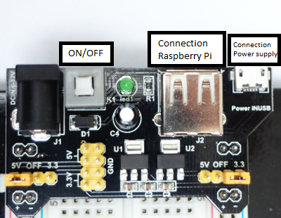
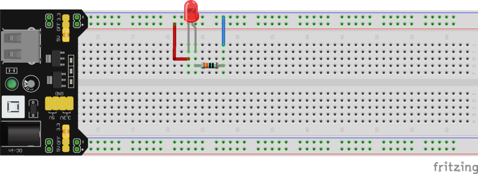
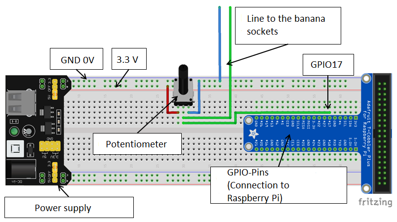
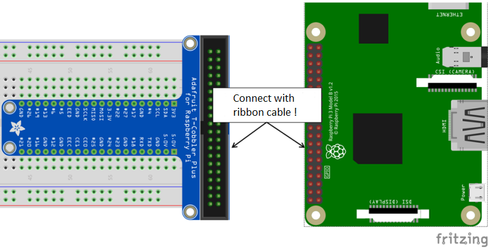
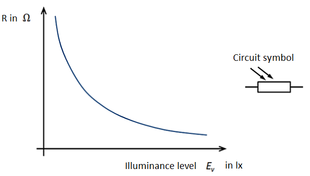
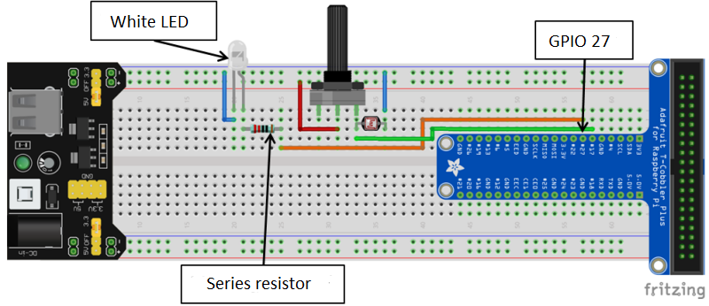
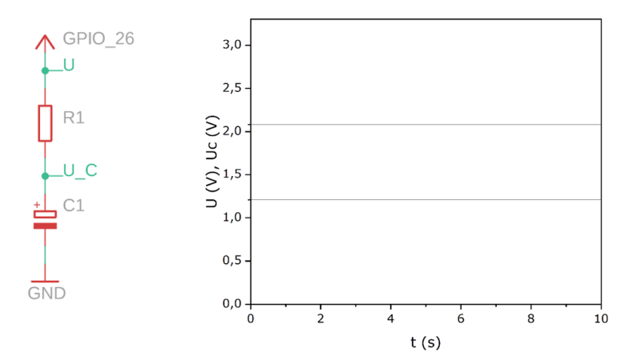

  


&nbsp;

&nbsp;

<center><span style="color:#5882FA; font-size: 40pt"> Introductory course <br>for digital data acquisition <br> with the Raspberry Pi <br> and PhyPiDAQ  </span></center>


| Overview of important components                |                                                              |
| --------------------------------------------------- | :----------------------------------------------------------: |
| AD-Converter ADS1115                                  |                      |
| Banana socket mit with connected breadboadcable |                  |
| Photo resistor (LDR Typ5516)                        |                          |
| Instrumentation Amplifier AD623                        |    |
| Ceramic capacitor 0,1 µF                           |              |
| Electrolytic capacitor 10 µF                         |               |
| Force sensor, load cell TAL220B                      |                 |
| NTC-resistor *R<sub>25</sub>* = 10 k&Omega;       |                          |
| Potentiometer 10 k&Omega;                           |                |
| Power supply                                 |                 |
| Resistor (ex. 10 k&Omega;)                       
Colour code: <span style="color:SaddleBrown">brown</span>, black, black, <span style="color:red">red</span>, <span style="color:SaddleBrown">brown</span>                                  | |

<div style="page-break-after: always;"></div>

# 1. Digital measurement technology

We encounter digital measurement technology everywhere in daily life, e. g. the digital temperature display on the freezer, a heart rate monitor for sports, a digital kitchen scale or the parking aid in the car ... . Our world would indeed be a different place without digital measurement technology!

<span style="color:#5882FA; font-size: 12pt">Task 1: </span>Name three other devices or applications in which digital measurement technology occurs and name the physical quantity that is measured.


|  |Device / Application| Physical quantity|
|--|--------------------------|---------------------------|
|1.|                               |                                |
|2.|                               |                                |
|3.|                               |                                |

# 2. The Breadboard and the LED

### Introduction 
In the next few hours, we will look at how to record and process digital measured values. We will use a breadboard on which we plug the circuits and LEDs as illuminants. First we will look at how to use them.

### The LED


When we want to display something optically In our project, we  use so-called LEDs. **LED** is the abbreviation for **L**ight **E**mitting **D**iode. In order to make the LED light up, it cannot simply be connected to a power supply, unlike an ordinary light bulb. Instead, there
are **two things** to consider:

  1. The LED must always be operated with a **resistor in series**, otherwise it will be destroyed.
  2. The LED is a diode and can be connected in forward or reverse direction. It therefore has an **anode** (positive pole) and a **cathode** (negative pole). If the **LED is to light up**, it must be connected in the forward direction, i. e. the **anode** must be connected to the **higher potential** or the +-pole of the power supply.

### The Breadboard
We build our circuits on a so-called "breadboard". To be able to plug in the circuits, it is important to know how the breadboard is constructed.
In the following illustration, the electrically connected plug contacts are marked by lines.  


<span style="color:#5882FA; font-size: 12pt">Task 1: </span> In which of the circuits shown below does the LED light up? Give reasons.  

**Circuit 1:**


**Circuit 2:**


**Circuit 3:**



&nbsp;
------


&nbsp;
------


&nbsp;
------

&nbsp;

<div style="page-break-after: always;"></div>

# 3. What does digital measurement mean?  

Before we can really get started, we first need to look at how the Raspberry Pi communicates with its environment. The Raspberry Pi has **GPIO** pins (**g**eneral **p**urpose **i**nput/**o**utput). It can communicate with its environment via these. The GPIO pins are numbered consecutively and connected to the breadboard via a (multi-coloured) ribbon cable. On the one hand, there are pins for the power supply with 5V and 3.3V as well as GND (0V) and GPIO pins that are used for the actual communication. Each pin can assume the digital **states 1 (true = true) or 0 (false = false)** and can be used both as an **input** or as an **output** of the Raspberry Pi. 

In order to communicate with the Raspberry Pi via the GPIO pins, we first need to investigate how the Raspberry Pi distinguishes between the two states 0 and 1. To do this, we will now build a circuit and write our first small program.

### GPIO-Pin


**Material:**

 + 10 k&Omega; potentiometer
 + Breadboard with power supply and power supply unit
 + Breadboard wires in different colours
 + voltmeter
 + Raspberry Pi
 + ribbon cable

**Implementation:**

<span style="color:#5882FA; font-size: 12pt ">1. </span>Plug the circuit onto the breadboard according to the following circuit diagram and the illustration of the circuit structure and, after checking the circuit structure, switch on the power supply of the breadboard (green LED on power supply lights up).   
With the help of the potentiometer, the electrical voltage at the input pin GPIO17 can be set in a range between 0 and 3.3V. The voltmeter is connected via the two leads to the banana sockets in such a way that the voltage between the wiper (the middle pin) of the potentiometer and GND (0V) can be measured.




<span style="color:#5882FA; font-size: 12pt ">2. </span> For those who want to work on the Raspberry Pi with screen, keyboard and mouse (those who want to work remotely with the VNC viewer instead can go directly to step 4): Connect the screen, keyboard and mouse to the Raspberry Pi.

<span style="color:#5882FA; font-size: 12pt ">3. </span>Now we have to connect the Raspberry Pi to the breadboard via the ribbon cable. The Raspberry Pi has no on/off switch, but is started simply by connecting it to the power supply.



<div style="page-break-after: always;"></div>

<span style="color:#5882FA; font-size: 12pt ">4. </span>For those who want to work remotely with the VNC viewer (others can go straight to step 5):  
Once the Raspberry Pi is started, we can connect to the Raspberry Pi from the laptop (or other display device) via the VNC viewer:

+ First call up the VNC viewer.

  

+ Next, enter the IP address of the Raspberry Pi you are using in the line at the top (it is written on a piece of paper on the Raspberry Pi) and confirm with Enter. 

+ Now a connection is established with the Raspberry Pi via the WLAN and the window shown below should appear. Here you only need to enter the user name pi and the password (which is on the Raspberry Pi) and start the connection with OK.

  

+ If everything has been specified correctly, you can now see the screen view of the Raspberry Pi and work with the Raspberry Pi via the VNC viewer.

  

+ For the next time, the created connection can be started by double-clicking on the screen icon with the appropriate IP address.

  

<span style="color:#5882FA; font-size: 12pt ">5. </span> To find out what state GPIO pin 17 has and to display this state, we now write our first small program:

- To do this, first open the **PhyPi** directory via the **folder symbol** at the top left and create a **Myprograms** directory in which we save our programs. 

- Using the **Raspberry** (top left) and the **Development** tab, we open the **Python 3 (IDLE)** program.

- Now we have to create a file for our first program via **File** and **New File**.

- We write our first program code in this file:

  Everything in the program behind a hashtag # symbol is an explanatory comment on the program line before it (and not a request to tweet) .

  ```python
  import RPi.GPIO as GPIO # We import the library GPIO. 
  import time # We import the library "time".
  GPIO.setmode(GPIO.BCM) # We indicate how the GPIO pins are numbered.
  GPIO.setup(17, GPIO.IN) # GPIO pin 17 is set as input.
  
  try: # Execution of the program code as long as there is no interruption.
  	while True: # Continuous loop (everything put in after that is repeated).
  		print("Status GPIO17:") # We output the text "Status GPIO17:".
  		print(GPIO.input(17)) # We output the state of GPIO pin 17.
  		time.sleep(0.1) # We wait 0.1 s (Raspberry Pi "sleeps").
  except KeyboardInterrupt: # When the program is interrupted with Ctrl + C,
  	GPIO.cleanup() #... still being roughened up.
  ```

<span style="color:#5882FA; font-size: 12pt ">6. </span> Before we can start our program, we have to save our file via **File** and **Save** under the name **digital.py** in our subdirectory **MyPrograms** in the directory **PhyPi**.

<span style="color:#5882FA; font-size: 12pt ">7. </span> With **Run** or `F5` we start our program and now get the state of GPIO pin 17 displayed every 0.1 seconds.

<span style="color:#5882FA; font-size: 12pt ">8. </span>Turn the potentiometer and use it to change the voltage at GPIO pin 17. Note down your observations.


&nbsp;
------


&nbsp;
------


&nbsp;
------


&nbsp;

<span style="color:#5882FA; font-size: 12pt ">9. </span> Everything that is indented (after line 7) in our continuous loop ```while(True):``` is now repeated over and over again. If we want to end our program, we have to interrupt our continuous loop. To do this, we press ``Ctrl + c`` at the same time.

<span style="color:#5882FA; font-size: 12pt ">10. </span>Formulate a mnemonic: What must be true for the voltage between GPIO pin 17 and GND (0V) if GPIO pin 17 has the state 1 (true) or 0 (false)?

&nbsp;
------


&nbsp;
------


&nbsp;
------


&nbsp;
------


&nbsp;

<span style="color:#5882FA; font-size: 12pt ">11. </span> So what does digital measurement mean?
Select the appropriate terms from the following and complete the cloze.

countable, analogue, digital, false, continuous, integer, GPIO pin, Raspberry Pi, true, stepless

Digital measurement means that measured values are recorded in steps. A digital _ _ _ _ _ _ _ _ is digital because it can only assume a _ _ _ _ _ _ _ _ _ and _ _ _ _ _ _ _ _ number of states. It can assume either state 0 ( _ _ _ _ _ _ _ _ _ _ ) or state 1 ( _ _ _ _ _ _ _ _ _ _ ).

<div style="page-break-after: always;"></div>

# 4. Automatic light control (light-dark sensor)
Now we know how the state of a GPIO pin is determined and can use that to build our first own digital sensor.  
Everyone knows the automatic light system in newer cars, which automatically switches on the light when it gets dark outside or when you drive into a tunnel. The lighting of entrances to houses or the lighting of paths is also often equipped with an automatic light system. To understand how something like this can work, we will now build our own automatic light system. 

### Schaltungsentwurf und Realisierung

### Circuit design and realisation

**Material:**

 + 10 k&Omega; potentiometer
 + 220 &Omega; series resistor for LED (colour code: red, red, black, black, brown)
 + photoresistor (LDR type5516)
 + white LED
 + breadboard with power supply and power supply unit
 + breadboard cables in different colours
 + Raspberry Pi
 + ribbon cable

**Implementation:**

<span style="color:#5882FA; font-size: 12pt ">1. </span>Plug the illustrated circuit onto the breadboard according to the following circuit diagram and the illustration of the circuit structure and, after checking the circuit structure, switch on the power supply to the breadboard.  


  

<span style="color:#5882FA; font-size: 12pt ">2. </span>Open the program **Python 3 (IDLE)** and the previously created program file **digital.py** in the directory **Myprograms**. Now start the previously created program with **Run** or `F5`.
Darken the photoresistor (LDR) by hand. Alternate several times between darkened and bright state and note down your observations. With `Ctrl + C` you can end the program.


&nbsp;
------


&nbsp;
------


&nbsp;
------

<span style="color:#5882FA; font-size: 12pt ">3. </span>How does the observed behaviour occur? Let's take a closer look at the photoresistor LDR (**L**ight **D**ependent **R**esistor):  
  

<div style="page-break-after: always;"></div>

Based on the illustration, formulate a note on how the ohmic resistance of the photoresistor behaves as a function of the illuminance.


&nbsp;
------


&nbsp;
------


&nbsp;
------

&nbsp;

<span style="color:#5882FA; font-size: 12pt ">4. </span> Let's go back to our observation from 3. How does this behaviour occur?
To find out, we need to take a closer look at the circuit we used. We have used a simple voltage divider (series connection of two resistors).  
The resistors have the same current *I* flowing through them, so the voltage divider splits the total voltage *U<sub>ges</sub>* in the ratio of the resistors, i. e. the ratio between the voltages *U<sub>1</sub>* and *U<sub>2</sub>* is equal to the ratio between the resistors.

The resistors have the same current *I* flowing through them, so the voltage divider divides the total voltage *U<sub>ges</sub>* in the ratio of the resistors, i. e. the ratio between the voltages *U<sub>1</sub>* and *U<sub>2</sub>* is equal to the ratio between the resistors *R<sub>1</sub>* and *R<sub>2</sub>*:  
$$
\frac{U_1}{U_2}=\frac{R_1}{R_2}
$$
In the same way, the ratio of the partial resistance (*R<sub>1</sub>* or *R<sub>2</sub>*) to the total resistance (*R<sub>ges</sub>* = *R<sub>1</sub>* + *R<sub>2</sub>*), can be used to infer the ratio between the partial voltage (*U<sub>1</sub>* or *U<sub>2</sub>*) and the total voltage *U<sub>ges</sub>*.  
$$
\frac{U_1}{U_{ges}}=\frac{R_1}{R_{ges}}=\frac{R_1}{R_1+R_2}
$$
 resp.  
$$
\frac{U_2}{U_{ges}}=\frac{R_2}{R_{ges}}=\frac{R_2}{R_1+R_2}
$$
In general, it can be stated for the voltage divider that the voltages behave like the associated resistors.  

Based on the relationships for the voltage divider and the characteristic curve from third, complete the following theorem:

The greater the illuminance, the _ _ _ _ _ the resistance *R<sub>2</sub>* of the photoresistor.  The voltage *U<sub>1</sub>* thus becomes _ _ _ _ _ _ _ _and the voltage *U<sub>2</sub>* applied to GPIO pin 17 becomes _ _ _ _ _ _ . 

What does this have to do with the state of GPIO pin 17, i. e. with whether a 0 or a 1 is displayed? 

Let's take a look at an example: The photoresistor has a resistance of *R<sub>2</sub>* = 2 k&Omega; in the illuminated case; and a resistance of *R<sub>2</sub>* = 30 k&Omega;  in the darkened case. What does this mean for the voltage *U<sub>2</sub>* at GPIO pin 17 and the state of the pin? Work on the following task.

**lighted case:**

What is the voltage at GPIO pin 17? Calculate 


&nbsp;


&nbsp;


&nbsp;


&nbsp;

What is the state of GPIO pin 17 in this case? Give reasons...


&nbsp;
------


&nbsp;
------


&nbsp;
------


&nbsp;

**darkened case:**

What is the voltage at GPIO pin 17? Calculate.


&nbsp;


&nbsp;


&nbsp;


&nbsp;

What is the state of GPIO pin 17 in this case? Give reasons.


&nbsp;
------


&nbsp;
------


&nbsp;
------

&nbsp;

<div style="page-break-after: always;"></div>

<span style="color:#5882FA; font-size: 12pt ">5. </span>So we built a simple sensor from a photoresistor and a second resistor, with which we can distinguish between light and dark after digitisation. In order to have an automatic light system, we still need a light that is switched on or off depending on our sensor. For this, we add a white LED (observe polarity) with a series resistor (220 &Omega;) to our circuit, which we connect to GPIO pin 27.


<span style="color:#5882FA; font-size: 12pt ">6. </span> We now just have to adapt our program so that the LED is switched on or off depending on the state of GPIO pin 17.

- We open the program **Python 3 IDLE** and create a file **lightcontrol.py** for our new program, which we save in the directory **Myprograms**.

- We write our program code for the automatic light system in this file:

```python
  import RPi.GPIO as GPIO # We import the library GPIO.
  import time # We import the library "time".
  GPIO.setmode(GPIO.BCM) # We specify how the GPIO pins are numbered.
  GPIO.setup(17, GPIO.IN) # GPIO pin 17 is set as input.
  GPIO.setup(27, GPIO.OUT) # GPIO pin 27 is set as output.
  try: # Execute the program code as long as there is no interruption.
    while True: # Continuous loop (everything set up afterwards is repeated).
        statusGPIO17 = GPIO.input(17) # Query the status of GPIO pin 17
        if statusGPIO17 == 1: # If (if) the state is 1, then...
            GPIO.output(27, GPIO.HIGH) # ...we switch on the LED.
        if statusGPIO17 == 0: # If (if) the state is 0, then...
            GPIO.output(27, GPIO.LOW) # ...we turn off the LED.
        time.sleep(0.1) # We wait 0.1 s (Raspberry Pi "sleeps").
  except KeyboardInterrupt: # If the program is interrupted with Ctrl + C,
    GPIO.cleanup() # ... is still being cleaned up.
  ```

  The program looks very similar to our first program. For the LED, however, we need a GPIO pin that is connected as an output. We can therefore determine its state in the program and use it to switch the LED on or off. The GPIO pin can also assume the states 1 (HIGH = 3.3 V = LED ON) and 0 (LOW = 0 V = LED OFF).

- Now we save our program and start it with **Run** or `F5`. 

- Now we can test our automatic light control. When dimming, the LED should now be switched on.

- If we want to end the program, we can simply press ``Ctrl + c`` and our continuous loop will be stopped. 

<span style="color:#5882FA; font-size: 12pt ">7. </span>Based on our observations of the past experiments, a basic principle of digital measured value acquisition can be identified, which is shown in the following figure on the left. Supplement the general illustration with the following terms from the example of the automatic lighting system:

illumination-dependent resistor, illuminance, GPIO pin, LED on / LED off, voltage divider


<div style="page-break-after: always;"></div>

# 5. We build a digital thermometer


Before we get straight to the thermometer, we first need to backtrack a bit. If the person on the ground wants to know where exactly their friend is, the answer "On level 10!" will certainly help them more than "In the treetop!". 

We also have digital values in this example:

- in the case of the answer "In the treetop!" exactly two ("In the treetop" = 1, "Not in the treetop" = 0).
- in the case of the answer "On step 10!" exactly as many possible values as the ladder has steps.

The person on the ground would know even more precisely if the ladder had an extremely large number of closely spaced steps. We could therefore resolve the height even better (i. e. indicate it more precisely).

But what does this have to do with our digital thermometer? In the example of our automatic light control, we saw that we can digitise (0 and 1) using the GPIO pins. For a thermometer, however, such a form of digitisation would not really be satisfactory. We could only distinguish between two values (warm and cold). So we need something comparable to the ladder that allows us a finely graduated digitisation so that we can determine temperature values.

<div style="page-break-after: always;"></div>

### The Analogue-to-Digital Conversion (AD-Conversion)


The analogue-to-digital converter converts an analogue signal into a digital signal. This means it converts a continuous signal with an infinite number of signal values into a sequence of value pairs consisting of a time value and a signal value. One signal value is recorded at fixed points in time (sampling). The signal values can only assume the values of fixed levels (quantisation). The values are always rounded to the nearest level. 

Since the signal values can only be recorded in steps, an error, the quantisation error, always occurs during the analogue-digital conversion. As in the example of the ladder, the smaller the distance between the steps (resolution *U<sub>LSB</sub>* ), the smaller this error. We also lose information through sampling. We only ever know the signal value at discrete points in time and cannot make any statement about the signal value between two sampling points in time.

<span style="color:#5882FA; font-size: 12pt">Task 1: </span>Label the two signals shown above with the terms "analogue signal" and "digital signal" respectively.

<div style="page-break-after: always;"></div>

### Circuit design

But now to the construction of our digital thermometer. As with the automatic light control, a variable resistor, the NTC resistor, is used here as well. This resistor is temperature-dependent.

Let's first look at its characteristic curve.


<span style="color:#5882FA; font-size: 12pt">Task 2: </span>Based on the illustration, formulate a note on how the ohmic resistance of the NTC resistor behaves as a function of temperature. 


&nbsp;
------


&nbsp;
------


&nbsp;
------


&nbsp;

<div style="page-break-after: always;"></div>

<span style="color:#5882FA; font-size: 12pt">Task 3: </span>Complete the following circuit so that the electrical voltage *U<sub>2</sub>* applied to the connection pin of the AD converter increases when the temperature rises (tip: voltage divider).


With the designed circuit, we have now laid the foundation for our thermometer. The voltage divider with the NTC resistor provides us with a temperature-dependent analogue voltage signal. Now we have to take care of digitising this voltage signal and calculating the temperature value.

### Realisation of the digital thermometer

**Material:**

- 10 k&Omega; resistor (colour code: brown, black, red, brown).
- NTC resistor (**N**egative **T**emperature **C**oefficient) *R<sub>25</sub>* = 10 k&Omega;
- AD converter ADS1115
- Breadboard with power supply and power supply unit
- Breadboard cables in different colours
- Raspberry Pi
- Ribbon cable
- Electric kettle
- Beakers
- Liquid thermometer
- Glass rod for stirring
<div style="page-break-after: always;"></div>

**Implementation**:

<span style="color:#5882FA; font-size: 12pt ">1. </span>Add lines to the following circuit design on the breadboard so that the voltage divider consisting of 10 k&Omega; resistor and NTC resistor corresponds to the circuit designed above.


<span style="color:#5882FA; font-size: 12pt ">2. </span>Build the circuit on the breadboard. The following table shows how to connect the AD converter to the breadboard.

| AD converter ADS1115 connections |  Connections breadboard / GPIO pin                          |
| ----------------------------- | ---------------------------------------------------------- |
| VDD                           | 5 V                                                        |
| GND                           | 0 V                                                        |
| SDL                           | GPIO-Pin SCL                                               |
| SDA                           | GPIO-Pin SDA                                               |
| A0                            | Voltage divider (between 10 k&Omega;- and NTC resistor) |

<span style="color:#5882FA; font-size: 12pt ">3. </span>Now we have built our circuit for the digital thermometer and can take care of a program for evaluation:

- To do this, we again open the program **Python 3 (IDLE)** and create a program file **thermometer.py**.

- Now we can create our program code for evaluation:

  ```python
  import Adafruit_ADS1x15 # We import the library for the AD converter.
  import time # We import the library "time".
  adWandler = Adafruit_ADS1x15.ADS1115() # We name our ADS1115 adWandler.
  
  while True: # Continuous loop.
      adValue = adWandler.read_adc(0,2/3) # We read the current value of the AD converter at port A0 and store it in "adValue".
      print("Current value AD converter:") # We output the text "Current value of the ad converter:".
      print(adValue) # We output the current value of the AD converter.
      time.sleep(1) # We wait 1 s (Raspberry Pi "sleeps").
  ```

  Our program now does the following: It queries the digitised signal value at connection A0 of the AD converter and outputs it. Then it waits one second and then queries the next value, and so on.

- We save our program and start it with **Run** or `F5`.

- Note the displayed value (approximately) at room temperature. What happens when the NTC resistor is brought to hand temperature between the palms? Note down your observations.


&nbsp;
------


&nbsp;
-------


&nbsp;

   - Then we interrupt our continuous loop and thus our program again with ``Ctrl + c``.

<span style="color:#5882FA; font-size: 12pt ">4. </span>Actually, we are interested in the voltage value at connection A0 of the AD converter in order to be able to determine a temperature from this value. But what do the observed values have to do with this voltage value? 

The values provide information about which level was assigned to the signal at connection A0 during digitisation. So we still have to assign this value to a voltage level.

To do this, we first need to know the resolution of our AD converter, i. e. we need to know "how high" a single stage is. Our AD converter (ADS1115) has 32767 stages. With each sample, it assigns a certain stage to the analogue signal at connection A0. So now we just need to know what voltage difference a stage corresponds to. Our AD converter (ADS1115) is programd to digitise voltage values from 0 V to 6.114 V.

- Calculate with the given information:

  What voltage difference does one step correspond to ( &#8793; resolution &#8793; *U<sub>LSB</sub>*) ? To do this, complete the following equation and calculate the resolution.


$$
  \text{Resolution} = U_{LSB}=
$$


   - As we note, this value is very small, so that the voltage to be measured can be resolved in very small steps.

   - Fill in the missing values in the following table.

     | Level | &#x27F9; | digitised voltage in V |
     | ----- | :------: | ---------------------------- |
     | 0     | &#x27F9; | 0                            |
     | 32767 | &#x27F9; | 6,114                        |
     | 1     | &#x27F9; |                              |
     | 518   | &#x27F9; |                              |
     | 16383 | &#x27F9; |                              |

   - Now we have to supplement our program so that we no longer get the value of the step, but the value of the digitised voltage. To do this, we have to complete the following program in such a way that the resolution is calculated in line 4 and assigned to the variable 'resolution'. We also have to add the calculation of the digitised voltage value in line 6. 

   - Complete the program **thermometer.py** accordingly.

     <span style="color:crimson">Attention: In programming, a point corresponds to a comma ( i. e. 6.114 &#8793; 6,114)! </span>

     ```python
     import Adafruit_ADS1x15 # We import the library for the AD converter.
     import time # We import the library "time".
     adWandler = Adafruit_ADS1x15.ADS1115() # We name our ADS1115 adWandler.
     resolution = 6.114/32767 # Here we calculate the resolution.
     while True: # Continuous loop.
         adValue = adConverter.read_adc(0,2/3) * resolution # We read the current value of the AD-converter and convert it into a digitised voltage.
         print("Current value AD converter:") # We output the text "Current value of the AD converter:".
         print(adValue) # We output the value of the digitised voltage.
         print("V") # We output the unit V.
         time.sleep(1) # We wait 1 s (Raspberry Pi "sleeps").
     ```

   - Now we can test our program. To do this, we save the program file and start it with **Run** or `F5`. 

   - Note the approximate voltage value at room temperature. What happens when the NTC resistor is brought to hand temperature between the palms? Note down your observations. 


&nbsp;
------


&nbsp;

<span style="color:#5882FA; font-size: 12pt ">5. </span>We are still missing something on our way to a digital thermometer. So far, the Raspberry Pi only gives us digitalised voltage values. So we still have to make sure that we can convert these voltage values into temperatures. This step is called calibration.

During calibration, we have to link our digitised voltage values with the corresponding temperature values. In this way, we obtain pairs of values from a voltage value and a temperature value. Based on these value pairs, the Raspberry Pi can then calculate the corresponding temperature from the digitised voltage values.


So let's carry out the calibration:

- To do this, we record the associated digitised voltage values in the range between 20 °C and 50 °C at intervals of approx. 10 °C:

  We obtain the required water temperatures by mixing water from the kettle and the tap accordingly. We measure the temperature with the liquid thermometer. Fill in the following table.

  |                      | 1.   | 2.   | 3.   | 4.   |
  | -------------------- | ---- | ---- | ---- | ---- |
  | Temperature *T* in °C |      |      |      |      |
  | Voltage *U* in V    |      |      |      |      |

- Draw the pairs of values in a diagram and connect the measuring points sensibly to form a curve (gap below).


&nbsp;


&nbsp;


&nbsp;


&nbsp;


&nbsp;


&nbsp;


&nbsp;


&nbsp;


&nbsp;
- Read from the diagram the approximate expected digitised voltage value for a temperature of 35 °C and note it down.


&nbsp;
-----

&nbsp;

<div style="page-break-after: always;"></div>

<span style="color:#5882FA; font-size: 12pt; ">6. </span>We can now use the determined calibration values to calculate temperature values with the digitised measuring voltage of the AD converter. We proceed in a similar way as when we connect the measured values by hand in the diagram (compare the previous task). 

We let the Raspberry Pi calculate a function whose course connects our measuring points as favourably as possible. With this function, we can then calculate the corresponding temperature for each measured digital voltage value. The more pairs of values we have for the calibration and the more precisely they have been determined, the more precise the temperature values determined will also be.

So let's complete the calculation of the temperature:

- To do this, we open our program **thermometer.py** again.

- Now we can add the calculation of the temperature values to our program. For value1 to value4, we have to enter the values from the calibration for voltage or temperature (without units). <span style="color:crimson">Attention: Apply ascending order of values! </span>

```python
  import Adafruit_ADS1x15 # We import the library for the AD converter.
  from scipy.interpolate import UnivariateSpline # We import the library for the interpolation.
  import time # We import the library "time".
  
  adWandler = Adafruit_ADS1x15.ADS1115() # We name our ADS1115 adWandler.
  resolution = 6.114/32767 # We calculate the resolution of the AD converter.
  U = [value1, value2, value3 , value4] # Voltage values from calibration.
  T = [value1, value2, value3 , value4] # temperature values from the calibration.
  calibFunkt = UnivariateSpline(U,T) # We calculate the calibration function.
  
  while True: # Continuous loop.
      adValue = adTransducer.read_adc(0,2/3) * resolution # Value adTransducer.
      temperature = calibFunkt(adValue) # We calculate the temperature from the digitised voltage of the AD converter.
      temperature = round(float(temperature),1) # We round the temperature value # to one decimal place.
      print("temperature:") # We output the text "temperature".
      print(temperature) # We output the value of the temperature.
      print("°C") # We output the unit °C.
      
      time.sleep(1) # We wait 1 s (Raspberry Pi "sleeps").
  ```

- We save our program file again and start the program with **Run** or `F5`.

- Now we can test our digital thermometer.

- We end the program again with ``Ctrl + c``. 

<div style="page-break-after: always;"></div>

<span style="color:#5882FA; font-size: 12pt">Aufgabe 4: </span>The basic principle of digital measured value acquisition learned in the example of the automatic light system can also be applied to our digital thermometer.

Fill in the missing terms for our example of the digital thermometer.


<div style="page-break-after: always;"></div>


# 6. We examine the charge and discharge curve of a capacitor

**Material:**

- 1 k&Omega; resistor (colour code: brown, black, black, brown, brown)
- 100 k&Omega; resistor (colour code: brown, black, black, orange, brown)
- Electrolytic capacitor 10 μF
- Photo resistor (LDR type5516)
- AD converter ADS1115
- Breadboard with power supply and power supply unit
- Breadboard cables in different colours
- Raspberry Pi
- Ribbon cable

**Implementation:**

In this task, the voltage when charging and discharging a capacitor is to be represented. To do this, we first determine the charging or discharging time for our circui

The product of resistance and capacitance gives **τ (Tau) = R* C** and is called the time constant. With this you are able to calculate when the capacitor is "fully" charged, or for example 63.2%, which would correspond exactly to **τ**. In the table you will find more values for different τ's.

| τ (Tau) | Loading: Uc(t) [%]  | Unloading to: Uc(t) [%] |
| --------| ------------------|-------------------------|
| 1τ      | 63,2              |36,8                     |
| 2τ      | 86,5              |13,5                     |
| 3τ      | 95,0              |5,0                      |
| 4τ      | 98,2              |1,8                      |
| 5τ      | 99,3              |0,7                      |

You can clearly see that after 5τ the capacitor is almost fully charged. In our diagram, we want to show a charging and a discharging curve within 10 seconds.

So how many seconds corresponds to 5τ in our case, how much to 1τ?
Note down your result in the table.

| τ      | t [s] |
| -------|-------|
| 1      |       |
| 5      |       |

We have a 10μF electrolytic capacitor available. How big do we have to choose the resistor R1? Calculate. (To choose from: 1k&Omega; and 100k&Omega;).

R1 =

The series circuit to be measured consisting of resistor R1 and capacitor C1 is shown below. We want to plot the potential Uc(t) over time t. Can you already draw a curve with a pencil on the next page using the table and the calculated values?



Now we want to measure the capacitor voltage Uc(t) using the analogue-digital converter ADS1115. This is connected to the Raspberry Pi via the I2C bus (signal SDA and SCL) and read out with the help of PhyPiDAQ. At the same time, we write a small piece of code that charges the capacitor while the LDR is illuminated and discharges it again when little light falls on the LDR.
To do this, we first build the following circuit on the breadboard: (Do not plug in the power supply or remove the ribbon cable yet!)


After we are sure that everything is set up correctly, the power supply and the ribbon cable are plugged in. 

Now we proceed in the same way as with the already programd light control (3.6) and want to use the LDR to control the charging and discharging process. To do this, we use the already programd file again. 

Tip: The tab key completes the entries in the console as soon as they are clear!

- In the console we change to the working directory with the command ```cd PhyPi/Meineprogram/```.
- Now we can display the contents of the folder with the command ```ls``` and find the file lichtautomatik.py, which we copy with ```cp lichtautomatik.py ladesteuerung.py```. 
- We now open this file with ```idle ladesteuerung.py```.

Now change the values of the GPIOs to which you have connected the output (charge signal) and input (LDR) in GPIO.setup() and in the rest of the program.

```python
import RPi.GPIO as GPIO # We import the library GPIO.
import time # We import the library "time".
GPIO.setmode(GPIO.BCM) # We specify how the GPIO pins are numbered.
GPIO.setup(17, GPIO.IN) # GPIO pin 17 is set as input.
GPIO.setup(26, GPIO.OUT) # GPIO pin 27 is set as output.

while True: # Continuous loop (everything set up afterwards is repeated).
	statusGPIO17 = GPIO.input(17) # We query the status of GPIO pin 17.
	if statusGPIO17 == 1: # If (if) the state is 1, then...
	  GPIO.output(26, GPIO.HIGH) # ...we switch on the LED.
	if statusGPIO17 == 0: # If (if) the state is 0, then...
	  GPIO.output(26, GPIO.LOW) # ...we turn off the LED.
	time.sleep(0.1) # We wait 0.1 s (Raspberry Pi "sleeps").
```

To start the program, type ``python3 ladesteuerung.py`` and confirm with Enter.  

To exit, you would now press ``Ctrl + c``, but we want to carry out the measurement in PhyPiDAQ in parallel and therefore start PhyPiDAQ via the icon on the desktop.

Now set the Y-axis range to 0 to 3.3V. To do this, go to ``Configuration -> PhyPiConfig`` and click on ``Edit-Mode`` in the upper right corner to be able to change the content of the text field.

Now change (without the inverted commas)

​	"##ChanLimits: "

​	"- [0., 1.]   # chan 0"

​	"- [0., 1.]   # chan 1"

zu

​	"##ChanLimits: "

​	"- [0., 3.3]   # chan 0"

​	"- [0., 3.3]   # chan 1"

to set the Y-axis range of both channels to 0 to 3.3V and then click on Save Config. Now switch to the Device Config tab and activate the corresponding ADC channel. Set the differential mode to false and leave the sample rate at 860.

What value do we set for Gain in order to be able to carry out an optimal measurement?

&nbsp;
-----

&nbsp;

Set the value you have chosen and save it again with Save Config. Now we start the data acquisition in the Control tab by clicking on StartRun. Now check the function of the circuit and save an image of the curve using Pause and Save!

Switching by means of the brightness change exactly at 5 seconds is relatively difficult. 
How could we automate the switching?

&nbsp;
-----

&nbsp;
-----

&nbsp;
Buffer: If there is still time, create a duplicate of your program and program the change and observe the result.


# 7. We build a digital force sensor

We all know digital scales from the kitchen or the bathroom. But how does such a scale work and how can we use components from a standard kitchen scale to build a digital force sensor for physics experiments?

<span style="color:#5882FA; font-size: 12pt">Task 1: </span> Specify the physical quantity that is measured on a scale.


&nbsp;
------

The following is an inside view of a commercially available, inexpensive kitchen scale. The elongated aluminium rod is the heart of the scale, a so-called load cell.


But how does such a load cell work and how can we build a digital force sensor from it?

The load cell consists of a spring body (double bending beam), the aluminium rod with the two overlapping holes. This deforms depending on the magnitude of the force applied, comparable to a helical spring (e.g. in a spring force gauge), which lengthens or shortens depending on the force pulling on it.


Below is a schematic sketch of such a load cell, in which the deformation caused by the applied force is strongly exaggerated. As with the previous sensors, we need an evaluable electrical signal with the help of which we can conclude the magnitude of the applied force. To do this, we need to be able to evaluate the force-dependent deformation of the spring body electrically. In such a load cell, so-called strain gauges are used, which consist of a coiled resistance wire with two connections and are attached to a carrier foil. Four of these strain gauges are glued to the spring body in such a way that they deform together with the spring body when force is applied.


The following figure shows two adjacent strain gauges glued to a load cell. You can see the coiled resistance wire (measuring grid) well in each case by the closely spaced horizontal lines.


<span style="color:#5882FA; font-size: 12pt">Task 2: </span> Cross out the incorrect statements, taking into account the principle sketch.

When force is applied, the strain gauges ***R<sub>1</sub>*** and ***R<sub>4</sub>*** are *stretched / compressed*. The resistance wire of the strain gauges is therefore *longer and thinner / shorter and thicker*. The length of the wire ***L*** *increases / decreases*, while the diameter ***D*** and thus the cross-sectional area ***A*** of the wire *increases / decreases*.

When force is applied, the strain gauges ***R<sub>2</sub>*** and ***R<sub>3</sub>*** are *stretched / compressed*. The resistance wire of the strain gauges is therefore *longer and thinner / shorter and thicker*. The length of the wire ***L*** *increases / decreases*, while the diameter ***D*** and thus the cross-sectional area ***A*** of the wire *increases / decreases*.

<div style="page-break-after: always;"></div>

<span style="color:#5882FA; font-size: 12pt">Task 3: </span> 

For the unloaded strain gauge, the resistivity of the wire ***&rho;*** gives the resistance ***R***:
$$
R=\rho\cdot\frac{L}{A}=\rho\cdot\frac{4 \cdot L}{D^2 \cdot \pi}
$$
Complete the following diagram using the equation above. Insert the following terms appropriately: *stretched, compressed, larger, smaller*.


<div style="page-break-after: always;"></div>

### Circuit design

Our digital force sensor follows the same basic principle of digital measurement value acquisition as the automatic light sensor or the digital thermometer. 


Remember: Our goal is to be able to measure forces digitally. The strain gauges on the spring body of the load cell enable us to convert the strain caused by the application of force into a change in resistance. In order to be able to digitise this change in resistance, we still have to convert it into a processable electrical signal that we can digitise with our AD converter.

**Problem:** The change in resistance of the strain gauges is very small. With a voltage divider as in the digital thermometer, we do not get an evaluable voltage signal.

**Solution:** We need a circuit that reacts sensitively to small changes in resistance and converts them into an evaluable voltage. In measurement technology, a bridge circuit (Wheatstone measuring bridge) is used for this.

For this purpose, two parallel voltage dividers consisting of a total of four resistors are used, which together form a bridge circuit.


<span style="color:#5882FA; font-size: 12pt">Task 4: </span> Calculate the voltage ratios for the two voltage dividers for the case where the load cell is unloaded and all four resistors are *R<sub>1</sub>* = *R<sub>2</sub>* = *R<sub>3</sub>* = *R<sub>4</sub>* = *R* = 1000 &Omega; large. Remember: The voltages in a voltage divider always behave like the associated resistors. This results in the following equations for the ratios:
$$
\frac{U_1}{U_2}=\frac{R_1}{R_{2}}
$$
bzw.
$$
\frac{U_3}{U_4}=\frac{R_3}{R_{4}}
$$
&nbsp;


&nbsp;


&nbsp;


&nbsp;


&nbsp;

<span style="color:#5882FA; font-size: 12pt">Task 5: </span> Note: What does this give for the voltages *U<sub>1</sub>* , *U<sub>2</sub>* , *U<sub>3</sub>* and *U<sub>4</sub>* if the total voltage *U<sub>0</sub>* = 5 V?


&nbsp;


&nbsp;


&nbsp;


&nbsp;


&nbsp;

<span style="color:#5882FA; font-size: 12pt">Task 6: </span> From the partial voltages we can now calculate the relevant measuring voltage *U<sub>M</sub>* with the help of the mesh rule (Kirchhoff's 2nd law). To do this, we look at the mesh of *U<sub>2</sub>* , *U<sub>4</sub>* and *U<sub>M</sub>* (green arrow in the diagram of the circuit).

As a reminder, here is the mesh rule again:  
The sum of all partial voltages along a closed mesh is equal to zero.

Using the mesh rule, set up the equation for the measuring voltage *U<sub>M</sub>* as a function of *U<sub>2</sub>* and *U<sub>4</sub>*.


&nbsp;


&nbsp;


&nbsp;

<span style="color:#5882FA; font-size: 12pt">Task 7: </span> Note: What is true for the measured voltage *U<sub>M</sub>* with the results for the voltages *U<sub>2</sub>* and *U<sub>4</sub>* from task 5? 


&nbsp;


&nbsp;


&nbsp;

<span style="color:#5882FA; font-size: 12pt">Task 8: </span> Let's think back to the strain gauges on the load cell. If a force acts on the load cell, the strain gauges *R<sub>1</sub>* and *R<sub>4</sub>* are stretched and their ohmic resistance increases. The strain gauges *R<sub>2</sub>* and *R<sub>3</sub>*, on the other hand, are compressed and their ohmic resistance decreases.

Describe how the voltages *U<sub>1</sub>* , *U<sub>2</sub>* , *U<sub>3</sub>* and *U<sub>4</sub>* change when a force is applied to the load cell. Write down the equations you used to arrive at the results.


&nbsp;


&nbsp;


&nbsp;


&nbsp;


&nbsp;


&nbsp;

<span style="color:#5882FA; font-size: 12pt">Task 9: </span> Describe: With the results from task 8 (loaded load cell), how does the measuring voltage *U<sub>M</sub>* change compared to task 7 (unloaded load cell)?


&nbsp;


&nbsp;


&nbsp;


&nbsp;

Our knowledge from the previous tasks is that a bridge circuit (Wheatstone bridge) can be used to detect small changes in resistance and convert them into a voltage signal that can be processed further. Let's now add to our diagram the basic principle of digital measurement value acquisition.


On our way to a digital force sensor, we now have to digitise it. To be able to access our measurement results for the next steps, we use the program 'phypi.py'. Here we have the option of having the digitised measured values displayed graphically and can save them for evaluation. The same steps run in the background as we did with the digital thermometer in our own programs.

<div style="page-break-after: always;"></div>

### Realisation of the digital force sensor

**Material:**

- Force sensor, load cell TAL220B
- AD converter ADS1115
- Breadboard with power supply and power supply unit
- Breadboard cables in different colours
- Raspberry Pi
- Ribbon cable
- Instrumentation amplifier AD 623 ANZ
- 2 x 10 k&Omega; resistor (colour code: brown, black, black, red, brown)
- 200 &Omega; resistor (colour code: red, black, black, brown)
- Ceramic capacitor 0.1 µF
- Electrolytic capacitor 10 µF
- 5 x mass piece 100 g
- Coil spring *D* = 10 N/m

**Implementation:**

<span style="color:#5882FA; font-size: 12pt ">1. </span>Build the following circuit on the breadboard. From the tables you can see how to connect the AD converter and the load cell on the breadboard. Between the green and the white measuring line we can measure the measuring voltage *U<sub>M</sub>* of our bridge circuit.


| Load Cell Connections | Breadboard Connections / GPIO Pin |
| ------------------------- | -------------------------------- |
| red connection line | 5 V |
| black connection line | 0 V |
| green connection line | A0 (AD converter ADS1115) |
| white connection cable | A1 (AD converter ADS1115) |

| AD converter ADS1115 connections | breadboard connections / GPIO pin |
| ----------------------------- | --------------------------------- |
| VDD | 5 V |
| GND | 0 V |
| SDL | GPIO pin SCL |
| SDA | GPIO pin SDA |
| A0 | green signal line of load cell |
| A1 | white signal line of the load cell |

<span style="color:#5882FA; font-size: 12pt ">2. </span> Attach the load cell to a stand so that the arrow shown on the face is pointing downwards. We are using a load cell that is used in scales up to 500 g. In contrast to the load cell from the 5 kg kitchen scale, this one has not only two holes, but an elongated slot between the holes, so that there are also bending beams at the top and bottom. This construction is only necessary to enable a higher sensitivity, but it works in the same way as the load cell above. The following picture shows a possible construction (here already loaded with mass pieces).


<div style="page-break-after: always;"></div>

<span style="color:#5882FA; font-size: 12pt ">3. </span>Once we have set up the circuit and attached the load cell to the stand, we can test our digital force sensor for the first time. To do this, we start the program "PhyPi" on the desktop of the Raspberry Pi with a double click.

<span style="color:#5882FA; font-size: 12pt ">4. </span> Now we can display the digitised measured voltage *U<sub>M</sub>* with the help of the AD converter. To do this, we must first configure the AD converter appropriately. To do this, we go to the Device Config of the ADS1115 via the Configuration tab and activate the Edit Mode at the top right.


<span style="color:#5882FA; font-size: 12pt ">5. </span>Since we already know that the resistance changes of the strain gauges and also of our measuring voltage are very small, we make use of another property of the AD converter ADS1115 we use. It is able to amplify an input signal with a gain of up to factor 16. In addition, we have to configure the AD converter so that it measures the voltage difference between the connections A0 and A1, i. e. the measuring voltage *U<sub>M</sub>*. To do this, we adapt the configuration file:

1. Under `ADCChannels:` in line 5 we indicate in the square bracket with `ADCChannels: [0]` which channel we want to use.
2. Under `DifModeChan:` in line 16 we indicate in the square bracket with `DifModeChan:[true]` that we want to digitise the difference of A0 and A1.
3. Under `Gain:` in line 17 we indicate in the square bracket with `Gain: [16]` that we want to amplify the input signal with a factor of 16.

<div style="page-break-after: always;"></div>

The configuration resulting from this is shown below.

```yaml
# example of a configuration file for ADC ADS1115

DAQModule: ADS1115Config  

ADCChannels: [0]         # active ADC-Channels
                            # possible values: 0, 1, 2, 3
                              # when using differential mode:
                                #  -  0 = ADCChannel 0 
                                #          minus ADCChannel 1
                                #  -  1 = ADCChannel 0 
                                #          minus ADCChannel 3
                                #  -  2 = ADCChannel 1 
                                #          minus ADCChannel 3
                                #  -  3 = ADCChannel 2 
                                #          minus ADCChannel 3
DifModeChan: [true]   # enable differential mode for Channels
Gain: [16]                # programmable gain of ADC-Channel
                              # possible values for Gain:
                              #  - 2/3 = +/-6.144V
                              #  -   1 = +/-4.096V
                              #  -   2 = +/-2.048V  
                              #  -   4 = +/-1.024V
                              #  -   8 = +/-0.512V
                              #  -  16 = +/-0.256V
sampleRate: 860             # programmable Sample Rate of ADS1115
                              # possible values for SampleRate: 
                              # 8, 16, 32, 64, 128, 250, 475, 860
```

<span style="color:#5882FA; font-size: 12pt ">6. </span> In the PhyPi Config, we can specify settings for the graphical output, the measurement interval and other settings for the output of the measured values. Here we adjust the range of values displayed for the graphical representation so that we only see the range of values that is of interest to us.

1. To do this, we delete the two `##` in front of `ChanLimits:` in line 26 to activate the setting of the displayed value range.
2. Since our measuring voltage *U<sub>M</sub>* is very small and positive with an applied force from above, we display a range from - 1 mV to 5 mV. To do this, we remove the two `##` in line 27 and adjust the values in the square brackets accordingly `- [-0.001, 0.005]`.

<div style="page-break-after: always;"></div>

```yaml
# Configuration Options for PhyPiDAQ 

# device configuration files 
DeviceFile: config/ADS1115Config.yaml  
#DeviceFile: config/MCP3008Config.yaml  
#DeviceFile: config/PSConfig.yaml         
#DeviceFile: config/MAX31865Config.yaml 
#DeviceFile: config/GPIOCount.yaml

## an example of multiple devices
#DeviceFile: [config/ADS1115Config.yaml, config/GPIOCount.yaml]  


DisplayModule: DataLogger
# DisplayModule: DataGraphs  # text, bar-graph, history and xy-view
Interval: 0.1                     # logging interval         
XYmode:     false                 # enable/disable XY-display


# channel-specific information
ChanLabels: [U, U]                 # names for channels 
ChanUnits: [V, V]                  # units for channels
ChanColors: [darkblue, sienna]    # channel colours in display

# eventually overwrite Channel Limits obtained from device config 
ChanLimits: 
 - [-0.001, 0.005]   # chan 0
## - [0., 1.]   # chan 1
## - [0., 1.]   # chan 2

# calibration of channel values
#  - null    or  - <factor> or  - [ [ <true values> ], [ <raw values> ] ]
#ChanCalib:
#  - 1.                          # chan0: simple calibration factor
#  - [ [0.,1.], [0., 1.] ]    # chan1: interpolation: [true]([<raw>] )
#  - null                      # chan2: no calibration

# apply formulae to calibrated channel values
#ChanFormula:
#  - c0 + c1  # chan0
#  - c1          # chan1
#  - null        # chan2 : no formula

# name of output file
DataFile:   null                  # file name for output file 
#DataFile:   testfile.csv         # file name for output file 
#CSVseparator: ';'
```
<div style="page-break-after: always;"></div>

<span style="color:#5882FA; font-size: 12pt ">7. </span> Using the Control tab, then clicking StartRun and confirming with OK, we can now start PhyPiDAQ and display the digitised measurement voltage over time.


<span style="color:#5882FA; font-size: 12pt ">8. </span> Now we can test by loading and unloading the load cell with our fingers whether we get a digitised measuring voltage displayed and whether it changes as expected. 

The following figure shows an example of such a measurement.


<div style="page-break-after: always;"></div>

<span style="color:#5882FA; font-size: 12pt ">9. </span> 

**Problem:** The very small measuring voltage has several disadvantages: On the one hand, such small voltage signals are very susceptible to interference. Even small interference voltages have a massive effect on the measurement result. Secondly, we can only poorly resolve the measurement voltage (we can only use a few of the digitisation stages of the AD converter).
From the partial voltages we can now calculate the relevant measuring voltage *U<sub>M</sub>* with the help of the mesh rule (Kirchhoff's 2nd law). To do this, we look at the mesh of *U<sub>2</sub>* , *U<sub>4</sub>* and *U<sub>M</sub>* (green arrow in the diagram of the circuit).

As a reminder, here is the mesh rule again:  
The sum of all partial voltages along a closed mesh is equal to zero.

Using the mesh rule, set up the equation for the measuring voltage *U<sub>M</sub>* as a function of *U<sub>2</sub>* and *U<sub>4</sub>*.


**Solution:** We amplify the analogue measuring voltage *U<sub>M</sub>* before we digitise it. This way, disturbances influence the measurement voltage much less when they occur after amplification. For digitisation with the AD converter, it is crucial for us to make good use of the digitisation stages of the AD converter so that we resolve our measurement voltage as well as possible. Therefore, we choose a gain that is so large that we make good use of the measuring range of the AD converter.

<span style="color:#5882FA; font-size: 12pt ">10. </span> 

**The instrumentation amplifier**: For amplification we use a so-called instrumentation amplifier, which enables us to amplify our measuring voltage with an adjustable amplification factor. The adjustment is made by a resistor that is connected to the instrumentation amplifier. In our case, we choose an amplification factor of 500 by connecting a resistor of 200 &Omega; to the instrumentation amplifier. The measuring voltage will therefore be 500 times greater than without amplification. The instrumentation amplifier AD623 is an electronic component with a total of eight pins (connections). The following figure shows the pin assignment for the instrumentation amplifier AD623. The housing of the instrumentation amplifier has a notch on one side. The pins are numbered in such a way that, seen from above, the pin to the left of this notch is numbered 1 and the pin to the right of the notch is numbered 8. The other pins are then numbered accordingly. When installing the instrumentation amplifier in a circuit, it is essential to ensure that the pins of the instrumentation amplifier are connected correctly.
From the partial voltages we can now calculate the relevant measuring voltage *U<sub>M</sub>* with the help of the mesh rule (Kirchhoff's 2nd law). To do this, we look at the mesh of *U<sub>2</sub>* , *U<sub>4</sub>* and *U<sub>M</sub>* (green arrow in the diagram of the circuit).

As a reminder, here is the mesh rule again:  
The sum of all partial voltages along a closed mesh is equal to zero.

Using the mesh rule, set up the equation for the measuring voltage *U<sub>M</sub>* as a function of *U<sub>2</sub>* and *U<sub>4</sub>*.


<div style="page-break-after: always;"></div>

The table shows the functions of the individual pins of the instrumentation amplifier and how they must be connected.

| Pin (Connector) | Description |
| :-------------: | ------------------------------------------------------------ |
| 1 | - R<sub>G</sub>: Connector for the resistor to adjust the gain factor. |
| 2 | - IN: Negative connection of the measuring signal (green line of the force sensor). |
| 3 | + IN: Positive connection of the measuring signal (white line of the force sensor). |
| 4 | -V<sub>s</sub>: Negative supply voltage 0 V.            |
| 5 | REF: A reference voltage can be added to the measuring signal via this input. |
| 6 | OUTPUT: Amplified measuring voltage as output signal.          |
| 7 | +V<sub>s</sub>: Positive supply voltage 5 V.             |
| 8 | + R<sub>G</sub>: Connection for the resistor for setting the amplification factor. |

<span style="color:#5882FA; font-size: 12pt ">11. </span> Assemble the following circuit on the breadboard. During assembly, make sure that the power supply of the breadboard is switched off (green LED is not lit). As the circuit is more complicated, make sure to check very thoroughly that all components are connected correctly before switching on the power supply of the breadboard. The AD converter ADS-1115 and the load cell are not shown in the following circuit diagram. The pin assignment of these components can be found in the tables below the circuit diagram.


| Load Cell Connections | Breadboard Connections / GPIO Pin |
| ------------------------- | ---------------------------------------- |
| red connection line | 5 V |
| black connection line | 0 V |
| green connection line | +IN instrumentation amplifier AD623 (pin 3) |
| white connection line | -IN instrumentation amplifier AD623 (pin 2) |

| Connections AD converter ADS1115 | Connections breadboard / GPIO pin |
| ----------------------------- | ---------------------------------------------------- |
| VDD | 5 V |
| GND | 0 V |
| SDL | GPIO pin SCL |
| SDA | GPIO pin SDA |
| A0 | OUTPUT Instrumentation amplifier AD623 (pin 6) |
| A1 | 2.5 V (between *R<sub>1</sub>* and *R<sub>2</sub>*) |


**Additional information about the circuit for those interested:**  
The two capacitors *C<sub>1</sub>* and *C<sub>2</sub>* are there to suppress interference signals in our circuit. With the voltage divider consisting of the resistors *R<sub>1</sub>* and *R<sub>2</sub>* we halve the supply voltage of 5 V so that we can tap a voltage of 2.5 V between the two resistors. We add this to the amplified measuring voltage via pin 5 of the instrumentation amplifier. This step is necessary because otherwise we would not be able to amplify very small measuring voltages and negative measuring voltages. Since we do not want to have this offset of 2.5 V in our digitised value of the measuring voltage, we subtract the voltage of 2.5 V in the AD-converter again by tapping the voltage of 2.5 V between the resistors of the voltage divider and connecting it to input A1 of the AD-converter. By configuring the AD converter, we then ensure that it digitises the voltage difference between the inputs A0 and A1 and that our digitised measurement voltage is adjusted by the offset of 2.5 V again.

<span style="color:#5882FA; font-size: 12pt ">12. </span> Now we can test our circuit and see if it works as expected and display the amplified and digitised measured voltage.

1. To do this, we start the PhyPi program on the desktop again and switch to the configuration of the PhyPi measurement data acquisition system via the **Configuration** and **PhyPi Config** tabs.

2. Here we make a change: We choose a different display of our measured values. To do this, we first deactivate the display module DataLogger in line 14 by commenting out this line using a `#` (`#DisplayModule: DataLogger`). Instead, we activate the display module DataGraphs in line 15 by removing the `#` (`DisplayModule: DataGraphs`). Now, in addition to the temporal course of our digitised measuring voltage, we also get its current value displayed in text form and a bar graph.

```yaml
# Configuration Options for PhyPiDAQ 

# device configuration files 
DeviceFile: config/ADS1115Config.yaml  
#DeviceFile: config/MCP3008Config.yaml  
#DeviceFile: config/PSConfig.yaml         
#DeviceFile: config/MAX31865Config.yaml 
#DeviceFile: config/GPIOCount.yaml

## an example of multiple devices
#DeviceFile: [config/ADS1115Config.yaml, config/GPIOCount.yaml]  


# DisplayModule: DataLogger
DisplayModule: DataGraphs  # text, bar-graph, history and xy-view
Interval: 0.1                     # logging interval         
XYmode:     false                 # enable/disable XY-display


# channel-specific information
ChanLabels: [U, U]                 # names for channels 
ChanUnits: [V, V]                  # units for channels
ChanColors: [darkblue, sienna]    # channel colours in display

# eventually overwrite Channel Limits obtained from device config 
##ChanLimits: 
## - [0., 1.]   # chan 0
## - [0., 1.]   # chan 1
## - [0., 1.]   # chan 2

# calibration of channel values
#  - null    or  - <factor> or  - [ [ <true values> ], [ <raw values> ] ]
#ChanCalib: 
#  - 1.                          # chan0: simple calibration factor
#  - [ [0.,1.], [0., 1.] ]    # chan1: interpolation: [true]([<raw>] )
#  - null                      # chan2: no calibration

# apply formulae to calibrated channel values
#ChanFormula:
#  - c0 + c1  # chan0
#  - c1          # chan1
#  - null        # chan2 : no formula

# name of output file
DataFile:   null                  # file name for output file 
#DataFile:   testfile.csv         # file name for output file 
#CSVseparator: ';'

```

3. We also need to configure the AD converter ADS1115 appropriately: To do this, we switch to the configuration file of the ADS1115 via the **Device Config** tab.
4. Here we adjust the configuration for our measurement:  First, we have to configure the AD converter so that it digitises the voltage difference between the connections A0 and A1, i. e. our amplified measurement voltage. To do this, we change line 5 to `ADCChannels:[0] ` and line 16 to `DifModeChan: [true]`. On the other hand, we adjust the internal amplification and thus the measuring range of the AD converter in such a way that we utilise the measuring range as much as possible. To do this, we change line 17 to `Gain:[2]` so that our measurement voltage is amplified by a factor of two and we can digitise voltages in a range of +2.048 V and -2.048 V.

```yaml
# example of a configuration file for ADC ADS1115

DAQModule: ADS1115Config  

ADCChannels: [0]         # active ADC-Channels
                            # possible values: 0, 1, 2, 3
                              # when using differential mode:
                                #  -  0 = ADCChannel 0 
                                #          minus ADCChannel 1
                                #  -  1 = ADCChannel 0 
                                #          minus ADCChannel 3
                                #  -  2 = ADCChannel 1 
                                #          minus ADCChannel 3
                                #  -  3 = ADCChannel 2 
                                #          minus ADCChannel 3
DifModeChan: [true]   # enable differential mode for Channels
Gain: [2]                # programmable gain of ADC-Channel
                              # possible values for Gain:
                              #  - 2/3 = +/-6.144V
                              #  -   1 = +/-4.096V
                              #  -   2 = +/-2.048V  
                              #  -   4 = +/-1.024V
                              #  -   8 = +/-0.512V
                              #  -  16 = +/-0.256V
sampleRate: 860             # programmable Sample Rate of ADS1115
                              # possible values for SampleRate: 
                              # 8, 16, 32, 64, 128, 250, 475, 860
```

5. Now we can start our test: To do this, we switch to **Control** and start the measurement with **StartRun**. We can now press gently on the force sensor from above or below with our fingers and test whether the measurement signal changes as desired. The picture below shows an example of a successful test.

   

<div style="page-break-after: always;"></div>

6. We can now add the amplification of the measuring voltage by the instrumentation amplifier and the analogue-digital conversion to our diagram of the basic principle of digital measured value acquisition.

   

<span style="color:#5882FA; font-size: 12pt ">7. </span>  After digitisation, we now have a digitised measuring voltage, but no digitised value of the force acting on the force sensor. We still need to convert and process our digitised measuring voltage. In order to really measure forces, we still have to calibrate our digital force sensor. To do this, we record the digitised measuring voltage for the weight force of various known masses.

Fill in the following table. First weigh the required pieces of mass with a laboratory balance and enter the result of the measurement in the table. Calculate the corresponding weight force *F<sub>G</sub>* from the measured mass *m* and the gravitational field strength *g* = 9.81 m/s<sup>2</sup>.
$$
F_G=m\cdot g
$$
To determine the measuring voltage *U<sub>M</sub>*, carry out steps 1. to 11. for each ground to be measured.

|                                   | 0 g  | 100 g | 200 g | 300 g | 400 g |
| --------------------------------- | ---- | ----- | ----- | ----- | ----- |
| measured mass  *m* in g         |      |       |       |       |       |
| weight force *F* in N            |      |       |       |       |       |
| measured voltage *U<sub>M</sub>* in V |      |       |       |       |       |

1. We start the **PhyPi** program again and use the configuration of the measurement we just performed. To do this, we click on the folder symbol in the **DAQ config** line. 

   

2. We open **Personal Folders** at the top left and then change to the **PhyPi** directory. In the latest phypi folder is the configuration of our test or our last measurement. Double-click on the **.daq file** to load this configuration into PhyPi. 3.

3. To ensure that only a reasonable range of values is displayed during calibration, we go back to the **PhyPi Config** via the **Configuration** tab and activate the display range setting in line 26 by removing the two `##` in front of `ChanLimits`. Now we can specify a value range for the display by removing the two `## ` in the following line `- [-0.5, 2nd] # chan 0`.

4. so that we not only get data displayed, but these are also saved for evaluation, we must enter a file name `calibrate` in line 45 under `DataFile: ` enter a file name `calibration_<enter mass used here>.csv` instead of `null`. Our measurement data will then be stored in the PhyPi directory in the newest folder.

5. now we attach the appropriate mass piece to the force sensor and make sure that it does not oscillate when we start the measurement.

6. We click on the **Control** tab and start the measurement with **StartRun**. 

7. After a little more than 10 seconds, we end the measurement with **End**.

8. Now we can evaluate our recorded measurement values for the calibration. To be able to assign the data later, we rename the latest folder in the PhyPi directory to kalibrierung_&lt; respective mass &gt;. 

9. Now we read the data into the spreadsheet program **LibreOffice Calc** (similar to Excel). First we open the program: To do this, we click on the **Raspberry** at the top left of the start screen, then on **Office** and on **LibreOffice Calc**.

10. We open our measurement data from the folder we just renamed and read them into LibreOffice Calc.

11. Now we can calculate the mean value from 100 measured values for the measured voltage *U<sub>M</sub>* for our calibration and transfer it to our table above.  
    Calculation of a mean value with LibreOffice Calc:

    - We click on any empty cell in the table.

    - We calculate the mean value from the cells A4 to A103 with `= AVERAGE(A4:A103)`.

    - We now enter the calculated mean value for the measured voltage *U<sub>M</sub>* in the table above. 


<span style="color:#5882FA; font-size: 12pt ">14. </span> Now we can complete the calibration by starting PhyPi and opening the .daq file of our last measurement in the PhyPi directory as the basis for the configuration. We switch back to the PhyPi Config and can now perform our calibration:

1. By removing the two `##` in line 33 we activate the calibration function `ChanCalib:`.
2. In line 32 we insert our values for the weight force *F<sub>G</sub>* and the associated measuring voltage *U<sub>M</sub>*, with the help of which PhyPi then calculates a function for the measured force as a function of the measuring voltage *U<sub>M</sub>*. This function can then be used to calculate an associated force value for any intermediate value. 3.
3. So that we get the appropriate value range displayed, we adjust the display range in line 27 accordingly `-[0., 5.]`.
Since our displayed measured value is now no longer a voltage, we adapt line 21 to the measured variable force `ChanLabels:[N]` and line 22 to the corresponding unit `ChanUnits: [N]`.

```yaml
# Configuration Options for PhyPiDAQ 

# device configuration files 
DeviceFile: config/ADS1115Config.yaml  
#DeviceFile: config/MCP3008Config.yaml  
#DeviceFile: config/PSConfig.yaml         
#DeviceFile: config/MAX31865Config.yaml 
#DeviceFile: config/GPIOCount.yaml

## an example of multiple devices
#DeviceFile: [config/ADS1115Config.yaml, config/GPIOCount.yaml]  


# DisplayModule: DataLogger
DisplayModule: DataGraphs  # text, bar-graph, history and xy-view
Interval: 0.1                     # logging interval         
XYmode:     false                 # enable/disable XY-display


# channel-specific information
ChanLabels: [F]                 # names for channels 
ChanUnits: [N]                  # units for channels 
ChanColors: [darkblue, sienna]    # channel colours in display

# eventually overwrite Channel Limits obtained from device config 
ChanLimits: 
 - [0., 5.]   # chan 0
## - [0., 1.]   # chan 1
## - [0., 1.]   # chan 2

# calibration of channel values
#  - null    or  - <factor> or  - [ [ <true values> ], [ <raw values> ] ]
ChanCalib:
- [[FG0, FG100, FG200, FG300, FG400], [UM0, UM100, UM200, UM300, UM400]]
#  - 1.                          # chan0: simple calibration factor
#  - [ [0.,1.], [0., 1.] ]    # chan1: interpolation: [true]([<raw>] )
#  - null                      # chan2: no calibration

# apply formulae to calibrated channel values
#ChanFormula:
#  - c0 + c1  # chan0
#  - c1          # chan1
#  - null        # chan2 : no formula

# name of output file
DataFile:   null                  # file name for output file 
#DataFile:   testfile.csv         # file name for output file 
#CSVseparator: ';'

```
1. With calibration, we can add the last step, the conversion of the digitised measured voltage into a force, to our scheme for the basic principle of digital measurement value acquisition.

   

<span style="color:#5882FA; font-size: 12pt ">15. </span> Now we can finally test our digital force sensor in a physics experiment. To do this, we display the force curve at the suspension point of a spring pendulum:

1. We attach the coil spring with an attached mass of *m* = 300 g to our force sensor and set the system oscillating. 2.

2. Now we can start the measurement as usual. 
