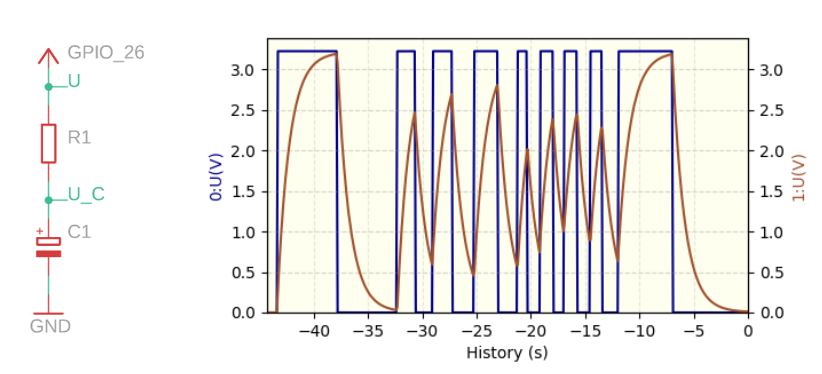
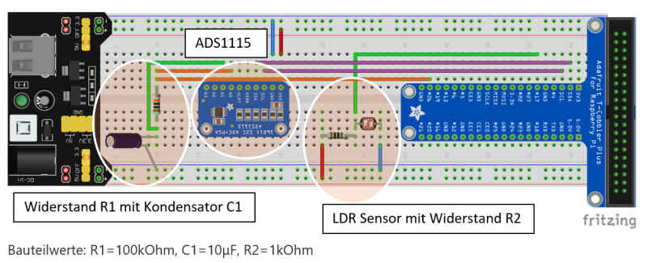

# Charging and discharging of a capacitor

The voltage on a capacitor, connecte in series with a charging resistor 
to a square-wave signal, is observed. The square-wave signal is contolled
by a light-dark switching circuit allowing to modify in a very intuitive
way the frequency and duty  cycle.



Material:  

  - 1 kΩ resistor 
  - 100 kΩ resistor 
  - Electrolytic capacitor 10 μF
  - Photo resistor (LDR type5516)
  - AD converter ADS1115
  - Breadboard with power supply unit
  - Breadboard cables in different colours
  - Raspberry Pi
  - Ribbon cable

A schematic of the placement of the components and the cabling on a 
 breadboard is shown in the figure below. 




**Set-up and Procedure** (student version)

First, we determine the charging and discharging time for our circuit.  
The time constant **τ** is given by the product of resistance and capacitance,
**τ (Tau) = R·C**. It is related to the time needed to charge the capacitor to a level
of 63.2% of the full charge given **QQ** by the product **Q=C·U**; values for other
levels are given in the table below:

| τ (tau) | charge: Uc(t) [%] | discharging to: Uc(t) [%] |
| --------| ------------------|-------------------------|
| 1τ | 63,2 |36,8 |
| 2τ | 86,5 |13,5 |
| 3τ | 95,0 |5,0 |
| 4τ | 98,2 |1,8 |
| 5τ | 99,3 |0,7 |

After a time of 5·τ the capacitor is almost fully charged. In our diagram, 
we would like to show the charging and discharging curve within 10 seconds.

So how many seconds corresponds to 5τ in our case, how much to 1τ?
Write down your result in the table.

| τ | t [s] |
| -------|-------|
| 1 | |
| 5 | |

We have a 10μF electrolytic capacitor available. What value do we have to choose 
for the resistor R1? Calculate (choice: 1k&Omega; and 100k&Omega;).

R1 =

The series circuit to be measured, consisting of resistor R1 and capacitor C1, is shown below. 
The Voltage Uc(t) is to be plotted over time t. Can you already draw the expected curve on the 
next page with the help of the calculated values in the table?


Next, you certainly want to check your expectation and measure the capacitor voltage Uc(t). We 
use the analogue-digital converter ADS1115 connected via the I2C-BUS (signals SDA and SCL) to the 
Raspberry Pi and read it out with PhyPiDAQ. At the same time we write a small piece of code that charges the capacitor while the LDR is illuminated and discharges again when only little light 
falls on the LDR.  
To do this, we first build the following circuit on the breadboard: 
 (Do not yet plug in the power supply and remove the ribbon cable connecting to the Raspberry Pi)


After we are sure that everything is set up correctly, we plug in the power supply and connect 
the ribbon cable. 


To implement the control of the square wave, we proceed in the same way as shown in the 
example "LightControl". We resuse to code snippet developed there to provide a logical signal
on a GPU pin that reflects the status of the illumination of the LDR. 

The code needed looks as follows: 

```python
import RPi.GPIO as GPIO # We import the library GPIO.
import time # We import the library "time".

GPIO.setmode(GPIO.BCM) # We specify how the GPIO pins are numbered.
GPIO.setup(17, GPIO.IN) # GPIO pin 17 is set as input.
GPIO.setup(26, GPIO.OUT) # GPIO pin 27 is set as output.

while True: # Continuous loop (everything set up afterwards is repeated).
	statusGPIO17 = GPIO.input(17) # We query the status of GPIO pin 17.
	if statusGPIO17 == 1: # If (if) the state is 1, then...
	  GPIO.output(26, GPIO.HIGH) # ...we switch on the LED.
	if statusGPIO17 == 0: # If (if) the state is 0, then...
	  GPIO.output(26, GPIO.LOW) # ...we turn off the LED.
	time.sleep(0.1) # We wait 0.1 s (Raspberry Pi "sleeps").
```

Save the code under the name **charge_control.py** and start by typing
``python3 charge_control.py`` and confirm with Enter.  

To exit again, you would press ``Ctrl + c``; but for now we want keep the program 
running while we carry out the measurement in PhyPiDAQ. 
Start PhyPiDAQ via the icon on the desktop. Make sure you are using the
configuration file *default.daq*.

First, the Y-axis range needs to be changed. 
To do this, go to ``Configuration -> PhyPiConfig`` and click on the radio button 
``Edit-Mode`` in the upper right corner to be able to change the content of the text field.

Now change (without the quotes)

"##ChanLimits: "  
"## - [0., 1.] # chan 0"   
"## - [0., 1.] # chan 1"  

To

"ChanLimits: "  
" - [0., 3.3] # chan 0"  
" - [0., 3.3] # chan 1"  

to set the Y-axis range of both channels to 0-3.3V and then click on Save Config. 

Now switch to the tab *Device Config* and activate the ADC channels 1 and 2. 
Set the differential mode to false and leave the sample rate at 860. 


Save your configuration with *Save Config* button. Then start the data acquisition 
in the tab *Control* by clicking on the button *StartRun*.  
Check the function of the circuit by 
repeatedly holding your hand over the LDR and removing it again. Save an image of the curve using 
*Pause* and *Save*. 


Switching by means of the brightness change exactly at 5 seconds is relatively difficult. 
How could we change the program *charge_control.py" to automate the switching? 

