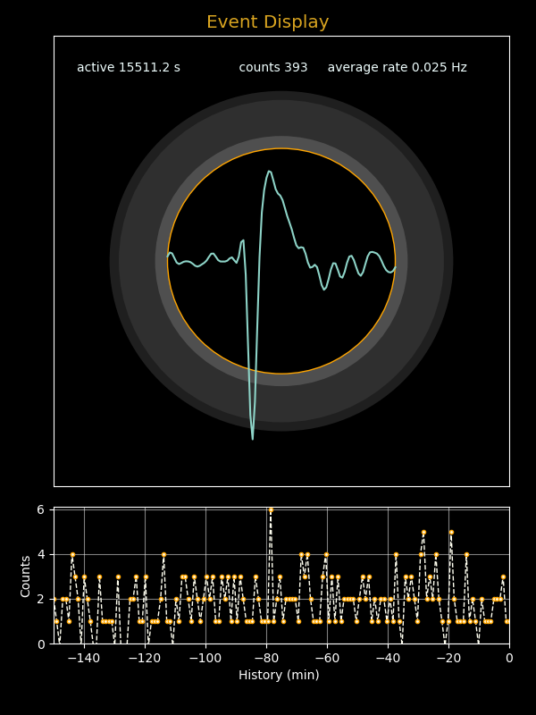

## *PhyPiDAQ*: Recording data from a do-it-yourself particle detector

The detection of radioactivity, either produced by artificial sources or as part of the natural environment
like K-40 or Radon from the inner of the Earth, is a fascinating field of study which today has become
accessible with cheap and simple detectors. There are commercial offers, but also a number of proposals
for do-it-yourself projects. A sound-card of a standard PC is suitable to record the signals, which can then
be visualized with any kind of sound-card oscilloscope. 

### The CERN DIY particle detector 

A rather recent proposal of a simple, cheap and easy to operate particle detector based on four silicon 
PIN photo-diodes(BPW34)  is the [CERN DIY_particle_detector](https://github.com/ozel/DIY_particle_detector). 
A two-stage amplifier with a high-bandwidth op-amp produces large signals of several hundred mV
shaped to a width of about 100 µs. Such signals can be easily recorded with a standard sound card. 
 
 The commercial availability of all necessary parts including the printed circuit board and the large and 
 long output signals make this detector an ideal choice for projects with high-school students. Besides 
 building the device, additional experience is gained in data acquisition software and data analysis of a
 fascinating phenomenon not directly accessible by the human senses. 

### Signal recording and analysis with *PhyPiDAQ*

*PhyPiDAQ* contains several modules supporting data recording, visualization and analysis. An interesting
and important aspect to study in this context is the randomness of the occurrence of signals. As the probability
to detect a signal is invariant with time, the number of events observed in a time interval is given by
Poisson statistics. Typical for such a process is the fact that the time between randomly occurring events 
follows an exponential distribution.

In addition, the exponentially falling decay rate of a sample of radioactive nuclei is another important aspect 
that can be studied if a sample of short-lived nuclei can be provided. In Nature, such a source is Radon produced 
from radioactive decays in the inner of the earth; decay products of Radon, which are themselves radioactive, 
can be  accumulated on an the surface of an electrically charged balloon. 

Relevant modules of the *PhyPiDAQ* package are:

   - `phypidaq\soundcardOsci` with two classes to record and select  and to display waveforms from a PC soundcard

   - `phypidaq/DisplayPoissonEvent`, a class to display a pulse corresponding to a single Poisson event and to show 
   a rate history. 

Ready-to use scripts  illustrate how to use these classes: 

   - `examples/oscilloscope/soundcardOsci.py` to record and display wave forms from a sound card.  

  - `examples/scGammaDetector.py` to visualize every occurrence of a large signal and also the  associated
    wave form data around the trigger point. A rate history is also shown. The script also offers the 
   possibility to store the event times in a file for off-line analysis, or to only visualize a sub-set of triggering
   pulses if the rate is very high. 
   
 Studies of Poisson processes are possible by using the Python scripts
 
  -  `examples/poissonFlash.py` to generate, visualize and store data of a simulated Poisson process, and  

  - `examples/poissonLED.py` to produce random flashes of a LED. A photodiode exposed to the light of
     the LED will produce signals analogous to  a detector for gamma rays.


### Notes on the installation

The *Python* scripts mentioned require a small part of the software contained in the
package *phypidaq*. If the download of the full package is not desired, a simplified
option is described below. Ideally, however one should download the entire *PhyPiDAQ*
package and install the Python libraries as follows: 

```sh
# get git repository with PhyPiDAQ code
cd <workdir>
echo “retrieving https://github.com/PhyPiDAQ/PhyPiDAQ”
git clone https://github.com/PhyPiDAQ/PhyPiDAQ
 
# install phypidaq modules
cd PhyPiDAQ
python -m pip install .
```

After this step, the *Python* programs mentioned above can be installed in the
directories *examples/* and *examples/oscilloscope/*.

*Note:* 
This command sequence also works on the console (“Terminal”) of computers with MS
Windows 10 or 11, if *Python* is installed there.


#### Simplified installation

The Python programs *scGammaDector.py* and *run_scOsci.py* can also be executed without downloading the complete *PhyPiDAQ* package. If a current Python version
is available, the libraries can also be downloaded can also be installed directly
from the *github* repository:

```sh
python -m pip install git+https://github.com/PhyPiDAQ/PhyPiDAQ
```
The Python programs can then be downloaded via the links
[run_scOsci.py](https://github.com/PhyPiDAQ/PhyPiDAQ/blob/main/examples/oscilloscope/run_scOsci.py)
and
[scGammaDetector.py](https://github.com/PhyPiDAQ/PhyPiDAQ/blob/main/examples/scGammaDetector.py)
into a working directory and executed.


#### Examples  

 A typical waveform recorded after issuing the command *scGammaDetector.py -o* on the command line 
 is shown in the figure below. The signal is clearly visible above the noise level of approx. 3500 ADC counts. 
 It  is sufficiently large to be directly connected to a earphone so that the signal clicks can also be acoustically 
 perceived. The picture below shows a pulse inverted by the soundcard. The original output pulse is negative with a clearly visible positive overshoot. 

 
 

The script provides a number of command line options to control the visual output, enable storage of results to a file,
and to set up the parameters of the soundcard and the trigger options. 

The output of the command `./scGammaDetector -h` is shown here: 

```
usage: scGammaDetector.py [-h] [-q] [-o] [-n] [-f FILE] [-t TIME] [-s {48000,96000,192000,44100}] [-c {1,2}]
                          [-l TRGLEVEL] [--trgfalling] [-d] [-z SAMPLESIZE] [-r RANGE] [-i INTERVAL]

Read waveforms from soundcard and display and optionally store data

options:
  -h, --help            show this help message and exit
  -q, --quiet           no status output to terminal
  -o, --oscilloscope    oscilloscope display
  -n, --noeventdisplay  deactivate event display
  -f FILE, --file FILE  base filename to store results
  -t TIME, --time TIME  run time in seconds
  -s {48000,96000,192000,44100}, --samplingrate {48000,96000,192000,44100}
                        sampling rate
  -c {1,2}, --channels {1,2}
                        number of channels
  -l TRGLEVEL, --trglevel TRGLEVEL
                        level of trigger
  --trgfalling          trigger falling edge
  -d, --trgdeactivate   deactivate triggering
  -z SAMPLESIZE, --samplesize SAMPLESIZE
                        number of samples per read
  -r RANGE, --range RANGE
                        display range
  -i INTERVAL, --interval INTERVAL
                        time bin for rate display
```

Reasonable default settings are ensure  that in most cases useful output is generated. Because the signal rate is  
very low in normal environments without a radioactive source, the trigger level should be set to be just above noise  
level so that some noise pulses become visible. It is also advisable to use the option `-o` to switch on the oscilloscope view. 
Note that the signal level depends on the  settings of the soundcard. Use the appropriate tool of your PC operating system to 
select the standard input device used for sound recording and adjust the volume control. 

To become acquainted with the software, in particular the selection of data by setting appropriate trigger conditions, it is 
useful to use a microphone signal as input source.  Initially, the only the oscilloscope with a very low trigger  level is started:  
   > `python3 scGammaDetector.py -n -o -l 100`

This will show raw data from the soundcard in the oscilloscope display.  Now make some noise, e .g. by clapping your hands or snipping your fingers, and you will see some short signals well above the average noise level. Remember the typical signal level
 of the background noise.  
Stop the program by typing 'E' on the command line or click the 'End' button in the graphical control interface. Then, restart at
a higher trigger level, this time also enabling the event display:  
   > `python3 scGammaDetector.py -o -l 1500`

You should see no signals at all - unless you create a loud sound signal, which then is displayed in the oscilloscope and also in the event display window.

Detecting the very small signals from the CERN DIY particle detector works exactly the same way. Connecting the detector output to a microphone input of a soundcard and repeat the the same procedure just described to find the right trigger level to
separate the noise level from true signals of detected particles.  Note that the
signal level depends on the settings of your soundcard, most importantly the volume.
If possible, increase the sampling rate to the highest possible value supported by
your soundcard - typical values are 44100, 48000, 96000 or 192000 samples/s. 
Also consider adjusting the sample size of a single recording using the option
`-z<n>`  - 256 or 512 are optimal settings for the short pulses of the particle detector,  but some sound drivers only support a minimum setting of 1024. If the sample size is too large, more than one signal may be contained in the sample, but only the first one would  be triggered and counted.   
It is obvious that the trigger level has a strong influence on the recorded signal rate. If it is too low, most true signal will be detected, but some noise pulses (called "background") will also be present. It the trigger level is too high, noise pulses will mostly be suppressed, but also some signal pulses will be lost. There is no way out here - the detection efficiency and the background suppression cannot both be 100 %.! If an absolute rate is to be determined, corrections for signal efficiency and background
contamination of a selected signal sample  must be applied.  

The output from the particle detector seen under measurement conditions at low rates is shown in the figure below. A flashing circle indicates the occurrence of triggered event, and the corresponding (normalized) wave form with 100 sampling points around
the trigger time is displayed. A rate history is also shown; the bin width in seconds can be set using the opton `--interval <n>` 


The determination of the background level and the signal efficiency is not always easy to do  with small uncertainties. the background level can be determined rather precisely by performing measurements without the signal source. The determination of the signal efficiency requires precise knowledge of the detector and the signal characteristics, typically gained by detailed modeling  of the physics processes in the detector and the response of the front-end electronics. In case such studies signal efficiency vs. purity are interesting, data recorded with `scGammaDetector.py` can be analyzed  to gain more insight. Recording of detected pulses is switched on with the option `-f <filename>`; for each detected signal, the "event number", the time of occurrence in seconds since program start and the pulse height in ADC counts are stored in the file. In an off-line analysis, a pulse-height spectrum, i. e. the frequency at which pulse heights in a given interval occur, can be derived from data taken at a low trigger threshold. This will show a large number of very small pulses, but also a clear  accumulation arising from true signals at higher values. From data taken without a particle source a spectrum of expected background signals during the measurement can be determined and subtracted from the data taken with a signal source.  


### Results of measurements

#### Environmental radioactivity 

The sensor surface area of the DIY particle detector is very small at just 28 mm², 
and and the sensitive layer is very thin. Of the typically several Hz gamma rate at normal ambient radioactivity of typically 0.1 µS/h, and therefore only a small fraction is registered. By comparison with a dosimeter, in this case a Radiacode 102, see [Instructions](GammaSpectra.md), an approximate calibration can be made: 

  > A dose rate of 0.1 µS/h corresponds to 2.5 registered events per minute. 

An example of a measurement of environmental radioactivity is shown below.



If sufficiently long measurement times are foreseen, the do-it-yourself
detector can be used to study radioactivity in different environments.
The difference in dose rate outdoors, in living rooms or in rooms with 
tiles or even granite differ by factors of two to three. With sufficiently
large measurement times of a few tens of minutes such differences can be 
shown with significant statistical precision. 
The effects of weakly radioactive rock samples or the decay products of
Radon on the surface of a balloon, electrically charged by rubbing,
are also detectable.

#### Statistics of Radioactive Decays  

The analysis of registered gamma quanta from a small sample of pitchblende recorded with `scGammaDetector.py` is shown in
the figure below. Signal pulses were registered at a rate of approximately 1.32 HZ. The file
`GammaStrahlung_Pechblende.csv` contains approx. 11500 recorded events with the columns  
  > `event_number, event_time[s], pulse_height[adc]`

Only the middle column with the times at which events were recorded was analyzed. For this purpose, 
the Python code `data/RateAnalysis.py` was executed with the input  
 > `python3 RateAnalyis.py GammaStrahlung_Pechblende.csv 10` 
 
 is used. The last parameter defines the duration of the time intervals (in s) in which the number of events is determined. 

The graphs show the number of events in intervals of 10 s duration, the frequency distribution of the observed numbers of events and the time between two events.
The expected distributions resulting from the mean rate are also plotted, i.e. a uniform distribution for an average number of events 
of 13.2 in every 10 s interval, the corresponding Poisson distribution and an 
exponential distribution for a mean time interval of 1/1.32 s = 0.757 s between the events are also shown. The graphics show very nicely the properties expected for a Poisson process.


  more to be written ....