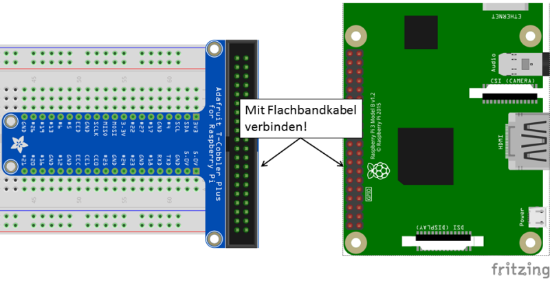

# Digital measurements

This example experiment deals with the very fundamentals of digital measurements. 
An adjustable voltage is measured with a voltmeter and applied to a GPIO pin of the 
Raspberry Pi configured as an input. The logical value of the pin is read with a
simple *Python* program and pinted to the screen.  

The circuit diagram looks like this: 


The expeirmetal setup and wiring on the breadboard is shown here: 


## Characterization of a GPIO pin

**Material:**

 + 10 k&Omega; potentiometer
 + Breadboard with power supply and power supply unit
 + Breadboard wires in different colours
 + voltmeter
 + Raspberry Pi
 + ribbon cable

**Execution:**

Build the circuit according to the circuit and wiring diagrams above. 
The voltmeter is connected via the two leads to the banana sockets in such a way 
that the voltage between the wiper (the middle pin) of the potentiometer and 
GND (0V) is measured. After careful checking of the circuit, switch on the power 
supply of the breadboard (green LED on power supply lights up).
With the help of the potentiometer, adjust the electrical voltage at the input pin 
GPIO17 to a value in the range between 0 and 3.3V. 

Next, connect the Raspberry Pi to the breadboard via the ribbon cable.


 
The Raspberry Pi itself has no on/off switch, but is started simply by 
connecting it to the power supply. 

In order to find out the state of GPIO pin 17 and to display this state, 
you will need to write your first small program, which looks like this:

```python
import RPi.GPIO as GPIO #  import GPIO library
import time # import library "time".  

GPIO.setmode(GPIO.BCM) # specify pin numbering scheme
GPIO.setup(17, GPIO.IN) # use GPIO pin 17 as input 

try: # execute program code
    while True: # loop
  		print("Status GPIO17: ", GPIO.input(17)) # show status of pin 17
  		time.sleep(0.1) # wait 0.1 s (Raspberry Pi "sleeps")
except KeyboardInterrupt: # when interrupting with Cntrl+C ... 
  	GPIO.cleanup() # ... clean up.
```

Save this program under the name *digital.py*, we will need it later again.  

Run the program and turn the potentiometer knob while watching the output. 
At a certain point, the output will change from 1 to 0 or vice versa: 
this is the threshold of the GPIO input. 
Voltages smaller than the threshold voltage will result
in a zero value, larger voltages are reported as one. This is the simplest
possible version of a digitization process: 
Question: is the applied voltage larger than the threshold voltage ?  
yes → True or 1  
no  → False or 0  

Report the threshold of the GPIO pin here:

&nbsp;
_____


