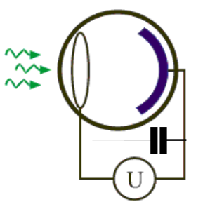
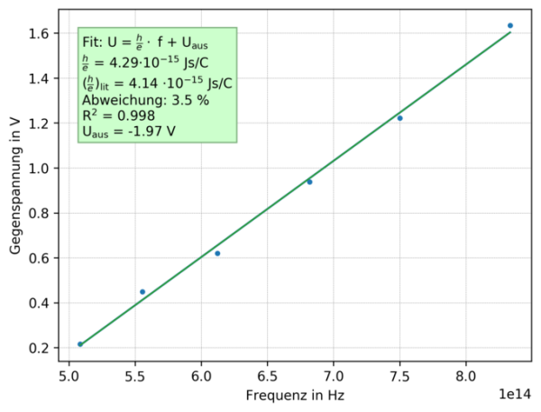

# *PhyPiDAQ*: Exploring the Photoeffect

A simple variant for the quantitative treatment of the photoelectric effect 
compared to the classical countervoltage method is possible with the help of an 
electrometer amplifier. If a capacitor is connected in parallel to a vacuum 
photocell illuminated with light of a known fixed wavelength, the capacitor is 
charged until even the fastest of the released electrons can no longer run against 
the capacitor voltage. This volatage can easily be measured with a modern operational amplifier with a very high internal resistance without discharging the capacitor.
A schematic of this simple measurement is shown here:  
*Fig. 1*:  **Photoelectric effect**: Principle for measuring the voltage with a capacitor.  
  


The photo effect is examined qantitatively with this method in more detail below. 
The resulting counter-voltage is to be measured for six different wavelengths in the 
range from *λ = 360 nm* to λ=590 nm. From the measruements, the ratio *h/e* is 
determined, where *h* is Planck's quantum and *e* is the elementary charge.  

A mercury lamp is used as the light source because it also emits light in the UV 
range. The light beam is bundled with lenses and reduced to the respective 
wavelength with interference filters. When the photons hit the cathode, electrons 
are released and a positive excess charge is created on the initially neutrally 
charged plate. If electrons hit the opposite cathode, it becomes negatively charged.
The separation of charges between the anode and the cathode creates an increasing 
electric field, which slows down further electrons that fly from the cathode to 
the anode. In equilibrium, the breaking force is so great that even electrons 
no longer arrive at the anode with maximum kinetic energy. The voltage between the 
cathode and anode is then maximum. The maximum voltage then corresponds to the 
counter voltage.

The measuring method used here contains a capacitor connected in parallel to the 
photocell, which is charged by the photovoltage. The tension that arises 
corresponds to the counter-tension. This method has the advantage that a rather 
complex and laborious setting of the photocurrent can be dispensed with. As a 
result, this test can be carried out in a very short time and with high accuracy. 

On the hardware side, the voltage is measured with the electrometer, since a large 
internal resistance is required here in order not to falsify the measurement. A 
commercially available multimeter is therefore unsuitable. The circuit structure 
can be seen in the following figure:

*Fig. 2*: **Photoeffect**: Schematic of the experimental setting  
                      

The capacitor with *C=47µF* may have to be adjusted if the charging is too fast or too slow.


The following *config file* can be used in *PhyPiDAQ*. (The plots below were created by 
exporting the values from *PhyPiDAQ* as *.csv* and then reading them into a 
Python script. This can be done just as well e.g. , with an Excel table or something similar.)  

*photoeffekt.daq:*
```yaml
DeviceFile: config/photoeffekt_ADS1115Config.yaml   # 16 bit ADC, I2C bus
ChanLabels: ['Voltage']            # names for channels 
ChanUnits: ['V']         # units for channels 
ChanColors: [darkblue]      # channel colours in display

Interval: 0.05                 # logging interval  
NHistoryPoints: 20000          # number of points used in history buffer, time=NHistoryPoints*Interval = 2000*0.05 = 
100 seonds
DisplayModule: DataGraphs     # text, bar-graph, history and xy-view
Title: "Data from File"       # display title
DataFile:   null              #  null to disable 
CSVseparator: '   '            # field separator, set to ';' for German Excel   
```

*photoeffekt_ADS1115Config.yaml:*
```yaml
DAQModule: ADS1115Config  
ADCChannels: [0]
DifModeChan: [false]
Gain: [1]
sampleRate: 860
```
The measurement can now be started and the counter voltage is displayed, which 
results from the charging of the capacitor by the photo effect. The capacitor is 
connected to ground again for discharging.

The results obtained are summarized in the Figure below. 

*Fig. 3*: **Photo effect**: Charging of a capacitor on a vacuum photocell for different wavelengths of the incident 
light  
                      

A number of interesting effects are worht mentioning:  
 
 - all voltages saturate at a fixed value depending on the color of the incident light
 - the rise time is different depending on the intensity of the light. 


To calculate the ratio *h/e*, the energy balance is first drawn up. The 
incident light with the wavelength *λ* has the frequency *ν=λc* and the 
energy *E<sub>light</sub>=hν*.  
After deducting the work function, the released electrons have the kinetic energy 
*E<sub>kin</sub>=E<sub>light</sub>-E_A*.  
For the energy of the electric field, *E<sub>field</sub>=U*e* applies, where *U* 
is the counter voltage and *e* is the elementary charge.  
In the stationary case, the energy of the electric field is the same as the kinetic 
energy, *E<sub>field</sub>=E<sub>kin</sub>*, so that when inserted, *U·e=h·ν−E_A* results.  
For the saturation voltage, *U = h/e · ν + e·A* applies.  

A graph showing the saturation voltage *U* as a function of the frequency *ν* 
of the incident light is shown in the Figure below. The slope of the indicated 
straight line, obtained via linear regression, corresponds to the ratio *h/e*.  
The y-axis intercept corresponds to the work function *E_A*, with a negative sign 
indicating that this physical work is needed to free an electron. 

*Fig. 4*: **Photoeffect**: Saturation voltage versus frequency of light.  
                      

The deviation of *(h/e)<sub>measured</sub>* from the literature value of 
*h/e=4.14·10^(−15) Js/C* is only 3.5%, which indicates a very precise measurement 
at the percent-level precision. The work function for a potassium cathode is 
*E_A = 2.25 eV*. The y-intercept corresponds to *|e·U| = 1. 97eV*, 
which deviates from the best known value at the level of 10%.


